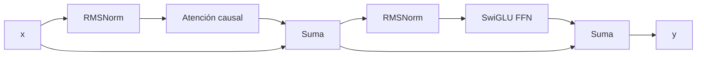
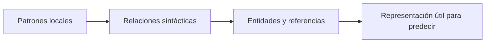

# Transformer causal: arquitectura completa y formas

## Qué debe lograr un bloque

Cada posición debe:

1. leer información permitida del contexto;
2. transformar su propia representación;
3. conservar una ruta estable para que señales y gradientes atraviesen muchas capas.

En una arquitectura moderna **pre-norm**:

$$u=x+\operatorname{Attention}(\operatorname{RMSNorm}(x)),$$

$$y=u+\operatorname{FFN}(\operatorname{RMSNorm}(u)).$$



## Libro mayor de formas

| Cantidad | Forma | Lectura |
|---|---:|---|
| IDs | $(B,S)$ | secuencia, posición |
| embeddings $X$ | $(B,S,D)$ | secuencia, posición, característica |
| consultas $Q$ | $(B,N,T,H)$ | secuencia, cabeza, consulta, rasgo de cabeza |
| claves $K$ | $(B,K,S,H)$ | secuencia, cabeza KV, posición leída, rasgo |
| valores $V$ | $(B,K,S,H)$ | igual organización que $K$ |
| puntajes | $(B,N,T,S)$ | una compatibilidad por consulta y clave |
| salida por cabeza | $(B,N,T,H)$ | mezcla de valores por consulta |
| salida unificada | $(B,T,D)$ | cabezas concatenadas |
| FFN intermedia | $(B,T,F)$ | expansión por posición |
| logits | $(B,T,V)$ | puntaje por token del vocabulario |

En entrenamiento causal normalmente $T=S$. Durante decode con KV cache, la nueva consulta suele tener $T=1$ mientras las claves conservadas tienen longitud $S$.

## Paso 1: embeddings

$$X^{(0)}=W_e[\text{tokens}],\qquad X^{(0)}\in\mathbb R^{B\times S\times D}.$$

La forma no contiene un eje de vocabulario: el lookup ya reemplazó cada ID por un vector de longitud $D$.

## Paso 2: atención

Para una capa $\ell$:

$$\bar X=\operatorname{RMSNorm}(X^{(\ell)}),$$

$$Q=\bar XW_Q,\quad K=\bar XW_K,\quad V=\bar XW_V.$$

Después se separan cabezas y se calcula:

$$A=\operatorname{softmax}\left(\frac{QK^\top}{\sqrt H}+M\right),$$

$$O=AV.$$

La proyección $W_O$ mezcla la información de las cabezas:

$$X' = X^{(\ell)} + \operatorname{concat}(O_1,\ldots,O_N)W_O.$$

## Paso 3: FFN por posición

La FFN recibe cada posición independientemente:

$$G=X'W_g,qquad U=X'W_u,$$

$$H=\operatorname{SiLU}(G)\odot U,$$

$$X^{(\ell+1)}=X'+HW_d.$$

La FFN no mezcla posiciones. Usa los mismos pesos para todas; la atención es la operación que intercambia información entre posiciones.

> [!important] División de responsabilidades
> **Atención mezcla tokens. FFN mezcla características dentro de cada token.**

## Paso 4: normalización final y unembedding

$$X_f=\operatorname{RMSNorm}(X^{(L)}),$$

$$Z=X_fW_{\text{vocab}}\in\mathbb R^{B\times S\times V}.$$

En muchos modelos se comparte:

$$W_{\text{vocab}}=W_e^\top.$$

Esto se llama **weight tying** y evita almacenar otra matriz de tamaño $V\times D$.

## Por qué el modelo es causal

La máscara $M$ satisface:

$$M_{ij}=\begin{cases}
0,&j\le i,\\
-\infty,&j>i.
\end{cases}$$

Después de softmax, las posiciones futuras reciben probabilidad cero.

```text
            clave j
consulta i   0  1  2  3
0            ✓  ×  ×  ×
1            ✓  ✓  ×  ×
2            ✓  ✓  ✓  ×
3            ✓  ✓  ✓  ✓
```

Sin máscara, durante entrenamiento el token en posición 1 podría leer la respuesta de posición 2. La pérdida parecería excelente, pero la generación real fallaría porque ese futuro no existe.

## Por qué muchas capas ayudan

Una capa produce una mezcla y una transformación. Varias capas permiten composición:



El diagrama es una intuición, no una asignación rígida de “una función por capa”. Las funciones aparecen distribuidas y dependen del modelo y de los datos.

## Parámetros frente a activaciones

| Tipo | Depende de | Persiste entre ejemplos |
|---|---|---|
| parámetros | $L,D,F,V,N,K$ | sí |
| activaciones | además $B,S$ | no; se producen por lote |
| gradientes | parámetros | durante entrenamiento |
| estado de Adam | parámetros | sí, durante entrenamiento |
| KV cache | $B,S,L,K,H$ | durante una generación |

Esta separación será central en [[05 Entrenamiento de un LLM - objetivo, parámetros, FLOPs y memoria]] y [[06 Inferencia autoregresiva - prefill, decode, KV cache y batching]].

## Pseudocódigo del modelo

```python
x = embedding(token_ids)                 # (B, S, D)

for block in blocks:
    x = x + attention(rmsnorm(x))        # (B, S, D)
    x = x + swiglu_ffn(rmsnorm(x))       # (B, S, D)

logits = lm_head(final_norm(x))          # (B, S, V)
```

## Prueba de formas antes de programar

Si $B=2$, $S=5$, $D=12$, $N=3$:

$$H=D/N=4.$$

Entonces:

- $X$: $(2,5,12)$;
- $Q,K,V$: $(2,3,5,4)$ en MHA;
- $QK^\top$: $(2,3,5,5)$;
- $AV$: $(2,3,5,4)$;
- concatenación: $(2,5,12)$.

> [!question] Comprobación
> ¿Por qué no se pueden sumar residual y atención si olvidaste transponer y la salida quedó $(B,N,S,H)$?

Porque el residual es $(B,S,D)$. Primero hay que volver a $(B,S,N,H)$ y aplanar $N\times H=D$.

## Errores frecuentes

- confundir $V$ de “vocabulario” con $V$ de “values”; usa contexto o nombres distintos en código;
- perder el significado de $S$ y $T$ durante decode;
- aplicar FFN mezclando el eje de secuencia;
- omitir la máscara causal en entrenamiento;
- usar `view` sobre un tensor no contiguo después de `transpose` sin comprender sus strides;
- contar dos matrices de vocabulario cuando los pesos están compartidos.

---

Anterior: [[01 Del texto a probabilidades - embeddings, logits, softmax y entropía]] · Siguiente: [[03 Atención - Q, K, V, máscara causal y multi-head]]
