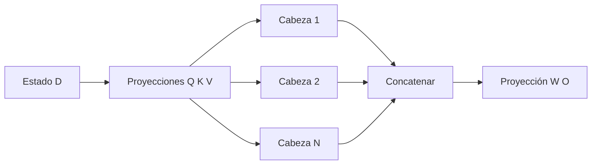

# Atención: Q, K, V, máscara causal y multi-head

## La intuición correcta

Para cada posición:

- **Query:** qué información necesita esta posición;
- **Key:** qué clase de información puede ofrecer cada posición;
- **Value:** qué contenido se entrega si esa posición recibe peso.

La atención no “escoge una palabra” necesariamente. Produce una mezcla continua de valores.

![[assets/03-atencion-paso-a-paso.gif|1000]]

## Una consulta contra todas las claves

Para una cabeza:

$$q_i,k_j,v_j\in\mathbb R^H.$$

El puntaje entre consulta $i$ y clave $j$ es:

$$s_{ij}=\frac{q_i^\top k_j}{\sqrt H}.$$

Luego:

$$a_{ij}=\frac{e^{s_{ij}}}{\sum_r e^{s_{ir}}},$$

$$o_i=\sum_j a_{ij}v_j.$$

Los $a_{ij}$ son no negativos y suman 1 por fila. Por eso $o_i$ es una combinación ponderada de valores.

## Por qué dividir por $\sqrt H$

Si los componentes de $q$ y $k$ tienen media 0 y varianza aproximada 1, el producto punto suma $H$ términos:

$$q^\top k=\sum_{h=1}^{H}q_hk_h,$$

cuya varianza crece aproximadamente como $H$. Dividir por $\sqrt H$ mantiene la escala aproximadamente estable.

Sin escalado, softmax recibiría magnitudes mayores al crecer $H$, se volvería demasiado picuda y sus gradientes serían pequeños.

## Máscara causal

Antes de softmax:

$$s_{ij}\leftarrow-\infty\quad\text{si }j>i.$$

Como $e^{-\infty}=0$, la posición futura queda fuera de la mezcla.

> [!important] Orden
> La máscara se aplica **a los logits de atención antes de softmax**, no después. Enmascarar probabilidades después exigiría renormalizarlas.

## Forma matricial

Para varias cabezas:

$$Q\in\mathbb R^{B\times N\times T\times H},$$

$$K,V\in\mathbb R^{B\times N\times S\times H}.$$

Entonces:

$$QK^\top:
(B,N,T,H)@(B,N,H,S)
\to(B,N,T,S).$$

Y:

$$AV:
(B,N,T,S)@(B,N,S,H)
\to(B,N,T,H).$$

El índice $S$ se contrae en la segunda multiplicación: se suman los valores del contexto.

## Ejemplo numérico pequeño

Supón para una consulta:

$$q=[1,0],$$

$$k_1=[1,0],\quad k_2=[0,1],$$

$$v_1=[10,0],\quad v_2=[0,20].$$

Los puntajes escalados son:

$$s=\left[\frac1{\sqrt2},0\right]\approx[0.707,0].$$

Softmax da aproximadamente:

$$a\approx[0.670,0.330].$$

La salida es:

$$o=0.670[10,0]+0.330[0,20]\approx[6.70,6.60].$$

La clave determina el peso; el valor determina qué números se mezclan.

## Multi-head attention

En lugar de una única representación de tamaño $D$, se usan $N$ cabezas de tamaño $H$, con $D=NH$.



La división en cabezas permite aprender varios patrones de compatibilidad en paralelo. No implica que cada cabeza tenga una etiqueta humana estable.

## MHA, GQA y MQA

| Variante | Cabezas Q | Cabezas K/V | KV cache relativo | Idea |
|---|---:|---:|---:|---|
| MHA | $N$ | $N$ | $1$ | cada consulta tiene K/V propios |
| GQA | $N$ | $K<N$ | $K/N$ | grupos de consultas comparten K/V |
| MQA | $N$ | $1$ | $1/N$ | todas las consultas comparten K/V |

En GQA, si $N=8$ y $K=2$, cada cabeza KV sirve a $G=N/K=4$ cabezas de consulta.

> [!note] Capacidad frente a sistema
> Compartir K/V reduce memoria y ancho de banda durante inferencia, pero restringe la diversidad de claves y valores. Es un compromiso, no una mejora gratuita.

## Implementación explícita

```python
def attention(q, k, v, mask):
    # q: (B, N, T, H)
    # k: (B, N, S, H)
    # v: (B, N, S, H)
    scores = q @ k.transpose(-2, -1) / math.sqrt(q.size(-1))
    scores = scores.masked_fill(~mask, float("-inf"))
    weights = torch.softmax(scores, dim=-1)
    return weights @ v
```

En `scaled_dot_product_attention`, una máscara booleana `True` indica que la posición **participa**. Otras APIs de PyTorch usan la convención opuesta; comprueba la documentación de la función concreta.

## Laboratorio sin dependencias

El script [[python/atencion_desde_cero.py]] implementa matrices, softmax estable y máscara causal usando solo Python. Verifica dos invariantes:

1. cada fila de pesos suma 1;
2. toda posición futura recibe peso 0.

Salida esperada:

```text
[1.0000, 0.0000, 0.0000]
[0.5423, 0.4577, 0.0000]
[0.2491, 0.3123, 0.4386]
```

## Qué la atención sí y no garantiza

| Sí | No |
|---|---|
| mezcla información según compatibilidades aprendidas | no garantiza causalidad semántica |
| conecta posiciones lejanas en una capa | no garantiza recordar todo el contexto |
| produce pesos interpretables numéricamente | no convierte automáticamente esos pesos en explicación causal del modelo |
| permite procesar posiciones en paralelo durante entrenamiento | no elimina el coste cuadrático de atención densa |

## Errores frecuentes

- transponer el eje de cabeza en lugar de los dos últimos ejes de $K$;
- dividir por $\sqrt D$ en vez de $\sqrt H$;
- hacer softmax sobre el eje de consultas $T$ en vez de claves $S$;
- usar una máscara con semántica invertida;
- olvidar que durante decode $T=1$ y $S$ crece;
- interpretar valores altos de atención como una explicación causal completa.

## Autoevaluación breve

Responde primero sin abrir los bloques.

> [!question]- 1. ¿Por qué $QK^\top$ termina con forma $(T,S)$ por cabeza?
> Porque $Q\in\mathbb R^{T\times H}$ y $K^\top\in\mathbb R^{H\times S}$. La multiplicación contrae $H$ —las características usadas para comparar— y conserva $T$ consultas y $S$ claves:
>
> $$
> (T,H)@(H,S)\to(T,S).
> $$
>
> La celda $(t,s)$ responde cuánto coincide la consulta de la posición $t$ con la clave de la posición $s$.

> [!question]- 2. ¿Por qué $AV$ elimina el eje $S$?
> $A\in\mathbb R^{T\times S}$ contiene, para cada consulta, un peso por posición del contexto; $V\in\mathbb R^{S\times H}$ contiene un vector de contenido por posición. En $AV$, el eje $S$ se contrae porque se calcula una suma ponderada sobre todas las posiciones:
>
> $$
> (T,S)@(S,H)\to(T,H).
> $$
>
> El eje desaparece como índice explícito, pero su información no se borra: queda resumida dentro de cada vector de salida.

> [!question]- 3. ¿Qué reduce GQA exactamente?
> Mantiene $N$ cabezas de consulta, pero usa solo $K<N$ cabezas distintas de claves y valores. Varias consultas comparten cada par K/V. Esto reduce los parámetros de las proyecciones K/V, el tamaño del KV cache y el ancho de banda asociado durante decode.
>
> No reduce directamente el número de cabezas de salida ni convierte la atención densa en atención lineal; cada cabeza de consulta sigue produciendo sus propios puntajes.

> [!question]- 4. ¿Por qué la máscara debe actuar antes de softmax?
> Porque queremos normalizar **solo entre claves permitidas**. Asignar $-\infty$ al futuro antes de softmax hace que $e^{-\infty}=0$ y que los pesos válidos sumen 1.
>
> Si se pusieran los puntajes futuros en cero antes de softmax, recibirían masa porque $e^0=1$. Si se anularan probabilidades después, la fila dejaría de sumar 1 salvo que se renormalizara, y se estaría implementando un algoritmo distinto.

---

Anterior: [[02 Transformer causal - arquitectura completa y formas]] · Siguiente: [[04 RMSNorm, conexiones residuales, SwiGLU y RoPE]]
