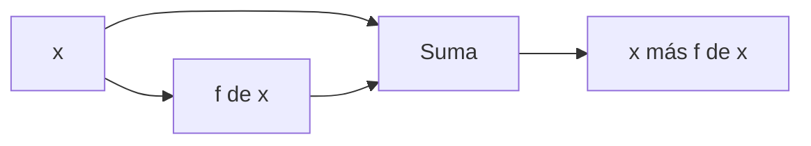
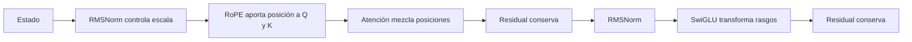

# RMSNorm, conexiones residuales, SwiGLU y RoPE

Estas piezas suelen parecer detalles, pero resuelven cuatro problemas diferentes:

| Pieza | Problema que aborda |
|---|---|
| RMSNorm | escala inestable de los estados |
| residual | dificultad para transportar información y gradiente |
| SwiGLU | transformación expresiva por posición |
| RoPE | falta de orden posicional en atención |

## RMSNorm

Para $x\in\mathbb R^D$:

$$\operatorname{RMS}(x)=\sqrt{\frac1D\sum_{i=1}^{D}x_i^2+\epsilon},$$

$$\operatorname{RMSNorm}(x)=\gamma\odot\frac{x}{\operatorname{RMS}(x)},$$

donde $\gamma\in\mathbb R^D$ es aprendible.

### Ejemplo

Para $x=[3,4]$:

$$\operatorname{RMS}(x)=\sqrt{\frac{9+16}{2}}=\sqrt{12.5}\approx3.536.$$

Sin considerar $\epsilon$ ni $\gamma$:

$$\frac{x}{\operatorname{RMS}(x)}\approx[0.849,1.131].$$

La normalización controla la magnitud global. $\gamma$ devuelve al modelo control por dimensión: puede amplificar una característica y reducir otra.

> [!note] RMSNorm frente a LayerNorm
> LayerNorm resta la media y divide por desviación estándar. RMSNorm no centra; solo controla la raíz media cuadrática. Ambas suelen incluir un escalado aprendido.

## Conexión residual

$$y=x+f(x).$$

La derivada contiene una ruta identidad:

$$\frac{\partial y}{\partial x}=I+\frac{\partial f}{\partial x}.$$

Incluso si la ruta de $f$ tiene una derivada problemática, la identidad ofrece un camino directo. Además, una capa puede aprender una corrección pequeña en vez de reconstruir toda la representación.



## Por qué pre-norm

En pre-norm:

$$y=x+f(\operatorname{Norm}(x)).$$

La ruta residual de $x$ a $y$ no atraviesa la normalización. Esto suele facilitar el entrenamiento de redes profundas.

## SwiGLU

Una FFN clásica aplica expansión, activación y contracción. SwiGLU usa dos proyecciones de expansión:

$$G=xW_g,\qquad U=xW_u,$$

$$h=\operatorname{SiLU}(G)\odot U,$$

$$y=hW_d.$$

Con:

$$\operatorname{SiLU}(z)=z\sigma(z).$$

Interpretación:

- $U$ propone contenido;
- $\operatorname{SiLU}(G)$ actúa como compuerta aprendida;
- el producto decide qué componentes pasan y con qué signo/magnitud;
- $W_d$ devuelve la forma de $F$ a $D$.

### Formas

$$x:(B,S,D),$$

$$G,U:(B,S,F),$$

$$h:(B,S,F),$$

$$y:(B,S,D).$$

La operación es independiente por posición: no contrae $S$.

## Por qué hace falta posición

Sin información posicional, la atención conoce los contenidos pero no el orden. Las secuencias:

```text
perro muerde hombre
hombre muerde perro
```

contienen tokens similares, pero el orden cambia la relación.

## RoPE como rotación

RoPE aplica rotaciones por posición a pares de coordenadas de $Q$ y $K$, no a $V$.

Para un par $(x_1,x_2)$ y ángulo $\phi$:

$$
R_\phi
\begin{bmatrix}x_1\\x_2\end{bmatrix}
=
\begin{bmatrix}
x_1\cos\phi-x_2\sin\phi\\
x_1\sin\phi+x_2\cos\phi
\end{bmatrix}.
$$

![[assets/04-rope-rotaciones.gif|1000]]

Para posición $m$ y par $i$:

$$\phi_{m,i}=m\theta_i,$$

$$\theta_i=\Theta^{-2i/H}.$$

Cada par gira con una frecuencia distinta:

- frecuencias altas distinguen posiciones cercanas;
- frecuencias bajas varían lentamente y transportan estructura de mayor escala.

## La propiedad relativa

Sean:

$$q_m'=R_mq,qquad k_n'=R_nk.$$

Entonces:

$$\langle q_m',k_n'\rangle
=(R_mq)^\top(R_nk)
=q^\top R_m^\top R_nk
=q^\top R_{n-m}k.$$

El producto depende de la diferencia $n-m$. Por eso una codificación absoluta mediante giros induce una interacción relativa en atención.

> [!important] Qué rota y qué no
> Se rotan $Q$ y $K$ porque la posición debe afectar **qué tokens son compatibles**. $V$ representa el contenido que se transporta y normalmente no se rota.

## Implementación sin construir matrices $H\times H$

```python
x_pairs = x.reshape(*x.shape[:-1], -1, 2)
x_even = x_pairs[..., 0]
x_odd = x_pairs[..., 1]

y_even = x_even * cos - x_odd * sin
y_odd = x_even * sin + x_odd * cos

y = torch.stack([y_even, y_odd], dim=-1).flatten(start_dim=-2)
```

Los senos y cosenos pueden precalcularse para posiciones y frecuencias.

## Una capa completa, ahora con significado



## Errores frecuentes

- normalizar $V$ pensando que RoPE debe aplicarse a todo;
- usar el mismo ángulo en todos los pares y perder variedad de escalas;
- olvidar que una rotación preserva norma pero cambia orientación;
- escribir la segunda coordenada como $x_2\sin\phi+x_2\cos\phi$; el primer término correcto es $x_1\sin\phi$;
- confundir `SiLU(x)` con `sigmoid(x)`;
- sumar el residual cuando la rama cambió de forma y no volvió a $D$.

## Autoevaluación

Responde primero sin abrir los bloques.

> [!question]- 1. ¿Qué información elimina RMSNorm y qué hace realmente $\gamma$?
> RMSNorm divide el vector por su RMS y, por tanto, elimina de la rama normalizada su **escala global dependiente de ese ejemplo**. Conserva la dirección relativa de las componentes, salvo el pequeño efecto de $\epsilon$.
>
> El vector aprendido $\gamma$ no puede reconstruir el RMS particular que se eliminó: aplica una escala fija, aprendida y distinta por característica. En una arquitectura residual, la ruta de identidad también conserva el estado sin normalizar. Decir que $\gamma$ “recupera toda la información” sería demasiado fuerte.

> [!question]- 2. ¿Por qué residual facilita que una capa aprenda una corrección?
> Con $y=x+F(x)$, si la transformación útil es pequeña basta aprender $F(x)$ como una corrección, incluso cercana a cero; la capa no tiene que reconstruir $x$. En backward:
>
> $$
> \frac{\partial y}{\partial x}=I+J_F,
> $$
>
> de modo que existe una ruta de gradiente identidad además de la que atraviesa $F$. Esto ayuda al flujo en redes profundas, aunque no sustituye una buena normalización e inicialización.

> [!question]- 3. ¿Qué diferencia conceptual hay entre compuerta y contenido en SwiGLU?
> La proyección `up` propone características de **contenido** $U=xW_u$. La proyección `gate` produce señales $G=xW_g$ que, tras SiLU, modulan elemento a elemento cuánto y con qué signo pasa de ese contenido:
>
> $$H=\operatorname{SiLU}(G)\odot U.$$
>
> Ambas rutas se aprenden. La compuerta no es una probabilidad —SiLU no está restringida a $[0,1]$— y no mezcla posiciones; decide cómo transformar canales dentro de cada posición.

> [!question]- 4. Demuestra en dos líneas por qué $R_m^\top R_n=R_{n-m}$.
> Una rotación es ortogonal, así que $R_m^\top=R_m^{-1}=R_{-m}$. Las rotaciones del mismo plano suman sus ángulos al componerse:
>
> $$
> R_m^\top R_n=R_{-m}R_n=R_{n-m}.
> $$
>
> La igualdad se aplica por bloques a cada par de dimensiones y explica por qué el producto entre query y key puede depender de la distancia relativa $n-m$.

---

Anterior: [[03 Atención - Q, K, V, máscara causal y multi-head]] · Siguiente: [[05 Entrenamiento de un LLM - objetivo, parámetros, FLOPs y memoria]]
