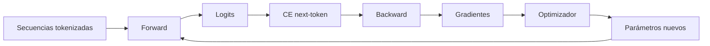
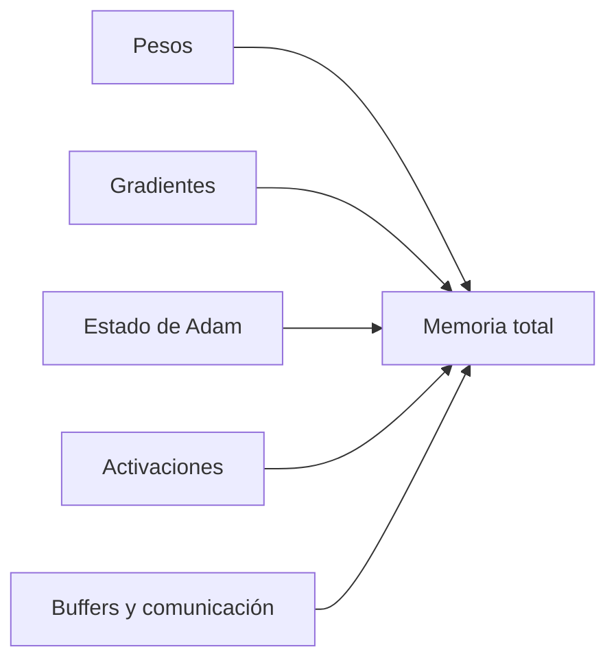
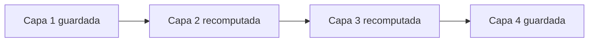

# Entrenamiento de un LLM: objetivo, parámetros, FLOPs y memoria

## El ciclo

Conecta esta nota con [[../gradientes autodiferenciacion y optimizacion/10 Ciclo de entrenamiento reproducible y diagnóstico|Ciclo de entrenamiento reproducible]]: el mecanismo es el mismo, pero las matrices y los lotes son mucho mayores.

## Datos y objetivo

Para tokens $x_1,\dots,x_S$:

$$L(\theta)=-\frac1{S-1}\sum_{t=1}^{S-1}\log p_\theta(x_{t+1}\mid x_{\le t}).$$

Una secuencia de $S$ tokens ofrece hasta $S-1$ objetivos supervisados. La máscara causal permite calcular todos en paralelo sin revelar el futuro.

> [!important] El entrenamiento es teacher forcing
> En la posición $t$, el modelo recibe el prefijo correcto del dataset. En generación recibe sus propias salidas anteriores. Esa diferencia puede acumular errores durante inferencia.

## Contar parámetros

Ignorando sesgos y términos pequeños de normalización:

### Embedding y salida

$$P_{\text{emb}}=VD.$$

Si unembedding no comparte pesos:

$$P_{\text{vocab}}=2VD.$$

Si hay weight tying, queda aproximadamente $VD$.

### Atención MHA

Cuatro proyecciones $D\times D$:

$$P_{\text{attn}}\approx4D^2.$$

### Atención GQA

Con $N$ cabezas Q, $K$ cabezas KV y $H=D/N$:

$$P_{\text{attn}}=D^2+D^2+2D(KH)=2D^2+2DKH.$$

El primer $D^2$ es $W_Q$, el segundo $W_O$ y los dos términos $DKH$ corresponden a $W_K,W_V$.

### SwiGLU FFN

Tres matrices:

$$P_{\text{ffn}}=DF+DF+FD=3DF.$$

Si $F\approx\frac83D$:

$$P_{\text{ffn}}\approx8D^2.$$

Por capa MHA:

$$P_{\text{capa}}\approx4D^2+8D^2=12D^2.$$

Total aproximado:

$$P\approx P_{\text{vocab}}+12LD^2.$$

> [!warning] Esta no es una identidad universal
> Cambia con GQA/MQA, sesgos, MoE, dimensión FFN, QK norm, vocabulario compartido y otros componentes. Cuenta las matrices reales del modelo.

## Ejemplo de orden de magnitud

Sea $D=4096$, $L=32$, $V=50\,000$ y $F=11\,008$.

- una matriz $D\times D$ tiene unos $16.8$ millones de parámetros;
- una FFN SwiGLU tiene $3DF\approx135$ millones por capa;
- 32 capas suman varios miles de millones de parámetros;
- embedding/unembedding añaden aproximadamente 205 millones cada uno si no comparten pesos.

El objetivo del cálculo no es obtener el nombre comercial de un modelo, sino desarrollar intuición: **la FFN suele contener gran parte de los parámetros; el vocabulario importa más en modelos pequeños; GQA reduce K/V.**

## FLOPs de una multiplicación

Para $(m,k)@(k,n)$ se usa la convención aproximada:

$$2mkn\ \text{FLOPs},$$

porque cada salida realiza aproximadamente $k$ multiplicaciones y $k$ sumas.

## FLOPs de atención por capa

En prefill MHA, con $T=S$:

- proyecciones $Q,K,V,O$: aproximadamente $8BSD^2$;
- $QK^\top$ y $AV$: aproximadamente $4BS^2D$.

Entonces:

$$C_{\text{attn}}\approx8BSD^2+4BS^2D.$$

El primer término es lineal en $S$; el segundo es cuadrático.

## FLOPs de FFN por capa

Tres matmuls:

$$C_{\text{ffn}}\approx6BSDF.$$

Si $F\approx\frac83D$:

$$C_{\text{ffn}}\approx16BSD^2.$$

## Forward total aproximado

Por capa:

$$C_{\text{capa}}\approx24BSD^2+4BS^2D.$$

Más la proyección al vocabulario:

$$C_{\text{lm-head}}\approx2BSDV.$$

> [!note] Cuándo domina $S^2$
> Aunque se diga “la atención es cuadrática”, para contextos moderados y $D$ grande, las proyecciones y FFN pueden dominar. El término $S^2$ se vuelve decisivo al crecer mucho el contexto.

## Coste del backward

Para un matmul del forward, backward suele calcular:

1. gradiente respecto de la entrada;
2. gradiente respecto de los pesos.

Como regla gruesa:

$$C_{\text{backward}}\approx2C_{\text{forward}},$$

y un paso de entrenamiento completo ronda tres veces el forward. No incluye todos los kernels ni comunicación distribuida.

## Memoria de entrenamiento

### Memoria asociada a parámetros

Para $P$ parámetros, un esquema clásico de entrenamiento mixto puede incluir:

| Componente | Precisión típica | Bytes aproximados |
|---|---:|---:|
| copia de cómputo | BF16 o FP16 | $2P$ |
| pesos maestros | FP32 | $4P$ |
| gradientes acumulados | FP32 en muchos esquemas | $4P$ |
| primer momento Adam | FP32 | $4P$ |
| segundo momento Adam | FP32 | $4P$ |

Total ilustrativo: alrededor de $18P$ bytes si todas esas copias coexisten. Otras implementaciones usan 16, 12 u otra cantidad de bytes por parámetro al cambiar la representación, omitir copia maestra, usar optimizadores de menor precisión o aplicar sharding.

> [!important] No memorices un único “bytes por parámetro”
> Pregunta qué copias existen, en qué dtype y en qué dispositivo. El resultado depende del stack de entrenamiento.

### Activaciones

Las activaciones dependen de $B,S,D,F,N,L$. Sin FlashAttention aparece una matriz por cabeza de forma $(S,S)$:

$$M_{\text{act}}\sim L\left(c_1BSD+c_2BSF+BN S^2\right).$$

Con FlashAttention no se conserva la matriz densa completa, por lo que la memoria auxiliar de atención baja sustancialmente.

## Gradient checkpointing

Backward necesita activaciones del forward. Checkpointing guarda solo algunas y recomputa las demás.

Intercambio:

- menos memoria;
- más cómputo;
- mismos gradientes salvo diferencias numéricas o aleatoriedad mal controlada.

Si $L$ capas se agrupan en $K$ segmentos, una intuición clásica da memoria del orden:

$$O\left(K+\frac{L}{K}\right),$$

con equilibrio cerca de $K\approx\sqrt L$.

## Diagnóstico de un OOM

Pregunta en este orden:

1. ¿ocurre en forward, backward o `optimizer.step()`?
2. ¿crece con batch $B$ o secuencia $S$?
3. ¿la matriz $S\times S$ se materializa?
4. ¿hay copias FP32 y estados de Adam?
5. ¿se guardan activaciones de todas las capas?
6. ¿se puede reducir micro-batch y acumular gradientes?
7. ¿se puede usar checkpointing, sharding o menor precisión?

## Errores frecuentes

- multiplicar parámetros por 2 “porque hay forward y backward”; los parámetros no se duplican por hacer backward;
- confundir memoria de activaciones con parámetros;
- asumir que FlashAttention vuelve lineal el cómputo de atención densa;
- contar embedding y unembedding por separado cuando están ligados;
- olvidar que Adam tiene dos estados por parámetro;
- decir “BF16 ahorra la mitad” sin indicar qué tensores permanecen FP32.

---

Anterior: [[04 RMSNorm, conexiones residuales, SwiGLU y RoPE]] · Siguiente: [[06 Inferencia autoregresiva - prefill, decode, KV cache y batching]]
