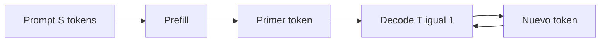
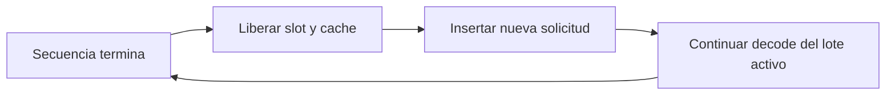

# Inferencia autoregresiva: prefill, decode, KV cache y batching

## Dos fases distintas

### Prefill

Procesa todos los tokens del prompt. Hay muchas consultas a la vez:

$$Q:(B,N,S,H).$$

Las multiplicaciones grandes aprovechan bien el paralelismo de GPU. Suele ser una fase intensiva en cómputo.

### Decode

Genera un token nuevo por secuencia y paso:

$$Q_{\text{nuevo}}:(B,N,1,H).$$

El modelo debe leer pesos y KV cache para producir pocos resultados. Suele estar más limitado por ancho de banda de memoria.



## El trabajo repetido sin cache

Al añadir un token, las claves y valores de los tokens anteriores no cambian en un Transformer causal. Recalcularlos sería desperdicio.

![[assets/06-kv-cache-generacion.gif|1000]]

## Qué guarda el KV cache

Por cada capa se almacenan:

$$K,V\in\mathbb R^{B\times K\times S\times H}.$$

Tamaño en elementos:

$$N_{\text{KV}}=2BKSLH.$$

Tamaño en bytes:

$$M_{\text{KV}}=2BKSLH\cdot \text{bytes(dtype)}.$$

El primer 2 corresponde a claves y valores.

### Ejemplo

Con:

$$B=1,\ S=8192,\ L=32,\ K=8,\ H=128,$$

y BF16, 2 bytes por elemento:

$$M_{\text{KV}}
=2(1)(8)(8192)(32)(128)(2)
=1\,073\,741\,824\ \text{bytes}
\approx1\ \text{GiB}.$$

Esto es solo el KV cache, no los pesos ni activaciones temporales.

> [!important] Corrección conceptual
> El KV cache estándar **sí crece linealmente con $S$**. Solo puede quedar acotado si el modelo usa una ventana fija y descarta posiciones antiguas, o aplica otra forma de compresión.

## Paso de decode con cache

En la posición $t$:

1. se calcula $q_t,k_t,v_t$ solo para el token nuevo;
2. $k_t,v_t$ se agregan al cache;
3. $q_t$ atiende a $K_{\le t},V_{\le t}$;
4. se obtiene el siguiente logit del vocabulario.

```python
k_cache[:, :, position, :] = k_new
v_cache[:, :, position, :] = v_new

k_used = k_cache[:, :, : position + 1, :]
v_used = v_cache[:, :, : position + 1, :]
output = attention(q_new, k_used, v_used)
```

## MHA, GQA y MQA en memoria

Si $D=NH$:

| Variante | Cabezas KV | Elementos por posición y capa |
|---|---:|---:|
| MHA | $N$ | $2NH=2D$ |
| GQA | $K$ | $2KH$ |
| MQA | $1$ | $2H$ |

GQA con $K=N/4$ reduce el cache aproximadamente a una cuarta parte frente a MHA.

## Latencia y throughput

- **latencia:** cuánto tarda una petición;
- **throughput:** cuántos tokens o solicitudes procesa el sistema por unidad de tiempo.

Optimizar uno puede perjudicar al otro. Esperar para formar un lote grande mejora utilización y throughput, pero añade tiempo de cola.

Métricas útiles:

- **TTFT:** time to first token, dominado por cola y prefill;
- **ITL/TPOT:** tiempo entre tokens, dominado por decode;
- tokens/s por solicitud;
- tokens/s agregados.

## Batching tradicional

Un lote fijo espera a que todas las secuencias terminen:

```text
solicitud A: ████████████████████
solicitud B: ███░░░░░░░░░░░░░░░░
solicitud C: ███████░░░░░░░░░░░░░
```

Las posiciones vacías representan GPU desaprovechada.

## Continuous batching

Cuando una secuencia termina, se inserta otra en su lugar. El conjunto activo cambia paso a paso y la GPU se mantiene ocupada.



## Selective batching

Puede mezclar trabajo de prefill y decode con límites para evitar que un prefill largo retrase demasiados tokens de decode. La planificación debe equilibrar:

- tamaño del lote;
- presupuesto de tokens;
- memoria del KV cache;
- latencia objetivo.

## Packing para entrenamiento o fine-tuning

Se concatenan ejemplos para llenar una secuencia física:

```text
[ejemplo A][EOS][ejemplo B][EOS][padding mínimo]
```

Una máscara por bloques impide contaminación entre ejemplos. Sin ella, A podría atender a B o viceversa.

Packing reduce padding, pero no significa que los ejemplos formen una sola conversación.

## Token-budget batching

En vez de limitar solo `batch_size`, se limita:

$$B\cdot S_{\max}\le T_{\text{presupuesto}}.$$

Agrupar longitudes similares evita que una secuencia larga obligue a rellenar muchas cortas.

## Ventana local

Si cada token atiende solo a los últimos $W$ tokens:

- cómputo total aproximado: $O(SW)$;
- KV cache por secuencia: $O(W)$ si se descarta lo anterior;
- se pierde acceso directo a contexto más antiguo salvo mecanismos globales o resumen.

## Errores frecuentes

- llamar “decode” a todo el forward del prompt;
- comparar tokens/s sin indicar batch, longitud, hardware y fase;
- reservar KV cache con $N$ cabezas cuando el modelo usa GQA con $K<N$;
- olvidar liberar o reciclar bloques del cache cuando una secuencia termina;
- confundir packing con concatenación semántica;
- pensar que KV cache evita el producto de la nueva consulta contra todas las claves conservadas.

---

Anterior: [[05 Entrenamiento de un LLM - objetivo, parámetros, FLOPs y memoria]] · Siguiente: [[07 Muestreo, temperatura, top-k, top-p y decodificación especulativa]]
