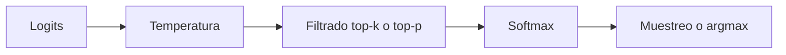
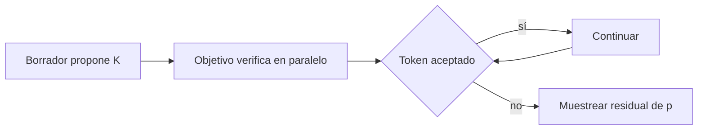

# Muestreo, temperatura, top-k, top-p y decodificación especulativa

## De logits a una decisión

El modelo produce una distribución. El algoritmo de decodificación decide cómo convertirla en token.



## Greedy decoding

$$x_{t+1}=\arg\max_i p_i.$$

Es determinista y barato. Elegir el token localmente más probable no garantiza la secuencia completa más probable ni la mejor respuesta.

## Temperatura

$$p_i(T)=\frac{e^{z_i/T}}{\sum_j e^{z_j/T}}.$$

![[assets/07-temperatura-sampling.svg|1000]]

- $T<1$: amplifica diferencias y concentra probabilidad;
- $T=1$: conserva la distribución original;
- $T>1$: reduce diferencias y aplana;
- $T\to0^+$: se aproxima a argmax, pero en código conviene tratar greedy de forma explícita.

> [!warning] Temperatura no añade conocimiento
> Solo redistribuye masa entre tokens ya puntuados por el modelo. Una temperatura baja puede hacer un error más consistente, no más verdadero.

## Top-k

Conserva solo los $k$ logits mayores y asigna $-\infty$ al resto.

Ejemplo, probabilidades ordenadas:

$$[0.42,0.25,0.14,0.10,0.09].$$

Con top-3 se conservan las tres primeras y se renormalizan:

$$[0.519,0.309,0.173,0,0].$$

Ventaja: límite fijo de candidatos. Desventaja: el mismo $k$ puede ser excesivo en una distribución fácil y insuficiente en una ambigua.

## Top-p o nucleus sampling

Ordena tokens por probabilidad y conserva el conjunto mínimo cuya probabilidad acumulada alcanza $p$.

Con la distribución anterior y $p=0.80$:

$$0.42+0.25+0.14=0.81,$$

por lo que se conservan tres tokens.

Top-p adapta el número de candidatos a la forma de la distribución.

> [!note] Detalle de implementación
> Normalmente se conserva también el primer token que cruza el umbral; de otro modo la masa retenida podría quedar estrictamente por debajo de $p$.

## Orden de operaciones

Una convención habitual:

1. dividir logits por temperatura;
2. aplicar top-k y/o top-p;
3. softmax;
4. muestrear.

Top-p depende de probabilidades; cambiar temperatura antes del filtrado puede cambiar qué tokens entran al núcleo.

## Ejemplo de código

```python
def sample(logits, temperature=1.0, top_k=None, top_p=None):
    if temperature <= 0:
        return logits.argmax(dim=-1, keepdim=True)

    logits = logits / temperature

    if top_k is not None:
        threshold = torch.topk(logits, top_k).values[..., -1, None]
        logits = logits.masked_fill(logits < threshold, float("-inf"))

    if top_p is not None:
        sorted_logits, sorted_idx = logits.sort(descending=True)
        sorted_probs = sorted_logits.softmax(dim=-1)
        remove = sorted_probs.cumsum(dim=-1) > top_p
        remove[..., 1:] = remove[..., :-1].clone()
        remove[..., 0] = False
        sorted_logits = sorted_logits.masked_fill(remove, float("-inf"))
        logits = torch.full_like(logits, float("-inf"))
        logits.scatter_(-1, sorted_idx, sorted_logits)

    return torch.multinomial(logits.softmax(dim=-1), 1)
```

## Repetición y contexto

Problemas de repetición no se resuelven siempre bajando temperatura. También pueden intervenir:

- distribución aprendida;
- prompt y contexto;
- penalizaciones de repetición;
- restricciones de longitud;
- bucles semánticos aunque los tokens no sean idénticos.

## Decodificación especulativa

Busca generar varios tokens por llamada al modelo grande sin cambiar su distribución final.

Se usan:

- modelo objetivo $p$, costoso y correcto;
- modelo borrador $q$, más rápido.

### Algoritmo conceptual

1. $q$ propone $K$ tokens autoregresivamente;
2. $p$ evalúa esos $K$ tokens en paralelo como un pequeño prefill;
3. cada token borrador $x$ se acepta con:

$$\alpha(x)=\min\left(1,\frac{p(x)}{q(x)}\right);$$

4. en el primer rechazo se muestrea de la distribución residual:

$$r(x)\propto\max(0,p(x)-q(x));$$

5. si todos se aceptan, se puede obtener un token adicional de $p$.



## Por qué conserva la distribución de $p$

La probabilidad de emitir $x$ por aceptación es:

$$q(x)\min\left(1,\frac{p(x)}{q(x)}\right)=\min(q(x),p(x)).$$

La contribución tras rechazo aporta:

$$\max(0,p(x)-q(x)).$$

Sumando:

$$\min(q(x),p(x))+\max(0,p(x)-q(x))=p(x).$$

Por eso el método es exacto respecto de la distribución objetivo si la aceptación y corrección se implementan bien.

## Cuándo acelera

Acelera si:

- el borrador es mucho más barato;
- coincide suficientemente con el objetivo y acepta varios tokens;
- verificar un bloque aprovecha mejor la GPU que varios pasos de decode;
- el overhead de coordinación es pequeño.

Puede no ayudar si $q$ discrepa mucho, $K$ está mal elegido o el sistema ya está saturado por otros cuellos.

## Errores frecuentes

- pensar que speculative decoding aproxima al modelo grande; el algoritmo correcto conserva su distribución;
- aceptar siempre los tokens del borrador y perder exactitud;
- usar $p/q$ sin proteger probabilidades cero;
- afirmar que top-p “elige los $p$ tokens”; $p$ es masa acumulada, no cantidad;
- usar temperatura 0 en una división;
- comparar creatividad solo por temperatura sin controlar semilla y filtros.

---

Anterior: [[06 Inferencia autoregresiva - prefill, decode, KV cache y batching]] · Siguiente: [[08 FlashAttention, estabilidad numérica y secuencias largas]]
