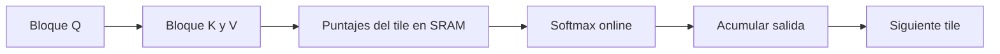

# FlashAttention, estabilidad numérica y secuencias largas

## Dos problemas distintos

1. **Estabilidad numérica:** evitar overflow, underflow y pérdida de precisión.
2. **Eficiencia de memoria:** evitar escribir y leer enormes matrices intermedias.

FlashAttention conecta ambos mediante softmax online por bloques.

## Softmax ingenuo

$$p_i=\frac{e^{x_i}}{\sum_j e^{x_j}}.$$

Si $x_i$ es grande, $e^{x_i}$ puede desbordar. Si todos son muy negativos, los exponenciales pueden redondear a cero.

## Restar el máximo

Softmax es invariante a una constante $c$:

$$\operatorname{softmax}(x)=\operatorname{softmax}(x-c).$$

Elige $c=m=\max_i x_i$:

$$p_i=\frac{e^{x_i-m}}{\sum_j e^{x_j-m}}.$$

Ahora todos los exponentes son $\le1$ y al menos uno vale 1.

## Log-sum-exp

$$\operatorname{LSE}(x)=\log\sum_i e^{x_i}.$$

Forma estable:

$$\operatorname{LSE}(x)=m+\log\sum_i e^{x_i-m}.$$

Entonces:

$$\log\operatorname{softmax}(x)_i=x_i-\operatorname{LSE}(x).$$

No se materializa una probabilidad diminuta antes de tomar el logaritmo.

## Softmax online

Al leer logits uno por uno o por bloques se mantienen:

- máximo parcial $m_k$;
- denominador reescalado $d_k$.

Al recibir $x_{k+1}$:

$$m_{k+1}=\max(m_k,x_{k+1}),$$

$$d_{k+1}=d_ke^{m_k-m_{k+1}}+e^{x_{k+1}-m_{k+1}}.$$

Si aparece un nuevo máximo, la contribución anterior se reescala al nuevo origen.

## Atención como cociente de sumas

Para una consulta fija, con $s_i=q^\top k_i/\sqrt H$:

$$o=\sum_i\frac{e^{s_i}}{\sum_j e^{s_j}}v_i
=\frac{\sum_i e^{s_i}v_i}{\sum_i e^{s_i}}.$$

Además de $m_k,d_k$, puede mantenerse un numerador vectorial:

$$u_k=\sum_{i=1}^{k}e^{s_i-m_k}v_i.$$

Al final:

$$o=\frac{u_S}{d_S}.$$

## El problema de IO en atención estándar

La implementación conceptual materializa:

$$A\in\mathbb R^{B\times N\times S\times S}.$$

Para $S=8192$, $N=32$, BF16 y $B=1$:

$$8192^2\cdot32\cdot2\ \text{bytes}\approx4\ \text{GiB}.$$

Esto es solo una matriz de atención. Además se escribe y lee varias veces entre HBM y el chip.

## HBM frente a SRAM

| Memoria | Capacidad | Velocidad | Uso |
|---|---|---|---|
| HBM | grande | menor ancho de banda relativo y mayor latencia | pesos, activaciones globales |
| SRAM/on-chip | pequeña | muy rápida | bloques activos y acumuladores |

El cuello no siempre es la cantidad de multiplicaciones; puede ser mover datos.

## Qué hace FlashAttention



Procesa tiles que caben en memoria rápida y conserva solo acumuladores necesarios. No escribe la matriz $S\times S$ completa en HBM.

Consecuencias:

- atención **exacta**, no aproximada;
- menos accesos HBM;
- mucha menos memoria auxiliar;
- mayor velocidad cuando IO era el cuello;
- el número de productos $QK^\top$ y $AV$ de atención densa sigue siendo $O(S^2D)$.

> [!important] Memoria no es cómputo
> Decir que FlashAttention usa memoria aproximadamente lineal no significa que la atención densa tenga tiempo lineal.

## PyTorch actual

```python
out = torch.nn.functional.scaled_dot_product_attention(
    q,
    k,
    v,
    dropout_p=dropout if training else 0.0,
    is_causal=True,
)
```

En CUDA, PyTorch intenta seleccionar un backend fusionado compatible. Si no puede, usa otra implementación. No asumas que el nombre de la función garantiza FlashAttention en todo hardware, dtype y forma.

## Estrategias para contexto largo

### Ventana deslizante

Cada token atiende a los últimos $W$:

$$O(SW).$$

Con $W$ fijo, también se puede acotar el KV cache.

### Atención dispersa

Combina patrones locales y conexiones globales seleccionadas. Reduce pares evaluados, pero modifica el patrón de comunicación.

### GQA/MQA

No reduce el número de consultas, pero sí el tamaño de claves/valores y del KV cache.

### Compresión o memoria resumida

Representa contexto antiguo en menos estados. Ahorra memoria a cambio de pérdida o transformación de información.

### Paralelismo de secuencia/contexto

Reparte posiciones entre dispositivos. No elimina el coste total, pero distribuye memoria y cómputo.

## Errores frecuentes

- calcular `log(softmax(x))` en dos pasos;
- restar la media en vez del máximo esperando la misma garantía;
- creer que FlashAttention es una atención aproximada;
- medir solo FLOPs e ignorar movimientos HBM↔SRAM;
- decir que “memoria $O(S)$” incluye todos los tensores del modelo;
- usar `is_causal=True` junto con una máscara incompatible sin comprobar la API.

## Prueba conceptual

Si el primer bloque tiene máximo 5 y denominador reescalado 1.4, y un bloque posterior introduce máximo 7, la contribución anterior se multiplica por:

$$e^{5-7}=e^{-2}.$$

No se descarta: se expresa respecto del nuevo máximo.

---

Anterior: [[07 Muestreo, temperatura, top-k, top-p y decodificación especulativa]] · Siguiente: [[09 Escalado, GPU, precisión y cuantización]]
