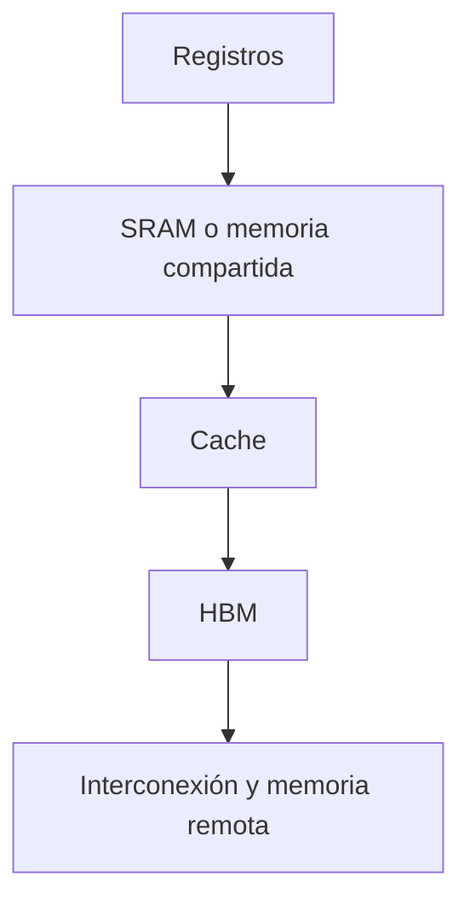

# Escalado, GPU, precisión y cuantización

## Escalar no es solo añadir parámetros

El rendimiento depende conjuntamente de:

- tamaño del modelo;
- cantidad y calidad de datos;
- cómputo de entrenamiento;
- receta de optimización;
- hardware y eficiencia del sistema.

Una scaling law es una relación empírica, no una ley física universal.

## Pérdida frente a cómputo

Una forma frecuente:

$$L(C)=L_\infty+\beta C^{-\alpha},$$

donde:

- $C$ es cómputo;
- $L_\infty$ es pérdida irreducible bajo el planteamiento;
- $\alpha>0$ controla la velocidad de mejora;
- $\beta$ ajusta escala.

Restando $L_\infty$ y aplicando log:

$$\log(L(C)-L_\infty)=\log\beta-\alpha\log C.$$

En escala log-log aparece aproximadamente una recta si el modelo describe bien el régimen medido.

> [!warning] Extrapolación
> Una recta ajustada en cierto rango puede romperse al cambiar datos, arquitectura, tokenizador, optimizador o cuello de sistema.

## Ajuste de tasa con escala

Puede modelarse:

$$\operatorname{LR}(C)=\beta C^{-\alpha}.$$

La idea de parametrizaciones como $\mu$P es diseñar inicializaciones y tasas por capa para que el comportamiento de las actualizaciones transfiera mejor entre anchuras.

## Jerarquía de memoria de GPU



Al bajar aumenta capacidad, pero también coste de acceso. Un kernel rápido reutiliza datos cerca de las unidades de cómputo.

## Compute-bound y memory-bound

- **compute-bound:** las unidades aritméticas están ocupadas; más ancho de banda no resuelve el límite principal;
- **memory-bound:** el procesador espera datos; reducir lecturas o aumentar intensidad aritmética puede ayudar.

Prefill suele usar matmuls grandes y puede aprovechar cómputo. Decode hace pocas operaciones por peso leído y suele ser memory-bound.

## Formatos numéricos

| Formato | Bytes | Exponente | Mantisa/precisión | Uso típico |
|---|---:|---|---|---|
| FP32 | 4 | amplio | alta | pesos maestros, reducciones sensibles |
| FP16 | 2 | menor rango que BF16 | más bits de fracción que BF16 | cómputo acelerado, puede necesitar loss scaling |
| BF16 | 2 | rango similar a FP32 | menor precisión de fracción | entrenamiento e inferencia estables en hardware compatible |
| INT8 | 1 | entero cuantizado | depende de escala | compresión y kernels cuantizados |
| INT4 | 0.5 | entero cuantizado | muy baja | gran compresión de pesos |

> [!important] Rango frente a precisión
> BF16 conserva un rango de exponentes amplio, pero cerca de 1 no puede representar incrementos tan pequeños como FP32. Por eso acumular una actualización pequeña sobre un peso grande puede requerir FP32.

## Corrección de API

```python
model.half()                         # FP16
model.bfloat16()                     # BF16
model.to(torch.bfloat16)             # BF16
```

`half()` no significa “cualquier formato de 16 bits”. En PyTorch es específicamente `float16`.

## Automatic Mixed Precision

```python
optimizer.zero_grad(set_to_none=True)

with torch.autocast(device_type="cuda", dtype=torch.bfloat16):
    logits = model(tokens)
    loss = loss_fn(logits, targets)

loss.backward()
optimizer.step()
```

Autocast decide dtype por operación. No convierte permanentemente todo el modelo. El backward se ejecuta fuera del contexto; las operaciones backward siguen los dtypes elegidos durante forward.

Con FP16 puede ser necesario escalar la pérdida para evitar underflow de gradientes. BF16 suele necesitarlo menos por su rango de exponente.

## Cuantización

Representa valores reales mediante enteros y escalas. Un esquema simple:

$$q=\operatorname{clip}\left(\operatorname{round}\frac{x}{s},q_{\min},q_{\max}\right),$$

$$\hat x=sq.$$

El error es:

$$e=x-\hat x.$$

### Decisiones del esquema

- escala por tensor, canal o grupo;
- simétrica o asimétrica;
- pesos solamente o pesos y activaciones;
- calibración estática o escalas dinámicas;
- entrenamiento consciente de cuantización o post-training quantization.

## Por qué activaciones son más difíciles

Las activaciones cambian con la entrada, pueden tener outliers y distribuciones distintas por token/capa. Los pesos son fijos durante inferencia y permiten calibración más controlada.

## Ahorro teórico de memoria de pesos

Para $P$ parámetros:

| Dtype de pesos | Memoria ideal |
|---|---:|
| FP32 | $4P$ bytes |
| BF16/FP16 | $2P$ bytes |
| INT8 | $P$ bytes |
| INT4 | $0.5P$ bytes |

La memoria real añade escalas, zero-points, buffers, cache y alineación.

## Precisión no equivale a kernel

Guardar pesos en INT8 no garantiza que toda la operación sea INT8. Es común descomprimir o acumular en mayor precisión. Para evaluar rendimiento pregunta:

1. ¿cómo se almacenan los pesos?
2. ¿en qué dtype entran las activaciones?
3. ¿en qué dtype se multiplica?
4. ¿en qué dtype se acumula?
5. ¿qué hardware soporta ese kernel?

## Memmap y carga de datos

Un archivo memory-mapped permite acceder por páginas sin cargarlo entero en RAM. Reduce picos de memoria, pero no elimina el coste de IO ni garantiza acceso eficiente si el patrón es aleatorio.

## Errores frecuentes

- afirmar que BF16 tiene “más precisión” que FP16 sin separar rango y mantisa;
- estimar memoria solo por los pesos;
- cuantizar sin medir degradación por capa o tarea;
- asumir que menor dtype siempre acelera en cualquier hardware;
- mezclar `autocast` con conversiones manuales indiscriminadas;
- extrapolar una scaling law fuera del régimen observado.

---

Anterior: [[08 FlashAttention, estabilidad numérica y secuencias largas]] · Siguiente: [[10 RNN, LSTM, SSM y Transformer - comparación]]
