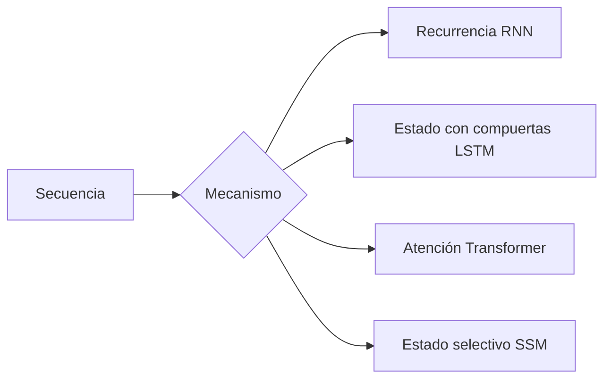
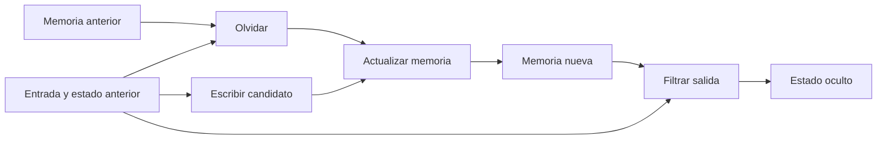

# RNN, LSTM, SSM y Transformer: comparación

## La pregunta común

Todos intentan representar una secuencia. Difieren en cómo transportan información entre posiciones y cuánto paralelismo permiten.

## RNN básica

En cada paso:

$$h_t=\tanh(W_xx_t+W_hh_{t-1}+b),$$

$$y_t=W_oh_t+b_o.$$

Los mismos pesos se reutilizan en el tiempo.

### Qué representa $h_t$

$h_t$ debe servir simultáneamente como:

- resumen del pasado;
- entrada recurrente del paso siguiente;
- representación para producir la salida actual.

Esta carga múltiple limita la memoria a largo plazo.

## Gradiente a través del tiempo

Sea $z_t=W_xx_t+W_hh_{t-1}+b$. Entonces:

$$\frac{\partial h_t}{\partial h_{t-1}}
=\operatorname{diag}(\tanh'(z_t))W_h.$$

Para conectar $t$ con $t-k$ se multiplican muchos Jacobianos:

$$\frac{\partial h_t}{\partial h_{t-k}}
=\prod_{r=t-k+1}^{t}\frac{\partial h_r}{\partial h_{r-1}}.$$

Si sus normas son menores que 1, el gradiente desaparece; si son mayores, puede explotar.

> [!important] Distancia de ruta
> En una RNN, conectar dos tokens separados por $k$ pasos exige atravesar $k$ transiciones. En atención densa, una capa ofrece una ruta directa entre posiciones permitidas.

## LSTM

LSTM separa **memoria** $c_t$ de **salida de trabajo** $h_t$.

### Compuerta de olvido

$$f_t=\sigma(W_f[h_{t-1},x_t]+b_f).$$

Decide qué parte de $c_{t-1}$ conservar.

### Escritura

$$i_t=\sigma(W_i[h_{t-1},x_t]+b_i),$$

$$\tilde c_t=\tanh(W_c[h_{t-1},x_t]+b_c).$$

### Actualización de memoria

$$c_t=f_t\odot c_{t-1}+i_t\odot\tilde c_t.$$

### Lectura

$$o_t=\sigma(W_o[h_{t-1},x_t]+b_o),$$

$$h_t=o_t\odot\tanh(c_t).$$

Si $f_t\approx1$, la memoria puede transportar gradiente mediante una ruta principalmente aditiva y elemento a elemento.

## GRU

Una GRU simplifica la idea con compuertas de actualización y reinicio. Tiene menos estados y parámetros que LSTM, pero conserva el principio: controlar qué recordar y qué reemplazar.

## Transformer

Cada posición puede consultar directamente otras posiciones permitidas:

$$O=\operatorname{softmax}\left(\frac{QK^\top}{\sqrt H}+M\right)V.$$

Ventajas:

- procesamiento paralelo de posiciones durante entrenamiento;
- ruta corta entre tokens lejanos;
- gran capacidad para combinar contexto.

Costes:

- atención densa cuadrática en longitud;
- KV cache creciente durante generación;
- decode sigue siendo secuencial entre tokens generados.

> [!warning] “Transformer es paralelo” tiene un alcance
> El forward de una secuencia conocida puede paralelizar posiciones. La generación autoregresiva no puede producir el token $t+1$ antes de conocer el token $t$.

## State Space Models

Un sistema de estado discreto básico:

$$x_k=Ax_{k-1}+Bu_k,$$

$$y_k=Cx_k+Du_k.$$

$u_k$ es entrada, $x_k$ memoria latente y $y_k$ salida.

Algunas formulaciones permiten calcular la secuencia mediante una recurrencia durante inferencia y mediante algoritmos paralelos o convolucionales durante entrenamiento.

## Selectividad

En modelos selectivos como Mamba, parámetros de escritura, lectura o escala temporal dependen de la entrada:

$$B_k=f_B(u_k),\qquad C_k=f_C(u_k),\qquad \Delta_k=f_\Delta(u_k).$$

Intuición:

- $B_k$: qué incorporar al estado;
- $C_k$: qué leer del estado;
- $\Delta_k$: a qué escala temporal actualizar.

No es atención: no construye una matriz explícita de compatibilidad entre cada par de tokens.

## Comparación

| Propiedad | RNN | LSTM/GRU | Transformer denso | SSM selectivo |
|---|---|---|---|---|
| entrenamiento por posición | secuencial | secuencial | paralelo | paralelizable según formulación |
| coste con longitud | $O(S)$ | $O(S)$ | atención $O(S^2)$ | típicamente $O(S)$ |
| estado de decode | fijo | fijo | KV cache $O(S)$ | estado fijo |
| ruta entre tokens lejanos | larga | larga pero protegida | directa | mediada por estado |
| contenido recuperable | comprimido en estado | comprimido con compuertas | valores por posición en cache | comprimido en estado selectivo |

## Ejemplo mental

Frase:

> “El libro que dejé sobre la mesa, junto a las llaves y el vaso, **era** rojo.”

- RNN/LSTM transporta información sobre “libro” a través de cada paso;
- Transformer permite que “era” atienda directamente a “libro”;
- SSM mantiene una representación selectiva del sujeto en el estado.

## Errores frecuentes

- decir que RNN no puede representar dependencias largas; puede, pero aprenderlas y conservarlas es difícil;
- decir que LSTM elimina completamente vanishing gradients;
- afirmar que Transformer tiene coste $O(1)$; la longitud de ruta es corta, no el cómputo total;
- confundir estado constante de SSM con memoria ilimitada exacta;
- comparar complejidades sin separar entrenamiento y decode.

---

Anterior: [[09 Escalado, GPU, precisión y cuantización]] · Siguiente: [[11 Post-entrenamiento - SFT, RLHF, PPO, GRPO y DPO]]
