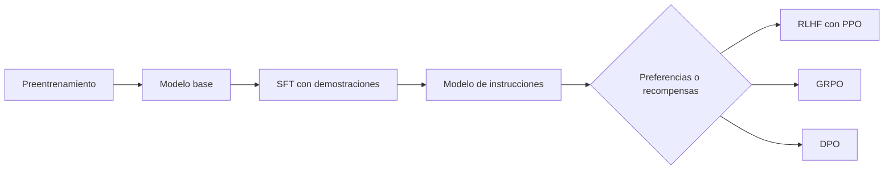

# Post-entrenamiento: SFT, RLHF, PPO, GRPO y DPO

## Por qué existe

El preentrenamiento enseña a predecir texto. No especifica por sí solo que el modelo deba seguir instrucciones, priorizar ayuda, evitar conductas no deseadas o adoptar un formato.

## SFT

Supervised fine-tuning usa pares $(x,y)$ de prompt y respuesta demostrada:

$$L_{\mathrm{SFT}}=-\sum_t\log\pi_\theta(y_t\mid x,y_{<t}).$$

Es el mismo objetivo next-token, pero la distribución de datos y la máscara de pérdida se orientan a comportamiento instructivo.

Puede enmascararse la parte del prompt y entrenar solo sobre tokens de respuesta.

## El LLM como política

| RL | Modelo de lenguaje |
|---|---|
| estado $s_t$ | prompt y prefijo generado |
| acción $a_t$ | token siguiente |
| política $\pi_\theta(a_t\mid s_t)$ | softmax del LLM |
| trayectoria $\tau$ | respuesta completa |
| recompensa $R(\tau)$ | puntuación de calidad |

Objetivo:

$$J(\theta)=\mathbb E_{\tau\sim\pi_\theta}[R(\tau)].$$

## REINFORCE o policy gradient

Usando $\nabla P=P\nabla\log P$:

$$\nabla_\theta J(\theta)
=\mathbb E_{\tau\sim\pi_\theta}
\left[R(\tau)\nabla_\theta\log P_\theta(\tau)\right].$$

Como:

$$\log P_\theta(\tau)=\sum_t\log\pi_\theta(a_t\mid s_t),$$

se obtiene:

$$\nabla_\theta J(\theta)=
\mathbb E\left[
\sum_t\nabla_\theta\log\pi_\theta(a_t\mid s_t)R(\tau)
\right].$$

Recompensa positiva incrementa la probabilidad de acciones muestreadas; negativa la reduce.

> [!important] La “policy loss” es un dispositivo de gradiente
> Su valor aislado no siempre mide la calidad de la política. Se construye con muestras, recompensas y a veces términos tratados como constantes.

## Baseline y ventaja

REINFORCE tiene alta varianza. Se resta una referencia $b(s_t)$:

$$\nabla J=
\mathbb E\left[
\sum_t\nabla\log\pi_\theta(a_t\mid s_t)
(R(\tau)-b(s_t))
\right].$$

No introduce sesgo si $b$ depende del estado, no de la acción actual, porque:

$$\mathbb E_{a\sim\pi}[\nabla\log\pi(a\mid s)b(s)]
=b(s)\nabla\sum_a\pi(a\mid s)
=b(s)\nabla1=0.$$

Si $b(s)=V(s)$, el término:

$$A_t\approx R(\tau)-V(s_t)$$

estima la ventaja: cuánto mejor fue la acción que lo esperado desde ese estado.

## On-policy y off-policy

- **on-policy:** los rollouts vienen de la política que se actualiza;
- **off-policy:** vienen de otra política, a menudo una copia anterior $\pi_{\mathrm{old}}$.

Para corregir parcialmente el cambio se usa el ratio:

$$r_t(\theta)=
\frac{\pi_\theta(a_t\mid s_t)}
{\pi_{\mathrm{old}}(a_t\mid s_t)}.$$

## PPO

Objetivo recortado:

$$J_{\mathrm{clip}}=
\mathbb E\left[
\min\left(
r_tA_t,
\operatorname{clip}(r_t,1-\epsilon,1+\epsilon)A_t
\right)
\right].$$

El `min` implementa una cota pesimista.

### Cuatro casos

| Ventaja | Ratio | Qué ocurre |
|---:|---:|---|
| $A_t>0$ | $r_t>1+\epsilon$ | deja de premiar un aumento excesivo |
| $A_t<0$ | $r_t<1-\epsilon$ | deja de premiar una reducción excesiva |
| $A_t<0$ | $r_t>1+\epsilon$ | permite corregir: la acción mala subió |
| $A_t>0$ | $r_t<1-\epsilon$ | permite corregir: la acción buena bajó |

El clipping no fuerza siempre $r_t$ dentro del intervalo; elimina incentivo cuando el cambio ya avanzó demasiado en la dirección favorecida.

## Modelo de recompensa en RLHF

Con un prompt $x$, una respuesta preferida $y_w$ y una rechazada $y_l$, Bradley–Terry modela:

$$P(y_w\succ y_l\mid x)
=\sigma(R_\phi(x,y_w)-R_\phi(x,y_l)).$$

La pérdida es:

$$L_{\mathrm{RM}}=-\log\sigma(R_w-R_l).$$

Solo importan diferencias de recompensa; sumar una constante a ambas no cambia la preferencia.

## Regularización KL en RLHF

Para evitar alejamiento excesivo de un modelo de referencia:

$$J_{\mathrm{RLHF}}=
\mathbb E_{\tau\sim\pi_\theta}
\left[R(\tau)-\beta D_{\mathrm{KL}}
(\pi_\theta\Vert\pi_{\mathrm{ref}})\right].$$

En implementaciones de secuencia suele estimarse por token mediante diferencias de log-probabilidades.

Intuición de $\beta$:

- grande: comportamiento más cercano a referencia;
- pequeño: mayor libertad para perseguir recompensa, con más riesgo de reward hacking o degradación.

## GRPO

Para un mismo prompt se muestrean $G$ respuestas con recompensas $r^{(1)},\dots,r^{(G)}$.

Una ventaja grupal típica:

$$A^{(i)}=
\frac{r^{(i)}-\operatorname{mean}(r)}
{\operatorname{std}(r)+\epsilon}.$$

Luego se combina con ratios y clipping estilo PPO. La misma ventaja de respuesta puede aplicarse a todos sus tokens.

### Ejemplo

Recompensas:

$$[0,1,1,2].$$

Media $=1$. Antes de dividir por desviación:

$$r-\bar r=[-1,0,0,1].$$

La respuesta 4 se refuerza, la 1 se reduce y las centrales sirven como referencia.

### Compromiso

- evita un crítico aprendido;
- usa más completions por prompt;
- ahorra memoria de la red de valor;
- la normalización por desviación puede amplificar grupos casi constantes;
- la normalización por longitud puede introducir sesgos hacia respuestas cortas o largas según el signo de la recompensa.

## DPO

DPO aprende de pares preferido/rechazado sin entrenar explícitamente un modelo de recompensa ni ejecutar un bucle PPO.

Define la diferencia relativa:

$$\Delta_\theta=
\log\pi_\theta(y_w\mid x)-\log\pi_\theta(y_l\mid x),$$

$$\Delta_{\mathrm{ref}}=
\log\pi_{\mathrm{ref}}(y_w\mid x)-\log\pi_{\mathrm{ref}}(y_l\mid x).$$

Pérdida:

$$L_{\mathrm{DPO}}=
-\mathbb E\left[
\log\sigma\left(\beta(\Delta_\theta-\Delta_{\mathrm{ref}})\right)
\right].$$

El modelo debe preferir $y_w$ más que la referencia, no solo asignarle probabilidad alta de manera absoluta.

## Comparación práctica

| Método | Datos | Critic/RM durante política | Rollouts online | Idea principal |
|---|---|---|---|---|
| SFT | demostraciones | no | no | imitar respuestas |
| PPO-RLHF | preferencias → RM | critic y RM | sí | maximizar recompensa con límites |
| GRPO | recompensas por grupos | RM/verificador; sin critic | sí | ventaja relativa del grupo |
| DPO | pares preferido/rechazado | referencia; sin RM explícito | no | clasificación directa de preferencias |

## Riesgos de razonamiento

- la recompensa es un proxy, no el objetivo humano completo;
- las preferencias pueden ser ruidosas o sesgadas;
- optimizar demasiado un proxy produce reward hacking;
- una mejora en el reward model no garantiza mejora humana;
- el modelo de referencia determina qué desviaciones son costosas;
- la evaluación debe separar utilidad, seguridad, estilo y robustez.

## Errores frecuentes

- llamar RLHF a cualquier fine-tuning con preferencias;
- decir que PPO “recorta la política”; recorta el incentivo del objetivo en casos concretos;
- usar un baseline dependiente de la acción y asumir que sigue siendo insesgado;
- confundir recompensa de una respuesta con ventaja por token;
- afirmar que DPO no tiene regularización; la referencia aparece dentro de la pérdida;
- comparar GRPO y PPO ignorando coste de rollouts, crítico y memoria.

---

Anterior: [[10 RNN, LSTM, SSM y Transformer - comparación]] · Siguiente: [[12 Paralelismo - datos, tensor, pipeline, secuencia y expertos]]
