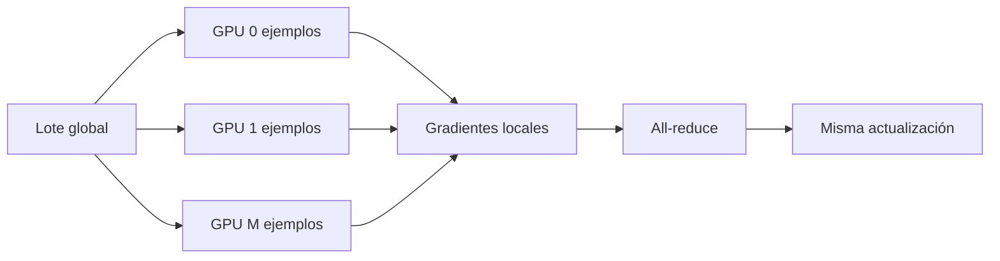
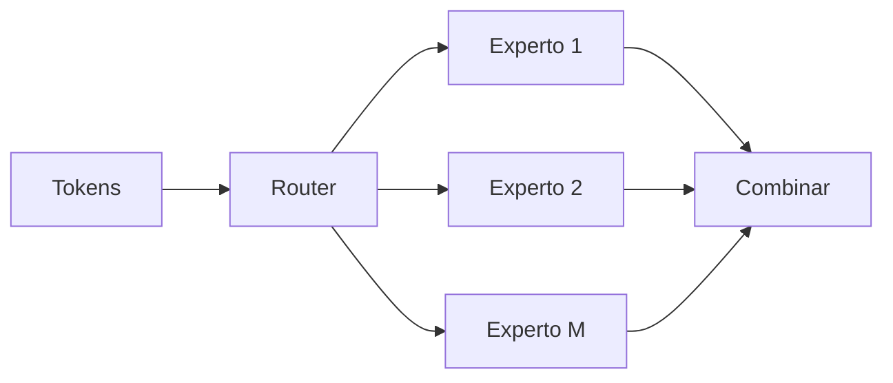

# Paralelismo: datos, tensor, pipeline, secuencia y expertos

## Dos razones para repartir

1. **Capacidad:** el modelo, activaciones o KV cache no caben en un dispositivo.
2. **Throughput:** el trabajo cabe, pero se desea terminar antes.

Una estrategia puede resolver una razón y no la otra.

## Colectivas fundamentales

Supón cuatro GPU con fragmentos $A,B,C,D$.

### Broadcast

Una GPU posee $X$ y todas reciben una copia.

```text
GPU0: X  →  GPU0:X GPU1:X GPU2:X GPU3:X
```

### All-gather

Cada GPU posee un fragmento y todas reciben la colección completa.

```text
antes:  GPU0:A GPU1:B GPU2:C GPU3:D
después cada GPU: [A B C D]
```

### Reduce-scatter

Cada GPU posee contribuciones para todos los fragmentos. Se suman y cada GPU conserva una parte del resultado.

### All-reduce

Cada GPU aporta un tensor, se reducen —por ejemplo mediante suma— y todas reciben el resultado completo.

![[assets/12-ring-allreduce.gif|1000]]

Conceptualmente, un ring all-reduce combina reduce-scatter y all-gather. En la práctica, coste y algoritmo dependen de topología, tamaño de mensaje, latencia y biblioteca.

> [!warning] Matiz de coste
> Para mensajes grandes domina el término de ancho de banda y puede aproximarse como casi independiente del número de GPU en ciertos anillos. La latencia y el factor $(M-1)/M$ sí dependen de $M$.

## Data parallelism

Cada GPU mantiene el modelo completo y procesa un micro-batch distinto.



Ventaja: escala throughput cuando el modelo cabe. Límite: cada GPU aún almacena modelo y estados completos en DDP tradicional.

## ZeRO y FSDP

| Etapa conceptual | Qué se fragmenta |
|---|---|
| ZeRO-1 | estado del optimizador |
| ZeRO-2 | estado + gradientes |
| ZeRO-3 / FSDP completo | estado + gradientes + parámetros |

En sharding completo, una capa suele:

1. hacer all-gather de parámetros justo antes de usarlos;
2. ejecutar forward/backward local;
3. liberar copias no necesarias;
4. aplicar reduce-scatter a gradientes.

Permite entrenar modelos cuyos estados completos no caben en una GPU, pero añade comunicación y complejidad.

> [!note] Activaciones
> Fragmentar parámetros no reduce automáticamente todas las activaciones. Puede combinarse con checkpointing, sequence parallelism o micro-batches más pequeños.

## Pipeline parallelism

Reparte **capas o etapas**:

```text
GPU0: capas 0–7 → GPU1: 8–15 → GPU2: 16–23 → GPU3: 24–31
```

Un lote se divide en micro-batches para superponer etapas:

```text
tiempo →
GPU0: m1 m2 m3 m4
GPU1:    m1 m2 m3 m4
GPU2:       m1 m2 m3 m4
```

Los huecos de inicio y final son la **burbuja de pipeline**. Más micro-batches reducen su proporción, pero aumentan planificación y memoria de activaciones en vuelo.

## Tensor parallelism

Reparte operaciones **dentro de una capa**.

### MLP column-parallel → row-parallel

Primera proyección por columnas:

$$W_{\text{up}}=[W_0\ W_1],$$

$$h=[xW_0\ xW_1].$$

Cada GPU produce parte de las características intermedias y aplica activación localmente.

Segunda proyección por filas:

$$W_{\text{down}}=
\begin{bmatrix}U_0\\U_1\end{bmatrix},$$

$$y=h_0U_0+h_1U_1.$$

Cada GPU calcula un sumando y un all-reduce produce $y$.

### Atención por cabezas

Cada GPU procesa un subconjunto de cabezas. QKV se proyecta column-parallel, la atención local no necesita comunicación entre cabezas y la proyección de salida combina mediante una reducción.

## Sequence parallelism

Reparte posiciones del eje $S$. Ayuda con activaciones que crecen como $BS D$ y con contextos largos. Algunas operaciones son locales; otras necesitan intercambiar fragmentos porque la atención conecta posiciones.

## Expert parallelism

En Mixture of Experts, cada token se enruta a uno o pocos expertos:



Si expertos viven en GPU distintas, suele requerirse all-to-all. Un enrutamiento desequilibrado puede dejar unas GPU saturadas y otras ociosas.

## Qué dimensión resuelve cada técnica

| Técnica | Reparte | Principal beneficio | Principal coste |
|---|---|---|---|
| DP | batch | throughput | sincronizar gradientes |
| FSDP | estados del modelo | memoria de parámetros/optimizador | all-gather por capas |
| PP | capas | modelo profundo no cabe | burbujas y activaciones entre etapas |
| TP | canales/cabezas | matrices anchas no caben | colectivas dentro del forward |
| SP/CP | secuencia/contexto | activaciones/contexto largo | intercambio entre posiciones |
| EP | expertos | capacidad MoE | all-to-all y balance de carga |

## Combinación multidimensional

Un sistema grande puede usar simultáneamente:

$$M=M_{DP}M_{TP}M_{PP}M_{SP}M_{EP}.$$

Ejemplo con 64 GPU:

$$M_{DP}=4,\quad M_{TP}=4,\quad M_{PP}=4,$$

$$4\cdot4\cdot4=64.$$

La elección depende de topología: TP comunica frecuentemente y suele mantenerse dentro de enlaces rápidos; DP puede cruzar grupos más lejanos.

## Strong y weak scaling

- **strong scaling:** mismo problema total, más dispositivos; se desea reducir tiempo proporcionalmente;
- **weak scaling:** crece problema y dispositivos manteniendo trabajo por dispositivo aproximadamente constante.

La eficiencia cae cuando comunicación, burbujas o desequilibrio crecen respecto del cómputo útil.

## Corrección terminológica

> [!important]
> **Pipeline parallelism reparte capas/etapas. Tensor parallelism reparte matrices, canales o cabezas dentro de una capa.** Si aparecen intercambiados, usa esta definición.

## Errores frecuentes

- creer que más GPU siempre reduce tiempo linealmente;
- llamar TP a repartir capas;
- afirmar que FSDP elimina memoria de activaciones;
- aumentar DP hasta superar un batch crítico sin considerar optimización;
- ignorar latencia en mensajes pequeños;
- combinar grados cuyo producto no coincide con el número de dispositivos;
- olvidar balance de expertos.

---

Anterior: [[11 Post-entrenamiento - SFT, RLHF, PPO, GRPO y DPO]] · Siguiente: [[13 Multimodalidad - ViT, CLIP y LLaVA]]
