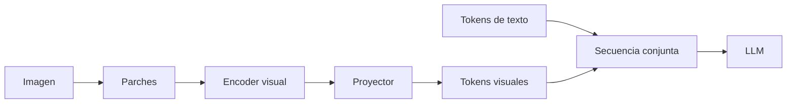
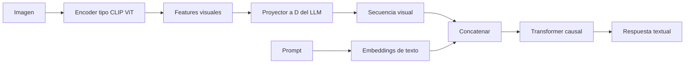

# Multimodalidad: ViT, CLIP y LLaVA

## La idea unificadora

Un Transformer procesa secuencias de vectores. Para incorporar una imagen hay que convertir regiones visuales en vectores compatibles con el espacio de entrada del modelo de lenguaje.



## Vision Transformer

Para una imagen $H_i\times W_i\times C$ y parches $P\times P$:

$$N_p=\frac{H_i}{P}\frac{W_i}{P}.$$

Cada parche se aplana a:

$$x_p\in\mathbb R^{P^2C}$$

y se proyecta a dimensión visual $D_v$.

### Ejemplo de formas

Imagen RGB $224\times224$, parche $14\times14$:

$$16\times16=256\ \text{parches},$$

$$14\cdot14\cdot3=588\ \text{valores por parche}.$$

```text
imagen             (224, 224, 3)
parches            (256, 588)
proyección          (256, Dv)
encoder visual      (256, Dv)
```

Los tamaños son ilustrativos y dependen del encoder.

## Posición visual

Sin posición, el modelo no sabría si un parche está arriba, abajo, a la izquierda o derecha.

Opciones:

- embeddings absolutos aprendidos;
- interpolación para nuevas resoluciones;
- codificación 2D relativa;
- RoPE 2D sobre coordenadas fila/columna.

RoPE 2D genera ángulos a partir de coordenadas y evita depender de una tabla de tamaño fijo, pero la implementación y extrapolación requieren cuidado.

## CLIP

CLIP entrena un encoder de imagen y uno de texto para que pares correctos queden cerca.

Para un lote de $B$ pares:

$$I\in\mathbb R^{B\times D_c},\qquad T\in\mathbb R^{B\times D_c}.$$

Se normalizan y se calcula una matriz de similitudes:

$$S=IT^\top/\tau\in\mathbb R^{B\times B}.$$

La diagonal contiene pares correctos; las otras celdas actúan como negativos del lote.

```text
                 textos
              t1  t2  t3
imagen i1      ✓   ×   ×
imagen i2      ×   ✓   ×
imagen i3      ×   ×   ✓
```

La pérdida contrastiva empuja la diagonal hacia arriba en ambas direcciones: imagen→texto y texto→imagen.

> [!important] Embedding compartido no significa lenguaje generado
> CLIP alinea representaciones para similitud. No es por sí solo un generador autoregresivo de texto.

## Puente hacia un LLM

El encoder visual produce:

$$X_v\in\mathbb R^{B\times N_p\times D_v}.$$

Un proyector aprende:

$$W_p\in\mathbb R^{D_v\times D},$$

$$Z_v=X_vW_p\in\mathbb R^{B\times N_p\times D}.$$

Ahora $Z_v$ tiene la misma dimensión oculta $D$ que los embeddings de texto y puede concatenarse:

$$Z=[Z_v;X_{\text{text}}]\in\mathbb R^{B\times(N_p+S)\times D}.$$

## LLaVA como patrón arquitectónico



El LLM puede atender a los tokens visuales como contexto. La máscara debe permitir el patrón deseado: normalmente el texto generado ve la imagen y el prefijo anterior.

## Resolución dinámica

Una imagen de alta resolución puede:

1. reducirse y perder detalle;
2. dividirse en crops o tiles;
3. codificar cada región;
4. concatenar tokens visuales y metadatos de posición.

Más tiles preservan detalle, pero aumentan longitud, memoria y coste de atención.

## Comprensión frente a generación de imágenes

Dos paradigmas frecuentes:

- **comprensión:** encoder visual → tokens visuales → LLM;
- **generación:** modelo condicionado que produce una representación visual, a menudo mediante difusión u otro decodificador.

Un LLM que describe imágenes no implica que genere píxeles con el mismo bloque de salida de vocabulario.

## Ejemplo de presupuesto de tokens visuales

Si una imagen produce 576 tokens visuales y el prompt usa 200 tokens:

$$S_{\text{entrada}}=576+200=776.$$

Antes de generar una sola palabra, el prefill ya procesa 776 posiciones. Con cuatro crops similares, el coste y el KV cache crecen sustancialmente.

## Errores frecuentes

- tratar cada píxel como un token sin considerar coste;
- confundir dimensión del parche $P^2C$ con dimensión proyectada $D_v$;
- concatenar features visuales de dimensión $D_v$ con texto de dimensión $D$ sin proyector;
- asumir que CLIP genera texto;
- usar posiciones 1D sin decidir cómo representar filas y columnas;
- citar dimensiones de una variante de LLaVA como si fueran universales.

---

Anterior: [[12 Paralelismo - datos, tensor, pipeline, secuencia y expertos]] · Siguiente: [[14 Laboratorio - mini Transformer causal en PyTorch]]
