# Resumen, mapa mental y autoevaluación

## Mapa mental final

```mermaid
flowchart TD
    A[LLM causal] --> B[Representación]
    A --> C[Arquitectura]
    A --> D[Entrenamiento]
    A --> E[Inferencia]
    A --> F[Post-entrenamiento]
    A --> G[Sistemas]
    A --> H[Discretización y memoria formal]
    B --> B1[Tokens y embeddings]
    B --> B2[Logits y softmax]
    C --> C1[Atención Q K V]
    C --> C2[RMSNorm y residual]
    C --> C3[SwiGLU y RoPE]
    D --> D1[CE next-token]
    D --> D2[Backward y Adam]
    D --> D3[Parámetros FLOPs memoria]
    E --> E1[Prefill]
    E --> E2[Decode y KV cache]
    E --> E3[Muestreo]
    F --> F1[SFT]
    F --> F2[PPO RLHF GRPO DPO]
    G --> G1[FlashAttention]
    G --> G2[Precisión y cuantización]
    G --> G3[DP TP PP SP EP]
    H --> H1[Gumbel-Softmax y STE]
    H --> H2[DFA PDA y redes secuenciales]
```

## La historia en doce frases

1. El tokenizador convierte texto en IDs discretos.
2. El embedding convierte cada ID en un vector de dimensión $D$.
3. La atención calcula qué valores mezclar para cada consulta.
4. La máscara causal impide leer el futuro.
5. Varias cabezas trabajan en subespacios de dimensión $H$.
6. RMSNorm controla escala, residual conserva rutas y SwiGLU transforma características.
7. RoPE rota $Q,K$ para introducir relaciones posicionales.
8. La salida produce $V$ logits y softmax una distribución.
9. El preentrenamiento minimiza CE del siguiente token.
10. Prefill procesa el prompt; decode genera paso a paso y reutiliza KV cache.
11. Post-entrenamiento orienta comportamiento con demostraciones, preferencias o recompensas.
12. Los sistemas combinan kernels, precisión y paralelismo para que el modelo quepa y sea útil.

## Formulario razonado

### Predicción

$$p_\theta(x_{t+1}\mid x_{\le t})=\operatorname{softmax}(z_t).$$

### Pérdida

$$L=-\sum_t\log p_\theta(x_{t+1}\mid x_{\le t}).$$

### Atención

$$\operatorname{Attn}(Q,K,V)=
\operatorname{softmax}\left(\frac{QK^\top}{\sqrt H}+M\right)V.$$

### RMSNorm

$$\operatorname{RMSNorm}(x)=
\gamma\odot\frac{x}{\sqrt{D^{-1}\sum_i x_i^2+\epsilon}}.$$

### SwiGLU

$$\operatorname{SwiGLU}(x)=
\left(\operatorname{SiLU}(xW_g)\odot xW_u\right)W_d.$$

### RoPE relativo

$$\langle R_mq,R_nk\rangle=q^\top R_{n-m}k.$$

### KV cache

$$M_{\mathrm{KV}}=2BKSLH\cdot\text{bytes(dtype)}.$$

### Policy gradient

$$\nabla J=\mathbb E\left[
\sum_t\nabla\log\pi_\theta(a_t\mid s_t)A_t
\right].$$

## Tabla de escalamiento

| Cantidad | Dependencia principal |
|---|---|
| parámetros densos por capa | $O(D^2)$ |
| activaciones base | $O(BSLD)$ |
| matriz de atención ingenua | $O(BNS^2)$ |
| FLOPs atención densa | $O(BS^2D)$ además de proyecciones |
| KV cache | $O(BSKHL)$ |
| FFN | $O(BSDFL)$ |
| decode autoregresivo | secuencial en tokens generados |

## Distinciones que no deben mezclarse

| A | B | Diferencia |
|---|---|---|
| logit | probabilidad | antes y después de softmax |
| atención | explicación causal | peso de mezcla frente a atribución causal |
| prefill | decode | muchas posiciones frente a una nueva |
| parámetros | activaciones | persistentes frente a dependientes del lote |
| memoria lineal | cómputo lineal | FlashAttention reduce memoria auxiliar, no pares densos |
| GQA | ventana local | comparte cabezas KV frente a limitar posiciones |
| SFT | RL | imitación supervisada frente a optimización por recompensa |
| PPO | RLHF | algoritmo de optimización frente a pipeline con preferencias humanas |
| PP | TP | capas frente a fragmentos dentro de la capa |
| BF16 | FP16 | mismo tamaño, distinto rango y precisión |

## Preguntas de autoevaluación

Intenta responder primero sin abrir los bloques. Haz clic en cada pregunta para comparar tu modelo mental con la explicación.

> [!question]- 1. ¿Por qué un token ID no tiene significado ordinal?
> **Respuesta corta:** porque es una etiqueta categórica que selecciona una fila de la matriz de embeddings.
>
> El ID `900` no significa “más” que el ID `12`, y que dos IDs sean consecutivos no implica que sus tokens sean parecidos. El tokenizador podría renumerar el vocabulario sin cambiar el modelo, siempre que se permutaran de la misma forma las filas del embedding y las columnas de salida correspondientes.
>
> La geometría empieza **después** del lookup: son los vectores aprendidos, no los números de los IDs, los que pueden tener distancias, direcciones o similitudes.
>
> **Profundiza en:** [[01 Del texto a probabilidades - embeddings, logits, softmax y entropía#De caracteres a token IDs|token IDs]] y [[01 Del texto a probabilidades - embeddings, logits, softmax y entropía#Lookup de embeddings|lookup de embeddings]].

> [!question]- 2. ¿Qué ejes posee $(B,S,D)$?
> **Respuesta corta:** lote, posición y característica.
>
> $B$ separa secuencias que normalmente no deben interactuar; $S$ enumera las posiciones de cada secuencia; $D$ contiene las características del estado oculto de cada posición. Una capa lineal transforma el último eje, por ejemplo $(B,S,D)@(D,F)\to(B,S,F)$, sin mezclar posiciones. La atención, en cambio, crea explícitamente una interacción entre posiciones.
>
> Nombrar los ejes evita errores que una comprobación de tamaños no detecta: dos tensores pueden tener el mismo tamaño numérico y representar cosas incompatibles.
>
> **Profundiza en:** [[02 Transformer causal - arquitectura completa y formas#Libro mayor de formas|libro mayor de formas]].

> [!question]- 3. ¿Por qué $QK^\top$ produce un eje de consultas y otro de claves?
> **Respuesta corta:** porque solo se contrae la dimensión interna de cada cabeza.
>
> Por cabeza, $Q$ tiene forma $(T,H)$ y $K^\top$ forma $(H,S)$. La multiplicación suma sobre $H$ y conserva $T$ y $S$, por lo que el resultado es $(T,S)$. En el tensor completo:
>
> $$
> (B,N,T,H)@(B,N,H,S)\to(B,N,T,S).
> $$
>
> Cada celda $(t,s)$ mide la compatibilidad de la consulta de la posición $t$ con la clave de la posición $s$.
>
> **Profundiza en:** [[03 Atención - Q, K, V, máscara causal y multi-head#Forma matricial|forma matricial de atención]].

> [!question]- 4. ¿Sobre qué eje se aplica softmax en atención?
> **Respuesta corta:** sobre el eje de claves/contexto $S$, para cada lote, cabeza y consulta.
>
> Para un $(b,n,t)$ fijo, softmax convierte los $S$ puntajes en pesos no negativos que suman 1. Así la consulta $t$ decide cómo repartir su mezcla entre las posiciones permitidas del contexto. Aplicarlo sobre $T$ normalizaría consultas distintas entre sí y respondería otra pregunta matemática.
>
> La máscara causal debe aplicarse antes: las claves futuras reciben $-\infty$ y, después de softmax, peso cero.
>
> **Profundiza en:** [[03 Atención - Q, K, V, máscara causal y multi-head#Máscara causal|máscara causal]] y [[03 Atención - Q, K, V, máscara causal y multi-head#Forma matricial|eje de softmax]].

> [!question]- 5. ¿Por qué se divide por $\sqrt H$?
> **Respuesta corta:** para que la escala de los puntajes no crezca con la dimensión de la cabeza.
>
> Si las componentes de $q$ y $k$ tienen varianza aproximada 1 y son débilmente dependientes, el producto punto suma $H$ términos y su varianza crece aproximadamente como $H$; su desviación estándar crece como $\sqrt H$. Dividir por $\sqrt H$ mantiene logits de orden comparable al cambiar $H$.
>
> Sin esa escala, softmax puede saturarse: una posición recibe casi toda la masa, las demás casi cero y los gradientes se vuelven poco informativos.
>
> **Profundiza en:** [[03 Atención - Q, K, V, máscara causal y multi-head#Por qué dividir por $\sqrt H$|escalado de atención]].

> [!question]- 6. ¿Qué evita la máscara causal?
> **Respuesta corta:** evita que la representación de una posición use tokens futuros durante el entrenamiento o la inferencia causal.
>
> Antes de softmax se asigna $-\infty$ a los pares no permitidos $j>i$; por eso su probabilidad se vuelve cero. Esto alinea el entrenamiento paralelo con la condición real de generación: al predecir $x_{i+1}$ solo están disponibles $x_{\le i}$.
>
> La máscara impide **fuga de información temporal**, pero no garantiza veracidad, seguridad ni causalidad en el sentido filosófico.
>
> **Profundiza en:** [[02 Transformer causal - arquitectura completa y formas#Por qué el modelo es causal|causalidad]] y [[03 Atención - Q, K, V, máscara causal y multi-head#Máscara causal|máscara]].

> [!question]- 7. ¿Por qué la FFN no mezcla tokens?
> **Respuesta corta:** porque aplica la misma función a cada posición de forma independiente.
>
> La FFN transforma el eje de características $D\to F\to D$ y conserva $B$ y $S$:
>
> $$
> (B,S,D)\to(B,S,F)\to(B,S,D).
> $$
>
> No hay ninguna suma ni contracción sobre el eje $S$. La atención hace *token mixing*; la FFN hace *channel mixing*. La información de otros tokens puede estar ya contenida en el vector de una posición gracias a la atención anterior, pero la FFN no consulta nuevas posiciones por sí misma.
>
> **Profundiza en:** [[04 RMSNorm, conexiones residuales, SwiGLU y RoPE#SwiGLU|SwiGLU]].

> [!question]- 8. ¿Qué aporta la ruta residual al gradiente?
> **Respuesta corta:** una ruta de identidad que no obliga al gradiente a atravesar únicamente la rama transformadora.
>
> Si $y=x+F(x)$, entonces $\partial y/\partial x=I+J_F$. El término $I$ permite que una parte de la señal viaje directamente hacia capas anteriores, incluso cuando la derivada de $F$ es pequeña o inestable. En el forward, la capa puede aprender una corrección $F(x)$ en vez de reconstruir toda la representación.
>
> Residual mejora el flujo, pero no vuelve imposible la inestabilidad; por eso se combina con inicialización, normalización y control de escala.
>
> **Profundiza en:** [[04 RMSNorm, conexiones residuales, SwiGLU y RoPE#Conexión residual|conexión residual]] y [[04 RMSNorm, conexiones residuales, SwiGLU y RoPE#Por qué pre-norm|pre-norm]].

> [!question]- 9. ¿Por qué RoPE se aplica a $Q,K$ y no necesariamente a $V$?
> **Respuesta corta:** porque la posición debe modificar la compatibilidad usada para seleccionar información; $V$ transporta el contenido seleccionado.
>
> Al rotar $q_m$ y $k_n$, el producto $\langle R_mq,R_nk\rangle$ depende de la separación $n-m$. Así la posición entra directamente en los puntajes de atención. Una vez calculados los pesos, $V$ aporta el contenido que se mezclará; rotarlo no es necesario para obtener esa propiedad relativa y alteraría el contenido entregado.
>
> Es una decisión arquitectónica, no una ley universal: otras familias pueden codificar posición de otra manera.
>
> **Profundiza en:** [[04 RMSNorm, conexiones residuales, SwiGLU y RoPE#La propiedad relativa|propiedad relativa de RoPE]].

> [!question]- 10. ¿Qué diferencia hay entre parámetros y activaciones?
> **Respuesta corta:** los parámetros son el estado aprendido persistente del modelo; las activaciones son resultados intermedios dependientes de la entrada.
>
> Pesos de embeddings, proyecciones y normas existen aunque no haya un lote activo y su cantidad no crece con $B$ o $S$. Q, K, V, puntajes, salidas de FFN y estados ocultos se crean al procesar datos; su memoria sí crece con lote y secuencia. En entrenamiento muchas activaciones se guardan para backward; en inferencia pueden liberarse por capa, salvo el KV cache necesario para continuar generando.
>
> **Profundiza en:** [[05 Entrenamiento de un LLM - objetivo, parámetros, FLOPs y memoria#Contar parámetros|parámetros]] y [[05 Entrenamiento de un LLM - objetivo, parámetros, FLOPs y memoria#Activaciones|activaciones]].

> [!question]- 11. ¿Cuándo aparece el término $S^2$?
> **Respuesta corta:** cuando cada una de $S$ consultas se compara con cada una de $S$ claves en atención densa.
>
> Los puntajes por capa tienen forma $(B,N,S,S)$ durante un prefill con $T=S$. Por eso su materialización ocupa $O(BNS^2)$ y los productos $QK^\top$ y $AV$ cuestan $O(BS^2D)$. Las proyecciones y la FFN crecen linealmente con $S$ para $D$ fijo.
>
> FlashAttention evita guardar toda la matriz en memoria externa, pero una atención densa sigue evaluando los pares y conserva el cómputo cuadrático.
>
> **Profundiza en:** [[05 Entrenamiento de un LLM - objetivo, parámetros, FLOPs y memoria#FLOPs de atención por capa|FLOPs de atención]] y [[08 FlashAttention, estabilidad numérica y secuencias largas#Qué hace FlashAttention|FlashAttention]].

> [!question]- 12. ¿Qué guarda exactamente el KV cache?
> **Respuesta corta:** las claves y los valores ya proyectados de cada token, capa y cabeza KV.
>
> No hace falta recalcular K y V del prefijo en cada paso de decode. La consulta del token nuevo se calcula ahora y se compara con las claves acumuladas. El cache estándar contiene $2BKSLH$ elementos: el factor 2 corresponde a K y V.
>
> No guarda “la respuesta” ni sustituye los pesos. Crece linealmente con contexto, lote, capas y número de cabezas KV; GQA y MQA reducen el factor $K$.
>
> **Profundiza en:** [[06 Inferencia autoregresiva - prefill, decode, KV cache y batching#Qué guarda el KV cache|contenido del KV cache]] y [[06 Inferencia autoregresiva - prefill, decode, KV cache y batching#MHA, GQA y MQA en memoria|efecto de GQA/MQA]].

> [!question]- 13. ¿Por qué prefill y decode tienen cuellos de botella distintos?
> **Respuesta corta:** prefill procesa muchas posiciones en paralelo; decode procesa una posición por paso y depende del resultado anterior.
>
> Prefill aprovecha multiplicaciones matriciales grandes y suele tener alta intensidad aritmética. Decode hace relativamente poco cálculo por secuencia, pero en cada paso debe leer pesos y un KV cache creciente; por eso suele ser más sensible al ancho de banda y a la gestión de lotes. Además, los tokens generados son secuenciales: no se puede conocer el paso $t+1$ antes de elegir el token $t$.
>
> Esta diferencia separa métricas como tiempo al primer token, tiempo entre tokens y throughput total.
>
> **Profundiza en:** [[06 Inferencia autoregresiva - prefill, decode, KV cache y batching#Dos fases distintas|prefill y decode]] y [[06 Inferencia autoregresiva - prefill, decode, KV cache y batching#Latencia y throughput|latencia y throughput]].

> [!question]- 14. ¿Cómo cambia top-p el conjunto de candidatos?
> **Respuesta corta:** usa un conjunto de tamaño adaptable que contiene la menor cantidad de tokens cuya probabilidad acumulada alcanza $p$.
>
> Se ordenan las probabilidades de mayor a menor, se incluyen tokens hasta superar el umbral y se renormaliza dentro de ese conjunto. Si la distribución está concentrada, entran pocos tokens; si está dispersa, entran más. A diferencia de top-k, no fija de antemano la cantidad de candidatos.
>
> La temperatura normalmente se aplica antes del filtrado, porque cambia la distribución sobre la que se calcula la masa acumulada.
>
> **Profundiza en:** [[07 Muestreo, temperatura, top-k, top-p y decodificación especulativa#Top-p o nucleus sampling|top-p]] y [[07 Muestreo, temperatura, top-k, top-p y decodificación especulativa#Orden de operaciones|orden de operaciones]].

> [!question]- 15. ¿Por qué la decodificación especulativa puede ser exacta?
> **Respuesta corta:** porque acepta o corrige las propuestas del modelo borrador con una regla que preserva la distribución del modelo objetivo $p$.
>
> El borrador propone varios tokens con distribución $q$ y el modelo objetivo los puntúa en paralelo. Cada propuesta se acepta con probabilidad $\min(1,p(x)/q(x))$. Si se rechaza, se muestrea de una distribución residual corregida; si todas se aceptan, el objetivo aporta el token siguiente. Esa corrección compensa exactamente el sesgo de haber propuesto con $q$.
>
> La aceleración depende de que el borrador sea barato y coincida lo suficiente con el objetivo; “proponer rápido” sin la corrección sí cambiaría la distribución.
>
> **Profundiza en:** [[07 Muestreo, temperatura, top-k, top-p y decodificación especulativa#Decodificación especulativa|algoritmo]] y [[07 Muestreo, temperatura, top-k, top-p y decodificación especulativa#Por qué conserva la distribución de $p$|prueba de exactitud]].

> [!question]- 16. ¿Qué mejora FlashAttention y qué no cambia?
> **Respuesta corta:** reduce materialización y tráfico HBM↔SRAM; no convierte la atención densa en cómputo lineal.
>
> Divide Q, K y V en bloques, mantiene estadísticas de softmax online y acumula la salida sin escribir la matriz completa $(S,S)$ en memoria externa. El resultado matemático es la misma atención exacta, salvo diferencias normales de redondeo y orden de operaciones.
>
> Disminuyen memoria auxiliar e IO y por ello suele bajar el tiempo real. Sin sparsity, ventana u otra aproximación, siguen existiendo $S^2$ compatibilidades y el número de FLOPs densos continúa siendo cuadrático.
>
> **Profundiza en:** [[08 FlashAttention, estabilidad numérica y secuencias largas#El problema de IO en atención estándar|problema de IO]] y [[08 FlashAttention, estabilidad numérica y secuencias largas#Qué hace FlashAttention|algoritmo por bloques]].

> [!question]- 17. ¿Por qué `half()` no es BF16?
> **Respuesta corta:** porque en PyTorch `half()` convierte a `torch.float16`; BF16 es `torch.bfloat16`.
>
> Ambos ocupan 16 bits, pero los reparten de forma distinta. BF16 conserva un rango de exponentes parecido a FP32 y usa menos bits de mantisa; FP16 tiene más precisión fraccionaria dentro de un rango mucho menor. Por eso no son nombres intercambiables ni tienen el mismo comportamiento numérico.
>
> Para BF16 se usa, por ejemplo, `model.bfloat16()`, `model.to(torch.bfloat16)` o un contexto de autocast configurado para BF16, si el hardware y el kernel lo soportan.
>
> **Profundiza en:** [[09 Escalado, GPU, precisión y cuantización#Formatos numéricos|formatos]] y [[09 Escalado, GPU, precisión y cuantización#Corrección de API|API correcta]].

> [!question]- 18. ¿Qué papel cumple el baseline en policy gradient?
> **Respuesta corta:** reduce la varianza al convertir una recompensa absoluta en una ventaja relativa.
>
> En REINFORCE se reemplaza $R$ por $A=R-b(s)$. Si el baseline no depende de la acción muestreada, restarlo no cambia el gradiente esperado, porque la esperanza del score $\nabla\log\pi(a\mid s)$ es cero. Sí reduce actualizaciones producidas por factores comunes a todas las acciones.
>
> Un baseline de valor pregunta “¿qué recompensa era esperable desde este estado?”. Una acción se refuerza si rindió mejor que esa referencia y se debilita si rindió peor. Un baseline dependiente indebidamente de la acción puede introducir sesgo.
>
> **Profundiza en:** [[11 Post-entrenamiento - SFT, RLHF, PPO, GRPO y DPO#Baseline y ventaja|baseline y ventaja]].

> [!question]- 19. ¿Qué diferencia DPO de PPO-RLHF?
> **Respuesta corta:** DPO aprende directamente de pares de preferencia offline; PPO-RLHF entrena una recompensa y optimiza una política mediante rollouts.
>
> En el pipeline clásico de RLHF se ajusta un modelo de recompensa, la política genera muestras, se estiman ventajas y PPO limita el cambio de política mientras optimiza la recompensa con regularización KL. Es flexible, pero operacionalmente complejo y cercano a on-policy.
>
> DPO transforma la preferencia “$y^+$ mejor que $y^-$” en una pérdida sobre las probabilidades relativas de la política frente a un modelo de referencia. Evita rollouts PPO y un modelo de recompensa explícito, pero queda más atado a la cobertura y calidad del dataset de preferencias.
>
> **Profundiza en:** [[11 Post-entrenamiento - SFT, RLHF, PPO, GRPO y DPO#DPO|DPO]] y [[11 Post-entrenamiento - SFT, RLHF, PPO, GRPO y DPO#Comparación práctica|comparación]].

> [!question]- 20. ¿Qué reparten DP, TP y PP?
> **Respuesta corta:** DP reparte ejemplos; TP reparte operaciones dentro de una capa; PP reparte capas o etapas.
>
> **Data parallelism** mantiene una réplica lógica del modelo por trabajador, procesa micro-lotes distintos y sincroniza gradientes; FSDP/ZeRO además fragmenta estados. **Tensor parallelism** divide matrices, canales o cabezas de una misma capa y requiere colectivas durante su cálculo. **Pipeline parallelism** asigna bloques consecutivos a etapas y mueve activaciones entre ellas usando micro-lotes para reducir burbujas.
>
> Se pueden combinar porque atacan dimensiones distintas del problema: throughput, tamaño de una capa y profundidad total.
>
> **Profundiza en:** [[12 Paralelismo - datos, tensor, pipeline, secuencia y expertos#Qué dimensión resuelve cada técnica|comparación]] y [[12 Paralelismo - datos, tensor, pipeline, secuencia y expertos#Combinación multidimensional|combinación]].

> [!question]- 21. ¿Qué diferencia hay entre Gumbel-Max, Gumbel-Softmax y straight-through?
> **Respuesta corta:** Gumbel-Max produce una muestra categórica dura; Gumbel-Softmax la reemplaza por una aproximación suave y diferenciable; straight-through combina una decisión dura en el *forward* con el gradiente de la versión suave en el *backward*.
>
> Con probabilidades $\pi_i$ y ruido $g_i\sim\operatorname{Gumbel}(0,1)$, Gumbel-Max usa $\arg\max_i(\log\pi_i+g_i)$. El `argmax` devuelve un índice y no ofrece un gradiente útil. La relajación calcula
>
> $$y_i=\operatorname{softmax}\!\left(\frac{\log\pi_i+g_i}{\tau}\right),$$
>
> de modo que $y$ vive en el simplex y sí depende suavemente de los logits. Un estimador straight-through usa un one-hot en el cálculo hacia delante, pero hace pasar hacia atrás la derivada de $y_{soft}$; por eso es útil, aunque su gradiente sea sesgado.
>
> Esta $\tau$ controla la relajación durante entrenamiento. No debe confundirse con la temperatura de generación usada para alterar la distribución de tokens durante inferencia.
>
> **Profundiza en:** [[21 Muestreo diferenciable - Gumbel-Max, Gumbel-Softmax y straight-through]].

> [!question]- 22. ¿Por qué demostrar que una red puede representar un DFA no demuestra que aprenderá su lenguaje?
> **Respuesta corta:** porque existencia de parámetros, capacidad de encontrarlos y generalización a longitudes nuevas son preguntas distintas.
>
> Una construcción explícita puede fijar pesos que actualizan exactamente un estado one-hot para cada par $(q,a)$. Eso prueba **expresividad** bajo ciertos supuestos. El entrenamiento por gradiente, sin embargo, puede converger a otra regla que solo ajusta las longitudes vistas. Incluso con exactitud perfecta en un test finito, no se ha probado comportamiento para cadenas arbitrariamente largas.
>
> También importa la precisión: un autómata discreto tiene transiciones exactas; una red aprendida usa números finitos y puede acumular error. Por eso deben reportarse por separado representación, *learnability*, generalización por longitud y robustez numérica.
>
> **Profundiza en:** [[22 Lenguajes formales, autómatas y memoria de redes secuenciales]].

## Ejercicios integradores

### Formas

Con $B=4$, $S=128$, $D=512$, $N=8$, $K=2$:

1. calcula $H$;
2. escribe formas de $Q,K,V$ en GQA;
3. escribe forma de puntajes después de expandir grupos;
4. calcula elementos del KV cache para $L=12$.

### Memoria

Convierte el resultado anterior a MiB para BF16. Luego compara MHA con $K=N$.

### Causalidad

Diseña una prueba donde dos secuencias compartan prefijo y difieran solo en el futuro. Explica qué logits deben coincidir.

### Post-entrenamiento

Para recompensas $[1,1,1,1.01]$, analiza por qué dividir por una desviación muy pequeña puede amplificar el último ejemplo.

### Sistemas

Un modelo cabe en una GPU, pero el throughput es insuficiente. Explica por qué DP puede ser la primera opción. Después explica qué cambiaría si una sola matriz $D\times F$ no cupiera.

## Soluciones de los ejercicios integradores

> [!success]- Solución 1 — Formas y KV cache
> Como $D=512$ y $N=8$:
>
> $$H=\frac DN=\frac{512}{8}=64.$$
>
> En GQA, antes de la expansión lógica de grupos:
>
> - $Q$: $(B,N,S,H)=(4,8,128,64)$;
> - $K,V$: $(B,K,S,H)=(4,2,128,64)$ cada uno.
>
> Cada cabeza KV sirve a $G=N/K=4$ cabezas de consulta. Después de esa asociación, K y V tienen forma lógica $(4,8,128,64)$ para el cálculo, aunque no aparecen seis cabezas KV aprendidas nuevas. Los puntajes quedan:
>
> $$QK^\top:(4,8,128,64)@(4,8,64,128)\to(4,8,128,128).$$
>
> El cache no guarda Q. Sus elementos son:
>
> $$2BKSLH=2(4)(2)(128)(12)(64)=1\,572\,864.$$
>
> **Comprueba el significado:** 2 tensores —K y V— por lote, cabeza KV, posición, capa y componente de cabeza.

> [!success]- Solución 2 — Memoria BF16 y comparación con MHA
> BF16 usa 2 bytes por elemento, así que:
>
> $$1\,572\,864\times2=3\,145\,728\text{ bytes}=3\text{ MiB}.$$
>
> En MHA, $K=N=8$ en vez de 2. El cache crece por un factor $8/2=4$:
>
> $$6\,291\,456\text{ elementos}\times2\text{ bytes}=12\text{ MiB}.$$
>
> Es el tamaño teórico de K y V para este ejemplo. Una implementación real puede añadir alineación, metadatos, fragmentación o copias temporales.

> [!success]- Solución 3 — Prueba de causalidad por prefijo
> Construye, por ejemplo, dos entradas con el mismo prefijo y un token futuro distinto:
>
> - A: `[El, cielo, es, azul]`
> - B: `[El, cielo, es, verde]`
>
> Ejecuta el modelo en modo evaluación, sin dropout. Los logits de las posiciones anteriores al punto de divergencia deben coincidir dentro de la tolerancia numérica. En particular, el estado que ha visto `[El, cielo, es]` no puede cambiar porque después aparezca `azul` o `verde`.
>
> Si esos logits difieren, hay fuga del futuro: suele deberse a máscara ausente/invertida, desplazamiento incorrecto o mezcla accidental entre posiciones. Los logits en y después de la posición divergente sí pueden diferir, porque ya reciben entradas distintas.

> [!success]- Solución 4 — Normalización de recompensas casi iguales
> Para $[1,1,1,1.01]$, la media es $1.0025$. Las desviaciones son $[-0.0025,-0.0025,-0.0025,0.0075]$ y la desviación estándar poblacional es aproximadamente $0.00433$.
>
> Al estandarizar dentro del grupo se obtienen ventajas aproximadas:
>
> $$[-0.577,-0.577,-0.577,1.732].$$
>
> Una diferencia absoluta de solo $0.01$ se convirtió en una señal de orden 1 porque se dividió por una escala muy pequeña. Esto puede ser intencional —comparar respuestas dentro del grupo—, pero también amplifica ruido del evaluador. Se mitiga con $\epsilon$, clipping, grupos suficientemente diversos y análisis de la escala de recompensas.

> [!success]- Solución 5 — Elegir el paralelismo por el cuello de botella
> Si el modelo completo cabe en una GPU y faltan ejemplos por segundo, la primera opción suele ser replicarlo: cada trabajador procesa datos o solicitudes diferentes. En entrenamiento, DP sincroniza gradientes; en serving, varias réplicas se colocan detrás de una cola o balanceador. Es simple porque cada réplica puede ejecutar capas completas localmente.
>
> Si una sola matriz $D\times F$ no cabe, añadir réplicas no resuelve el problema: cada réplica seguiría necesitando esa matriz completa. Hace falta **tensor parallelism** para fragmentar la multiplicación dentro de la capa, o un esquema de sharding/offload compatible. Pipeline parallelism reparte capas, pero tampoco divide por sí solo una matriz individual.
>
> **Regla:** primero identifica qué objeto no cabe o qué recurso está saturado; después elige el eje de paralelismo que realmente lo divide.

## Plan de repaso de siete días

| Día | Tema | Evidencia |
|---:|---|---|
| 1 | tokens, logits, CE | derivar $p-y$ conceptualmente |
| 2 | arquitectura y formas | reconstruir ledger sin mirar |
| 3 | atención y RoPE | resolver ejemplo $QK^\top$ |
| 4 | costes, prefill y cache | calcular memoria KV |
| 5 | sampling, Gumbel y FlashAttention | separar generación, relajación y complejidad |
| 6 | post-training | comparar PPO, GRPO y DPO |
| 7 | paralelismo, multimodalidad y memoria formal | elegir estrategia y distinguir DFA de PDA |

## Lista de dominio

Marca solo cuando puedas explicarlo sin leer:

- [ ] Puedo seguir las formas desde IDs hasta logits.
- [ ] Puedo calcular una fila de atención a mano.
- [ ] Puedo explicar residual, RMSNorm, SwiGLU y RoPE por separado.
- [ ] Puedo separar parámetros, activaciones, gradientes, Adam y KV cache.
- [ ] Puedo distinguir prefill, decode, latencia y throughput.
- [ ] Puedo explicar por qué FlashAttention es exacto y eficiente en IO.
- [ ] Puedo comparar MHA, GQA y MQA.
- [ ] Puedo comparar SFT, PPO-RLHF, GRPO y DPO.
- [ ] Puedo elegir entre DP, FSDP, TP, PP, SP y EP.
- [ ] Puedo distinguir Gumbel-Max, Gumbel-Softmax y un estimador straight-through.
- [ ] Puedo separar expresividad, aprendizaje y generalización por longitud en lenguajes formales.
- [ ] Puedo detectar las correcciones técnicas señaladas en el índice.

## Cierre

> [!summary]
> Un LLM no es una caja indivisible. Es una composición de tablas, proyecciones, normalizaciones, mezclas, pérdidas, reglas de decisión y sistemas de memoria. Cuando puedes nombrar cada eje y cada coste, el modelo deja de ser magia y se convierte en ingeniería verificable.

---

Anterior: [[14 Laboratorio - mini Transformer causal en PyTorch]] · Siguiente: [[16 Tokenización práctica - BPE, WordPiece y SentencePiece]] · Volver a [[00 Índice - Modelos de lenguaje y transformers]]
