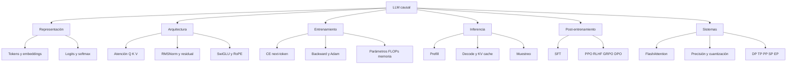

# Resumen, mapa mental y autoevaluación

## Mapa mental final

## La historia en doce frases

1. El tokenizador convierte texto en IDs discretos.
2. El embedding convierte cada ID en un vector de dimensión $D$.
3. La atención calcula qué valores mezclar para cada consulta.
4. La máscara causal impide leer el futuro.
5. Varias cabezas trabajan en subespacios de dimensión $H$.
6. RMSNorm controla escala, residual conserva rutas y SwiGLU transforma características.
7. RoPE rota $Q,K$ para introducir relaciones posicionales.
8. La salida produce $V$ logits y softmax una distribución.
9. El preentrenamiento minimiza CE del siguiente token.
10. Prefill procesa el prompt; decode genera paso a paso y reutiliza KV cache.
11. Post-entrenamiento orienta comportamiento con demostraciones, preferencias o recompensas.
12. Los sistemas combinan kernels, precisión y paralelismo para que el modelo quepa y sea útil.

## Formulario razonado

### Predicción

$$p_\theta(x_{t+1}\mid x_{\le t})=\operatorname{softmax}(z_t).$$

### Pérdida

$$L=-\sum_t\log p_\theta(x_{t+1}\mid x_{\le t}).$$

### Atención

$$\operatorname{Attn}(Q,K,V)=
\operatorname{softmax}\left(\frac{QK^\top}{\sqrt H}+M\right)V.$$

### RMSNorm

$$\operatorname{RMSNorm}(x)=
\gamma\odot\frac{x}{\sqrt{D^{-1}\sum_i x_i^2+\epsilon}}.$$

### SwiGLU

$$\operatorname{SwiGLU}(x)=
\left(\operatorname{SiLU}(xW_g)\odot xW_u\right)W_d.$$

### RoPE relativo

$$\langle R_mq,R_nk\rangle=q^\top R_{n-m}k.$$

### KV cache

$$M_{\mathrm{KV}}=2BKSLH\cdot\text{bytes(dtype)}.$$

### Policy gradient

$$\nabla J=\mathbb E\left[
\sum_t\nabla\log\pi_\theta(a_t\mid s_t)A_t
\right].$$

## Tabla de escalamiento

| Cantidad | Dependencia principal |
|---|---|
| parámetros densos por capa | $O(D^2)$ |
| activaciones base | $O(BSLD)$ |
| matriz de atención ingenua | $O(BNS^2)$ |
| FLOPs atención densa | $O(BS^2D)$ además de proyecciones |
| KV cache | $O(BSKHL)$ |
| FFN | $O(BSDFL)$ |
| decode autoregresivo | secuencial en tokens generados |

## Distinciones que no deben mezclarse

| A | B | Diferencia |
|---|---|---|
| logit | probabilidad | antes y después de softmax |
| atención | explicación causal | peso de mezcla frente a atribución causal |
| prefill | decode | muchas posiciones frente a una nueva |
| parámetros | activaciones | persistentes frente a dependientes del lote |
| memoria lineal | cómputo lineal | FlashAttention reduce memoria auxiliar, no pares densos |
| GQA | ventana local | comparte cabezas KV frente a limitar posiciones |
| SFT | RL | imitación supervisada frente a optimización por recompensa |
| PPO | RLHF | algoritmo de optimización frente a pipeline con preferencias humanas |
| PP | TP | capas frente a fragmentos dentro de la capa |
| BF16 | FP16 | mismo tamaño, distinto rango y precisión |

## Preguntas de autoevaluación

1. ¿Por qué un token ID no tiene significado ordinal?
2. ¿Qué ejes posee $(B,S,D)$?
3. ¿Por qué $QK^\top$ produce un eje de consultas y otro de claves?
4. ¿Sobre qué eje se aplica softmax en atención?
5. ¿Por qué se divide por $\sqrt H$?
6. ¿Qué evita la máscara causal?
7. ¿Por qué FFN no mezcla tokens?
8. ¿Qué aporta la ruta residual al gradiente?
9. ¿Por qué RoPE se aplica a $Q,K$ y no necesariamente a $V$?
10. ¿Qué diferencia hay entre parámetros y activaciones?
11. ¿Cuándo aparece el término $S^2$?
12. ¿Qué guarda exactamente el KV cache?
13. ¿Por qué prefill y decode tienen cuellos distintos?
14. ¿Cómo cambia top-p el conjunto de candidatos?
15. ¿Por qué speculative decoding puede ser exacto?
16. ¿Qué mejora FlashAttention y qué no cambia?
17. ¿Por qué `half()` no es BF16?
18. ¿Qué papel cumple el baseline en policy gradient?
19. ¿Qué diferencia DPO de PPO-RLHF?
20. ¿Qué reparte DP, TP y PP?

> [!faq]- Respuestas breves
> 1. Es un índice de tabla. 2. Lote, posición, característica. 3. Se contrae $H$. 4. Claves $S$. 5. Controla varianza. 6. Fuga del futuro. 7. Aplica la misma transformación por posición. 8. Ruta identidad. 9. Posición modifica compatibilidad; $V$ transporta contenido. 10. Los primeros persisten; las segundas dependen del lote. 11. En atención densa entre todos los pares. 12. K y V por capa y posición. 13. Prefill usa matmuls grandes; decode mueve mucho estado por poco trabajo. 14. Conserva masa acumulada adaptable. 15. Corrige rechazos para recuperar $p$. 16. IO y memoria auxiliar; no elimina cómputo cuadrático denso. 17. Es `float16`; BF16 es otro dtype. 18. Reduce varianza. 19. DPO usa pares offline y referencia sin rollout PPO. 20. Batch, fragmentos de capa y capas.

## Ejercicios integradores

### Formas

Con $B=4$, $S=128$, $D=512$, $N=8$, $K=2$:

1. calcula $H$;
2. escribe formas de $Q,K,V$ en GQA;
3. escribe forma de puntajes después de expandir grupos;
4. calcula elementos del KV cache para $L=12$.

### Memoria

Convierte el resultado anterior a MiB para BF16. Luego compara MHA con $K=N$.

### Causalidad

Diseña una prueba donde dos secuencias compartan prefijo y difieran solo en el futuro. Explica qué logits deben coincidir.

### Post-entrenamiento

Para recompensas $[1,1,1,1.01]$, analiza por qué dividir por una desviación muy pequeña puede amplificar el último ejemplo.

### Sistemas

Un modelo cabe en una GPU, pero el throughput es insuficiente. Explica por qué DP puede ser la primera opción. Después explica qué cambiaría si una sola matriz $D\times F$ no cupiera.

## Plan de repaso de siete días

| Día | Tema | Evidencia |
|---:|---|---|
| 1 | tokens, logits, CE | derivar $p-y$ conceptualmente |
| 2 | arquitectura y formas | reconstruir ledger sin mirar |
| 3 | atención y RoPE | resolver ejemplo $QK^\top$ |
| 4 | costes, prefill y cache | calcular memoria KV |
| 5 | sampling y FlashAttention | explicar exactitud y complejidad |
| 6 | post-training | comparar PPO, GRPO y DPO |
| 7 | paralelismo y multimodal | elegir estrategia para tres escenarios |

## Lista de dominio

Marca solo cuando puedas explicarlo sin leer:

- [ ] Puedo seguir las formas desde IDs hasta logits.
- [ ] Puedo calcular una fila de atención a mano.
- [ ] Puedo explicar residual, RMSNorm, SwiGLU y RoPE por separado.
- [ ] Puedo separar parámetros, activaciones, gradientes, Adam y KV cache.
- [ ] Puedo distinguir prefill, decode, latencia y throughput.
- [ ] Puedo explicar por qué FlashAttention es exacto y eficiente en IO.
- [ ] Puedo comparar MHA, GQA y MQA.
- [ ] Puedo comparar SFT, PPO-RLHF, GRPO y DPO.
- [ ] Puedo elegir entre DP, FSDP, TP, PP, SP y EP.
- [ ] Puedo detectar las correcciones técnicas señaladas en el índice.

## Cierre

> [!summary]
> Un LLM no es una caja indivisible. Es una composición de tablas, proyecciones, normalizaciones, mezclas, pérdidas, reglas de decisión y sistemas de memoria. Cuando puedes nombrar cada eje y cada coste, el modelo deja de ser magia y se convierte en ingeniería verificable.

---

Anterior: [[14 Laboratorio - mini Transformer causal en PyTorch]] · Volver a [[00 Índice - Modelos de lenguaje y transformers]]
