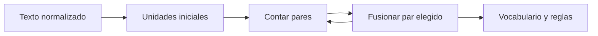

# Tokenización práctica: BPE, WordPiece y SentencePiece

## Qué hace un tokenizador

Convierte texto en una secuencia finita de IDs:

```text
"transformadores" → [4512, 87, 190]
```

El modelo solo ve IDs y embeddings. Los límites de token afectan longitud, coste, representación de idiomas, código y números.

## Objetivos en tensión

- vocabulario pequeño reduce tabla de embeddings;
- tokens largos reducen secuencia;
- cobertura abierta evita palabras desconocidas;
- segmentación consistente facilita aprendizaje;
- bytes garantizan representación de cualquier texto.

## BPE

Byte Pair Encoding comienza con unidades pequeñas y fusiona pares frecuentes.

Corpus simplificado:

```text
b a j o </w>
b a j a </w>
b a j a r </w>
```

Si `b a` y luego `ba j` son pares frecuentes, se fusionan. Cada merge se añade al vocabulario y se aplica en orden aprendido.



## WordPiece

También construye subpalabras, pero suele elegir fusiones con un criterio relacionado con la probabilidad o ganancia del modelo, no solo frecuencia bruta. Convenciones como `##ing` indican continuación de palabra en ciertos tokenizadores.

## SentencePiece

Entrena directamente sobre texto sin depender de separar primero por espacios. Trata el espacio espacios como símbolos y ofrece modelos BPE o Unigram. Es útil en idiomas donde la separación por espacios no basta.

## Unigram

Comienza con vocabulario grande de piezas y elimina las menos útiles según un modelo probabilístico. Puede existir más de una segmentación candidata; se elige una de alta probabilidad.

## Tokenización por bytes

Usar bytes garantiza cobertura: cualquier cadena UTF-8 puede representarse. La secuencia puede crecer para caracteres o idiomas poco favorecidos por los merges.

## Entrenamiento frente a uso

Entrenar tokenizador:

1. definir corpus representativo;
2. normalización explícita;
3. tamaño de vocabulario;
4. tokens especiales;
5. algoritmo;
6. métricas de cobertura y longitud.

Usar tokenizador significa aplicar exactamente la misma normalización, reglas e IDs. Cambiar tokenizador rompe la correspondencia con embeddings aprendidos.

## Tokens especiales

- BOS: inicio;
- EOS: final;
- PAD: relleno;
- UNK: desconocido si existe;
- separadores o roles de chat.

Máscara de padding y máscara causal responden problemas distintos.

## Auditoría

Compara por idioma/dominio:

- caracteres por token;
- tokens por palabra;
- secuencias máximas;
- fragmentación de números, nombres y código;
- reversibilidad de encode/decode.

> [!warning] Fertilidad desigual
> Si un idioma necesita más tokens para expresar el mismo contenido, consume más contexto y cómputo. Es una propiedad técnica con consecuencias de acceso y calidad.

## Autoevaluación

1. ¿Por qué no usar palabras completas solamente?
2. ¿Qué diferencia conceptual hay entre BPE y Unigram?
3. ¿Por qué cambiar tokenizador invalida la tabla de embeddings?
4. ¿Qué medirías para comparar idiomas?

---

Anterior: [[15 Resumen, mapa mental y autoevaluación]] · Siguiente: [[17 Fine-tuning eficiente - LoRA, QLoRA y PEFT]]

