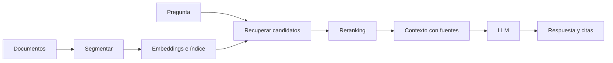

# RAG: chunking, embeddings, recuperación y reranking

![[../assets/ruta maestra ia/10-rag-pipeline.gif|900]]

## Idea

Retrieval-Augmented Generation separa dos tareas:

1. recuperar evidencia relevante;
2. generar una respuesta condicionada por esa evidencia.

## Ingesta

- extraer texto preservando títulos y páginas;
- limpiar ruido sin borrar significado;
- conservar metadatos y permisos;
- asignar identificadores estables;
- registrar versión del documento.

## Chunking

Un chunk debe ser recuperable y contener suficiente contexto. Opciones:

- longitud fija con solapamiento;
- por párrafo/sección;
- estructura semántica;
- jerárquico: sección grande y fragmento pequeño.

Chunks demasiado pequeños pierden contexto; demasiado grandes reducen precisión y consumen ventana.

## Embeddings

Cada chunk se representa como vector $v_i$. Para consulta $q$:

$$\cos(q,v_i)=\frac{q^Tv_i}{\|q\|\|v_i\|}.$$

Si vectores están normalizados, maximizar coseno equivale a maximizar producto interno.

## Recuperación léxica y densa

- léxica: coincide términos exactos, útil para nombres/códigos;
- densa: aproxima similitud semántica;
- híbrida: combina ambas.

## Reranking

La primera etapa recupera muchos candidatos con bajo coste. Un reranker más caro compara consulta-documento y reordena los mejores.

## Context construction

Incluye:

- texto del chunk;
- título/documento/página;
- separación clara entre instrucciones y evidencia;
- límite de tokens;
- orden por relevancia o estructura.

No permitas que texto recuperado actúe como instrucción privilegiada.

## Evaluación por capas

Recuperación:

- Recall@k;
- precision@k;
- MRR o nDCG cuando importa ranking.

Generación:

- corrección;
- fidelidad a evidencia;
- cobertura;
- calidad de citas;
- abstención cuando falta soporte.

> [!important] Diagnóstico en dos etapas
> Si la evidencia correcta no fue recuperada, no es un fallo primario del generador. Si fue recuperada y la respuesta la contradice, el problema está en construcción de contexto, instrucciones o generación.

## Seguridad y permisos

El índice debe filtrar por permisos antes de entregar chunks. RAG no debe convertir acceso parcial en búsqueda global.

## Autoevaluación

Responde primero sin abrir los bloques.

> [!question]- 1. ¿Qué compromiso controla chunking?
> Un chunk pequeño ofrece coincidencias precisas y cabe con facilidad en el contexto, pero puede separar una afirmación de su definición, tabla o excepción. Un chunk grande conserva más contexto local, pero diluye la señal de recuperación, consume más tokens y puede mezclar temas distintos.
>
> La unidad correcta suele respetar estructura semántica —sección, párrafo, página o registro— y se valida por recuperación y respuesta, no por una longitud elegida de forma aislada.

> [!question]- 2. ¿Cuándo ayuda la recuperación híbrida?
> Cuando las consultas contienen tanto coincidencias exactas como equivalencias semánticas. La búsqueda léxica destaca códigos, nombres raros, cifras y frases literales; la búsqueda densa recupera paráfrasis y conceptos relacionados aunque no compartan palabras.
>
> Combinar y fusionar ambos rankings suele mejorar recall en colecciones heterogéneas. Si una modalidad ya resuelve todas las consultas o la fusión está mal calibrada, la complejidad añadida puede no compensar.

> [!question]- 3. ¿Qué aporta reranking?
> Un retriever barato obtiene un conjunto candidato con alto recall; el reranker evalúa con más profundidad cada par consulta–chunk y mejora el orden antes de construir el contexto. Puede usar interacción cruzada entre todos los tokens, por lo que capta relaciones que un simple producto de embeddings pierde.
>
> A cambio añade latencia y coste. No puede rescatar un documento que nunca entró en el conjunto candidato, así que retrieval y reranking deben medirse por separado.

> [!question]- 4. ¿Cómo separas error de retrieval y de generation?
> Conserva para cada caso la evidencia esperada y registra los chunks recuperados. Si la evidencia necesaria no aparece en top-k, el fallo primario es de ingesta, chunking, índice, consulta, filtros o ranking. Si sí aparece y el modelo responde mal, contradice la fuente o cita otro fragmento, el fallo está en construcción del contexto o generación.
>
> Esta separación exige métricas por etapa: Recall@k/MRR/nDCG para recuperación y exactitud, fidelidad, citas y abstención para la respuesta final.

---

Anterior: [[17 Fine-tuning eficiente - LoRA, QLoRA y PEFT]] · Siguiente: [[19 Evaluación, alucinaciones, seguridad y prompt injection]]
