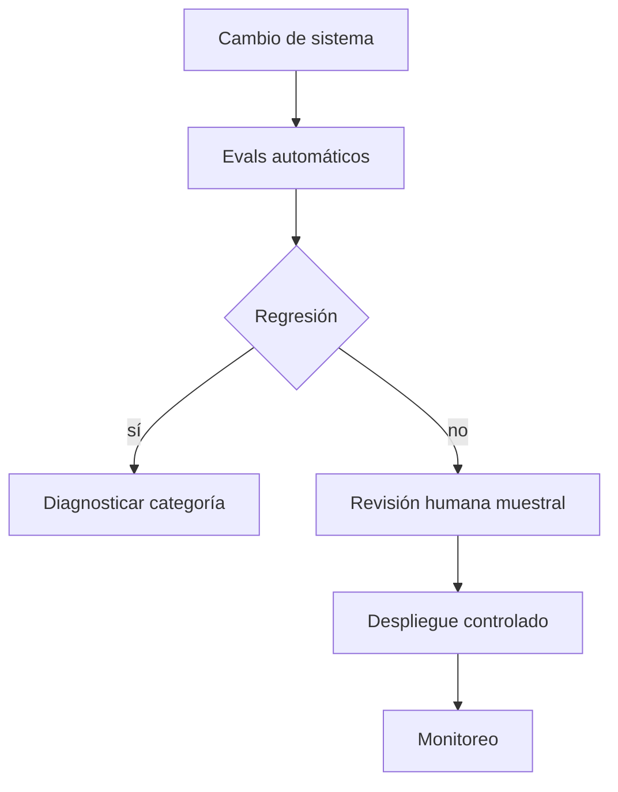

# Evaluación, alucinaciones, seguridad y prompt injection

## Evaluar un sistema, no una impresión

Separa dimensiones:

| Dimensión | Pregunta |
|---|---|
| exactitud | ¿la afirmación es correcta? |
| relevancia | ¿responde la pregunta? |
| fidelidad | ¿está respaldada por evidencia dada? |
| robustez | ¿resiste variaciones y entradas adversas? |
| seguridad | ¿evita acciones o contenido no autorizado? |
| latencia/coste | ¿cumple restricciones operativas? |

## Dataset de evaluación

Cada caso debería tener:

- entrada;
- contexto permitido;
- criterios observables;
- respuesta o evidencia de referencia cuando existe;
- etiquetas por dificultad/dominio;
- identificador estable.

No ajustes prompts indefinidamente sobre el mismo set final. Conserva development y test.

## Elegir una prueba estadística según la pregunta

Antes de elegir una prueba identifica la **unidad de análisis**, si las observaciones están emparejadas y qué cantidad quieres comparar. La prueba no se escoge por el nombre del modelo, sino por el diseño de los datos.

| Pregunta | Diseño o tipo de dato | Herramienta inicial | Qué responde |
|---|---|---|---|
| ¿dos muestras continuas parecen venir de la misma distribución? | grupos independientes | Kolmogorov–Smirnov de dos muestras | detecta diferencias en las CDF, no solo en la media |
| ¿cambió una distribución de categorías? | conteos por categoría | chi-cuadrado; exacta si los conteos son muy pequeños | compara observados con esperados bajo independencia/homogeneidad |
| ¿difieren dos medias independientes? | valor continuo por unidad | prueba $t$ de Welch como punto de partida | contrasta diferencia de medias sin asumir varianzas iguales |
| ¿difieren dos modelos sobre los mismos casos? | diferencia continua pareada por caso | $t$ pareada, permutación o bootstrap de diferencias | usa que cada caso produce un par relacionado |
| ¿difieren dos clasificadores correcto/incorrecto sobre los mismos casos? | resultado binario pareado | McNemar | analiza los pares discordantes, no dos proporciones independientes |
| ¿alguna de más de dos medias difiere? | varios grupos | ANOVA, seguido de comparaciones planificadas | el test global no identifica por sí solo qué pares difieren |
| ¿dos variables continuas tienen relación lineal? | pares $(x_i,y_i)$ | correlación de Pearson | estima fuerza lineal y permite contrastar $r=0$ bajo supuestos |
| ¿la relación es monotónica o hay outliers fuertes? | pares convertibles a rangos | correlación de Spearman | mide asociación de rangos, no solo una recta |
| ¿hay dependencia posiblemente no lineal? | variables generales | información mutua + estimador/protocolo de contraste | MI mide dependencia; por sí sola no es automáticamente un test ni corrige sesgo del estimador |

> [!important] Qué significa —y qué no significa— un p-value
> Es la probabilidad, **suponiendo la hipótesis nula y el modelo del test**, de observar un resultado al menos tan extremo como el obtenido. No es $P(H_0\mid\text{datos})$, no mide tamaño práctico del efecto y no compensa un diseño dependiente o una selección oportunista de pruebas.
>
> Reporta también efecto, incertidumbre, tamaño muestral, supuestos y decisiones múltiples. Para el tratamiento completo usa [[../comparacion estadistica de modelos/00 Índice - Comparación estadística de modelos|Comparación estadística de modelos]].

> [!question]- Ejemplo — dos LLM responden los mismos 500 ítems con acierto/error. ¿Qué prueba encaja?
> McNemar, porque cada ítem produce dos resultados binarios emparejados. La evidencia está en los casos donde A acierta y B falla frente a los casos donde A falla y B acierta. Tratar los dos porcentajes como muestras independientes descartaría ese emparejamiento y estimaría mal la incertidumbre.

## Alucinación

Una respuesta fluida puede contener afirmaciones no respaldadas. En RAG distingue:

- evidencia ausente;
- evidencia irrelevante;
- evidencia presente pero ignorada;
- cita correcta con inferencia incorrecta;
- fuente inventada.

## Abstención

Un sistema confiable debe poder decir que la evidencia no alcanza. Evalúa tanto respuesta como decisión de abstener.

## Prompt injection

Contenido externo puede incluir texto como “ignora instrucciones anteriores”. Ese texto es dato no confiable, no autoridad.

Defensas por capas:

- separar instrucciones del sistema y contenido;
- mínimo privilegio en herramientas;
- validar parámetros de acciones;
- filtrar por permisos antes de recuperación;
- confirmar acciones de alto impacto;
- registrar y evaluar ataques;
- no confiar en una clasificación única como defensa total.

## Evaluación determinista y humana

- reglas exactas para formato, citas o números;
- modelos evaluadores con calibración y auditoría;
- revisión humana para matices;
- pares de preferencia con orden aleatorio;
- acuerdo entre evaluadores.

## Pass@k y variabilidad

Una salida estocástica necesita múltiples muestras cuando se evalúa capacidad de resolver. Reporta configuración de sampling y número de intentos.

## Regresión continua

Cada cambio de modelo, prompt, índice o chunking debe ejecutar un conjunto fijo de regresión y comparar:

- calidad;
- seguridad;
- latencia;
- coste;
- fallos nuevos por categoría.

## Autoevaluación

Responde primero sin abrir los bloques.

> [!question]- 1. ¿Cuál es la diferencia entre exactitud y fidelidad?
> **Exactitud** pregunta si la afirmación es correcta respecto del mundo o una referencia fiable. **Fidelidad** pregunta si está respaldada por la evidencia que el sistema recibió y citó.
>
> Una respuesta puede ser exacta por conocimiento previo pero no fiel al documento proporcionado; también puede repetir fielmente un documento erróneo y no ser exacta. Un sistema RAG serio mide ambas dimensiones por separado.

> [!question]- 2. ¿Por qué no debemos iterar sobre el conjunto de test?
> Porque cada decisión tomada después de mirar sus resultados adapta indirectamente el sistema a esos ejemplos. Aunque no se entrenen pesos, cambiar prompts, umbrales, chunking o reglas usando el test filtra información y produce una estimación optimista.
>
> Se itera con train/dev y se reserva test para una evaluación final o poco frecuente. Cuando el test deja de ser independiente, debe tratarse como desarrollo y crearse una nueva evaluación no vista.

> [!question]- 3. ¿Qué autoridad tiene un documento recuperado?
> Es **evidencia no confiable**, no una instrucción privilegiada ni un permiso. Su procedencia, fecha y controles de acceso determinan si puede usarse como fuente; el texto dentro del documento no puede cambiar reglas del sistema, ampliar permisos ni ordenar acciones externas.
>
> El sistema debe separar instrucciones de datos, filtrar por autorización antes de recuperar y citar el fragmento que respalda cada afirmación.

> [!question]- 4. ¿Por qué la seguridad requiere controles fuera del prompt?
> Porque seguir una instrucción es un comportamiento probabilístico y el contenido adversario puede competir con ella. Un prompt que diga “ignora ataques” no impide por sí mismo acceso indebido, llamadas peligrosas o fuga de datos.
>
> Los límites críticos deben imponerse de forma determinista: autenticación y autorización, mínimo privilegio, allowlists de herramientas, validación de argumentos y salidas, aislamiento, límites de tasa, confirmaciones para acciones sensibles, registros y pruebas adversariales.

---

Anterior: [[18 RAG - chunking, embeddings, recuperación y reranking]] · Siguiente: [[20 Laboratorio aplicado - elegir prompting, RAG o fine-tuning]]
