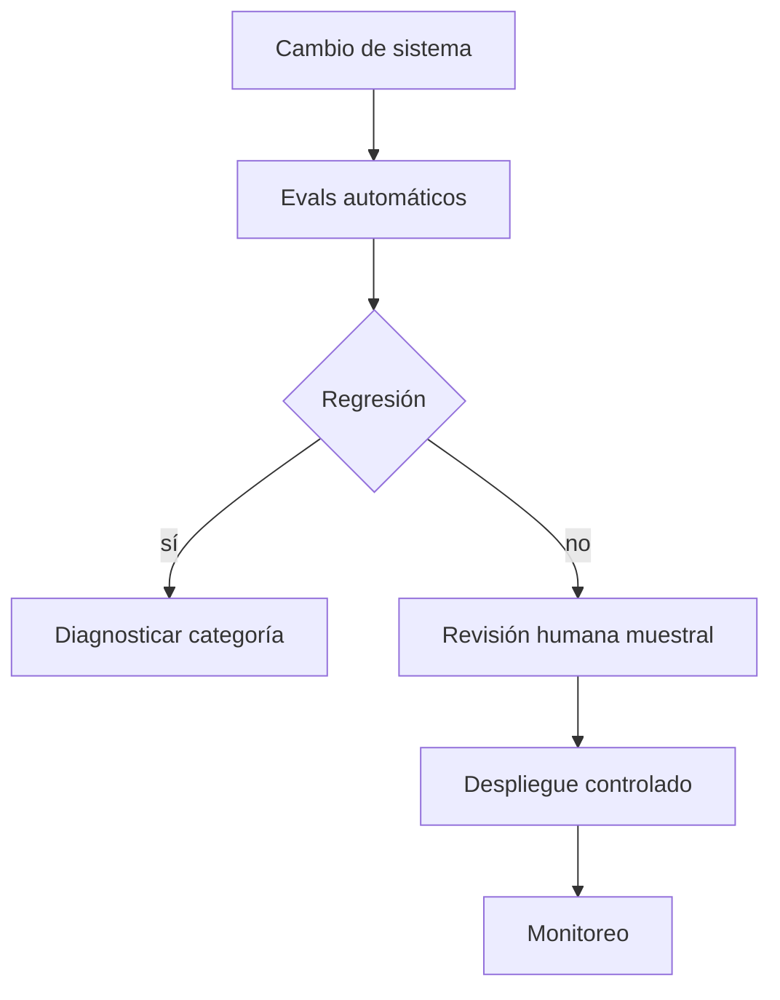

# Evaluación, alucinaciones, seguridad y prompt injection

## Evaluar un sistema, no una impresión

Separa dimensiones:

| Dimensión | Pregunta |
|---|---|
| exactitud | ¿la afirmación es correcta? |
| relevancia | ¿responde la pregunta? |
| fidelidad | ¿está respaldada por evidencia dada? |
| robustez | ¿resiste variaciones y entradas adversas? |
| seguridad | ¿evita acciones o contenido no autorizado? |
| latencia/coste | ¿cumple restricciones operativas? |

## Dataset de evaluación

Cada caso debería tener:

- entrada;
- contexto permitido;
- criterios observables;
- respuesta o evidencia de referencia cuando existe;
- etiquetas por dificultad/dominio;
- identificador estable.

No ajustes prompts indefinidamente sobre el mismo set final. Conserva development y test.

## Alucinación

Una respuesta fluida puede contener afirmaciones no respaldadas. En RAG distingue:

- evidencia ausente;
- evidencia irrelevante;
- evidencia presente pero ignorada;
- cita correcta con inferencia incorrecta;
- fuente inventada.

## Abstención

Un sistema confiable debe poder decir que la evidencia no alcanza. Evalúa tanto respuesta como decisión de abstener.

## Prompt injection

Contenido externo puede incluir texto como “ignora instrucciones anteriores”. Ese texto es dato no confiable, no autoridad.

Defensas por capas:

- separar instrucciones del sistema y contenido;
- mínimo privilegio en herramientas;
- validar parámetros de acciones;
- filtrar por permisos antes de recuperación;
- confirmar acciones de alto impacto;
- registrar y evaluar ataques;
- no confiar en una clasificación única como defensa total.

## Evaluación determinista y humana

- reglas exactas para formato, citas o números;
- modelos evaluadores con calibración y auditoría;
- revisión humana para matices;
- pares de preferencia con orden aleatorio;
- acuerdo entre evaluadores.

## Pass@k y variabilidad

Una salida estocástica necesita múltiples muestras cuando se evalúa capacidad de resolver. Reporta configuración de sampling y número de intentos.

## Regresión continua

Cada cambio de modelo, prompt, índice o chunking debe ejecutar un conjunto fijo de regresión y comparar:

- calidad;
- seguridad;
- latencia;
- coste;
- fallos nuevos por categoría.

## Autoevaluación

1. Diferencia exactitud y fidelidad.
2. ¿Por qué no iterar sobre test?
3. ¿Qué autoridad tiene un documento recuperado?
4. ¿Por qué seguridad requiere controles fuera del prompt?

---

Anterior: [[18 RAG - chunking, embeddings, recuperación y reranking]] · Siguiente: [[20 Laboratorio aplicado - elegir prompting, RAG o fine-tuning]]

