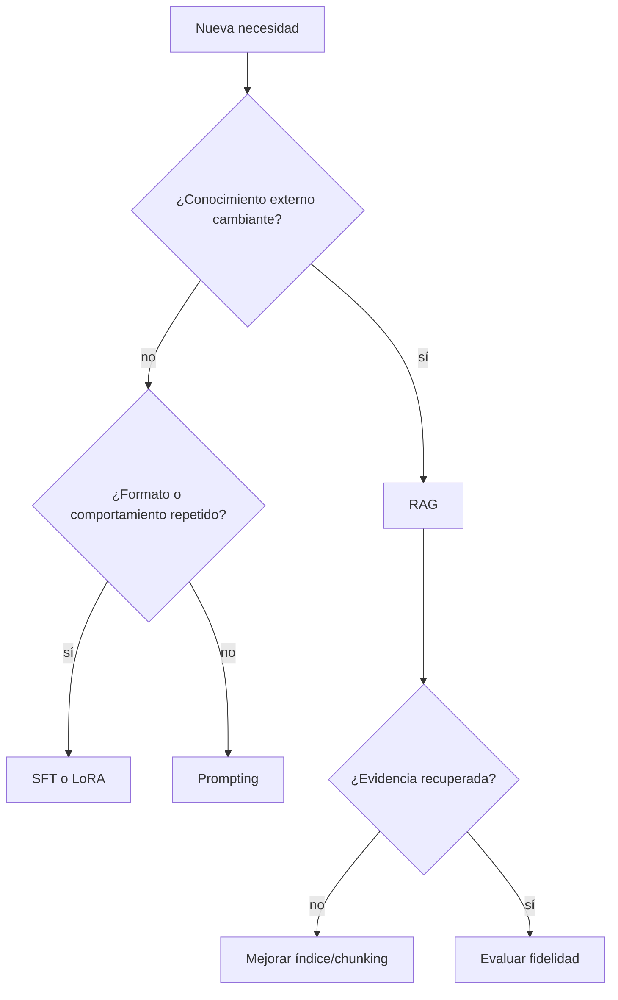

# Laboratorio aplicado: elegir prompting, RAG o fine-tuning

Archivo: [[../laboratorios fundamentos ia/rag_desde_cero.py]].

## Árbol de decisión

## Caso 1: política que cambia cada mes

Usa RAG porque el conocimiento debe actualizarse, citarse y retirarse sin reentrenar pesos.

## Caso 2: respuestas siempre en un esquema JSON

Empieza con prompting y validación estructural. Si el formato es masivo y persistente, evalúa SFT/LoRA.

## Caso 3: nuevo tono institucional

Prompting puede bastar; LoRA puede ayudar con consistencia si hay suficientes ejemplos. No uses RAG para enseñar únicamente estilo.

## RAG mínimo desde cero

El laboratorio implementa:

1. documentos pequeños;
2. chunking por párrafos;
3. representación TF-IDF simplificada;
4. similitud coseno;
5. top-k;
6. respuesta extractiva con fuente;
7. evaluación Recall@k.

No pretende sustituir embeddings neuronales; hace visible la interfaz de recuperación.

## Experimentos

- cambiar tamaño de chunk;
- eliminar términos raros;
- comparar top-1 y top-3;
- hacer una pregunta sin respuesta;
- insertar una instrucción maliciosa dentro de un documento y comprobar que se trata como texto.

## Matriz de evaluación

| Caso | Evidencia recuperada | Respuesta correcta | Cita válida | Abstención correcta |
|---|---:|---:|---:|---:|
| conocido | sí/no | sí/no | sí/no | n/a |
| ausente | no esperado | n/a | n/a | sí/no |
| adversarial | sí/no | sí/no | sí/no | según caso |

## Checklist de decisión

- [ ] Separé conocimiento de comportamiento.
- [ ] Definí evaluación antes de elegir solución.
- [ ] Mantengo test separado.
- [ ] Puedo atribuir fallo a retrieval o generation.
- [ ] Los documentos no reciben autoridad de instrucciones.
- [ ] Consideré coste, latencia y actualización.

## Cierre

> [!summary]
> Prompting cambia instrucciones en tiempo de ejecución; RAG aporta evidencia externa; fine-tuning cambia parámetros. Pueden combinarse, pero cada uno debe responder a un problema identificado y evaluable.

---

Anterior: [[19 Evaluación, alucinaciones, seguridad y prompt injection]] · Volver al [[00 Índice - Modelos de lenguaje y transformers]]

