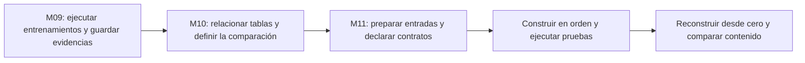

# M11: del resultado a un proceso que otra persona puede repetir

> [!abstract] La pregunta de todo el módulo
> **¿Puede otra persona reconstruir mi ranking con las mismas entradas y reglas, y detectar si falta algo?** Un producto analítico incluye el resultado, su procedencia, las transformaciones y las pruebas que permiten aceptarlo.

![[assets/m11-proposito-v2.png|1100]]

## Cómo estudiar estas notas

Primero entiende el propósito; después sigue una fila a través de las herramientas; finalmente intenta romper el proceso. Las preguntas están cerradas: **haz clic en su título o flecha para desplegar la respuesta** en la vista de lectura de Obsidian. Responde antes de abrirlas.

| Orden | Nota | Qué aprenderás | Fuente principal |
|---|---|---|---|
| 1 | [[01 Propósito, procedencia y contratos - M11]] | qué entregamos y qué significa cada dato | PDF pp. 1–7 |
| 2 | [[02 HTML, regex y Polars paso a paso - M11]] | cómo pasa un texto a una tabla validada | PDF pp. 8–12 |
| 3 | [[03 Arrow, DuckDB y ranking comparable - M11]] | cómo integrar sin perder o multiplicar ejecuciones | PDF pp. 13–18 |
| 4 | [[04 dbt, dependencias y modelos SQL - M11]] | cómo declarar el orden de construcción | PDF pp. 20–26 |
| 5 | [[05 Pruebas, fallos y reconstrucción - M11]] | qué comprueba cada prueba y cómo reparar | PDF pp. 19, 27–33 |
| 6 | [[06 Laboratorio razonado y gráficos - M11]] | calcular, comparar y diagnosticar un ejemplo pequeño | ampliación didáctica |
| 7 | [[07 Repaso activo, transferencia y respuestas - M11]] | recordar, justificar y aplicar a otro problema | PDF pp. 34–35 y repaso |

## Qué viene de antes y qué añade M11

- [[../contenedores y ejecucion reproducible con docker/00 Índice - M09 Docker y ejecución reproducible|M09]]: cómo se ejecutó y qué se guardó.
- [[../modelo relacional y sql analitico/00 Índice - M10 Modelo relacional y SQL analítico|M10]]: qué representa cada fila y cómo comparar correctamente.
- M11: cómo dejar esa comparación preparada, comprobada y reconstruible. Aquí **no se vuelve a entrenar el clasificador**.

## El mapa de herramientas explicado

![[assets/m11-componentes-v4.png|1100]]

Lee cada fila como una responsabilidad: **parser encuentra; regex reconoce; Polars tipa; DuckDB consulta; dbt organiza; Python conecta; Arrow intercambia**. Esta frase ayuda a recordar el reparto del caso, aunque una herramienta pueda realizar más funciones en otros proyectos.

![[assets/m11-procesos.png|1100]]

Un **proceso** es una actividad, como limpiar o integrar. Un **componente** es la herramienta que participa. Web scraping es un proceso; HTMLParser es un componente. El HTML de M11 ya está guardado localmente: el ejercicio practica extracción, no descarga una web en vivo.

## Tres ideas para no perderte

1. **Una fila tiene una unidad:** origen, ejecución, medición o resumen. Hay que decir cuál.
2. **Una prueba tiene un alcance:** comprobar nulos no comprueba cobertura.
3. **Repetible no significa verdadero:** puedes repetir exactamente el mismo error.

> [!question]- ¿Por qué usar tantas herramientas en un ejemplo pequeño?
> Para aprender sus responsabilidades y cómo se conectan. Las diapositivas no demuestran que esta combinación sea más rápida. Otro proyecto puede usar menos herramientas si conserva las reglas y comprobaciones.

## Fuentes y alcance

Material conservado dentro de `assets`: [[assets/module_11.pdf|PDF original de 35 páginas]] y las tres infografías proporcionadas. Las referencias de página corresponden al orden del PDF. Los ejemplos añadidos se identifican como didácticos; no son nuevas ejecuciones de los experimentos del curso. Las consignas del PDF se tratan como material de estudio, no como instrucciones para modificar bases reales.

Volver a [[../00 INICIO - Qué es cada cosa y ruta maestra de IA|ruta maestra de IA]].
