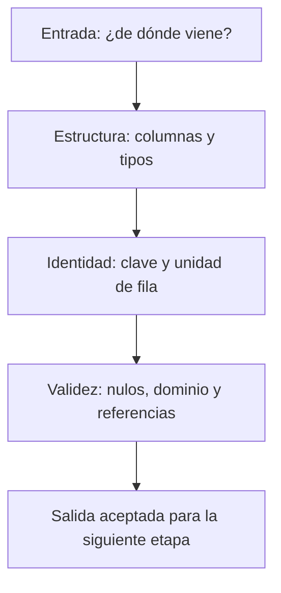

# 1. Propósito, procedencia y contratos

## Qué es un pipeline y para qué sirve

Un **pipeline de datos** es una secuencia de pasos conectados: cada paso recibe entradas, aplica reglas y produce algo que otro paso necesita. Sirve para que el resultado no dependa de recordar qué celda ejecutaste o qué archivo cambiaste a mano.

Piensa en una receta: el ranking es el plato; las fuentes son los ingredientes; SQL es parte de la receta; las pruebas comprueban cantidades y condiciones; el registro de ejecución deja evidencia de lo ocurrido. Fotografiar el plato no basta para cocinarlo otra vez.

El PDF comienza con un ranking ya disponible (p. 2):

| Configuración | Media de validation/accuracy | Semillas | Puesto |
|---|---:|---:|---:|
| cfg_lr010 | 0.603515625 | 2 | 1 |
| cfg_lr005 | 0.595703125 | 2 | 2 |

Son resultados **mostrados por el material docente**, de la versión `train-holdout-191d62fc6cc9`. No los hemos recalculado con sus archivos de origen, porque esos archivos no forman parte de los adjuntos. Esa tabla no cuenta por sí sola qué ejecuciones participaron, cómo se promediaron o qué controles pasaron.

## Qué hay que conservar

| Entrada mencionada en el PDF | Para qué sirve | Qué no sustituye |
|---|---|---|
| experiments.sqlite | registro de datasets, configuraciones, ejecuciones y métricas | las reglas de comparación |
| design.json | combinaciones esperadas del experimento | los resultados observados |
| split.json | evidencia de la partición local | la descripción general del dataset |
| provenance.json | procedencia del material | las pruebas de validez |
| fashion_metadata.html | ficha docente local con datos del origen | el registro de entrenamientos |

La lista documenta los archivos del caso. No significa que esos archivos estén disponibles aquí: se adjuntó el PDF y tres imágenes, no el proyecto ejecutable del curso.

**Procedencia** responde de dónde salió un archivo, quién lo preparó y qué fuente respalda sus hechos. El PDF identifica el HTML como un *fixture*: una entrada fija y controlada para el ejercicio, de autoría docente. No es una captura descargada de la página oficial. Su ficha incluye fuente factual, fecha de contraste y un hash abreviado (p. 7).

## Origen oficial y experimento local son distintos

![[assets/m11-p05.png|1000]]

| Nivel | Qué describe | Valores del material |
|---|---|---|
| origen Fashion-MNIST | colección oficial | imágenes 28 × 28; 10 clases; train 60000 y test 10000 |
| experimento local | subconjuntos usados en este entrenamiento | train 2048 y validation 512; 2 épocas |
| versión local | identidad de la partición usada | train-holdout-191d62fc6cc9 |

El mapeo `fashion_holdout → fashion_mnist` dice **de qué origen deriva** el experimento. No dice que ambos conjuntos sean iguales. Los 512 ejemplos de validación local no se convierten en el test oficial de 10000.

## Contrato: el acuerdo que una etapa debe cumplir

Un contrato explicita qué puede recibir y entregar una etapa. Incluye columnas, tipos, claves, nulos permitidos, dominio y significado de una fila.

| Tabla o resultado | Una fila representa | Identidad o clave conceptual |
|---|---|---|
| metadatos | un origen de dataset | dataset_key |
| runs | una ejecución de una configuración con una semilla | run_id |
| metrics | una medición de una ejecución | run_id + split + metric_name |
| diseño esperado | una combinación planificada | dataset + versión + configuración + semilla |
| resumen | una configuración completa en una versión | versión + configuración, dentro del alcance del caso |
| ranking | ese resumen con un puesto añadido | la misma identidad del resumen |

La clave de agrupación debe ampliarse con `dataset_id` si las versiones no son inequívocas entre datasets. No copies una clave sin revisar su alcance.

## El diseño esperado debe existir antes de mirar lo observado

En el caso se esperan dos configuraciones (`cfg_lr005`, `cfg_lr010`) y dos semillas (`11`, `22`): **cuatro combinaciones**. Para cada una debe existir exactamente una ejecución elegible. Elegible significa que satisface las condiciones del análisis: versión y diseño correctos, estado `completed` y métrica `validation/accuracy` requerida.

Si construyes la lista esperada a partir de las filas que sobrevivieron a un JOIN, una ausencia deja de ser visible. Es como pasar lista utilizando únicamente los nombres de quienes sí entraron al aula.

> [!question]- ¿Qué falta si entrego solo la tabla final?
> Entradas identificables, diseño esperado, reglas de selección y agregación, comprobaciones y evidencia de reconstrucción. El ranking no permite inferir todo eso.

> [!question]- ¿Por qué 60000 no es el tamaño de entrenamiento de este experimento?
> Es el tamaño del train oficial descrito en los metadatos. El entrenamiento local de las diapositivas usa 2048 ejemplos. Origen y derivación tienen contratos distintos.

> [!question]- ¿Una fila ausente en metrics significa accuracy igual a cero?
> No. Significa que no hay una medición correspondiente. Un LEFT JOIN puede representarlo con NULL; cero sería una medición concreta y diferente.

> [!question]- ¿Qué recuerdas con “ingredientes, receta y controles”?
> Entradas con procedencia, transformaciones explícitas y pruebas. Los tres hacen defendible la reconstrucción.

Fuente: [[assets/module_11.pdf#page=2|PDF pp. 2–7]]. Sigue con [[02 HTML, regex y Polars paso a paso - M11]].
