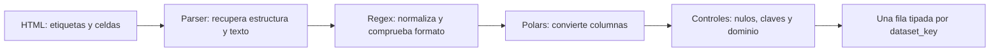

# 2. Del HTML a una tabla válida

## Seguir un dato completo

Queremos transformar la celda `<td>60000</td>` en un campo entero llamado `official_train`. No basta con quitar los signos `<` y `>`: hay que localizar la tabla correcta, saber a qué columna pertenece la celda y validar el significado del valor.



## Parser HTML: encontrar la estructura

`HTMLParser` reconoce etiquetas del documento. En este caso localiza la tabla con `id="dataset-metadata"`, sus filas `tr` y sus celdas `th`/`td`. El parser recupera texto; el código que lo rodea decide si la estructura cumple el contrato.

![[assets/m11-p08.png|1000]]

El material exige una tabla seleccionada, dos filas (encabezado y ficha), cinco celdas por fila y encabezados exactos. Rechaza una estructura inesperada mediante guardas que lanzan `ValueError`.

¿Por qué rechazar? Si la página añade una columna y el programa sigue asignando por posición, podría interpretar el número de clases como el tamaño de entrenamiento. Un resultado plausible puede ser más difícil de detectar que un error explícito.

Este parser está pensado para HTML sencillo, sin celdas combinadas ni tablas anidadas. Beautiful Soup puede ser una alternativa. Extraer todo el HTML con regex mezcla estructura y texto y vuelve frágil la solución.

## Regex: comprobar una forma textual acotada

Una expresión regular es un patrón para cadenas. En el material se usa después de extraer las celdas, no para comprender todo el documento.

Ejemplo didáctico equivalente al patrón del módulo:

```python
import re
texto = " 28   ×  28 "
limpio = re.sub(r"\s+", " ", texto).strip()
coincidencia = re.fullmatch(r"([0-9]+)\s*×\s*([0-9]+)", limpio)
if coincidencia is None:
    raise ValueError("Se esperaba alto × ancho")
alto, ancho = map(int, coincidencia.groups())
```

| Parte | Cómo leerla |
|---|---|
| `\s+` | uno o más espacios en blanco |
| `strip()` | quitar espacios de los extremos |
| `[0-9]+` | uno o más dígitos |
| `( ... )` | capturar una parte del texto |
| `\s*` | cero o más espacios |
| `×` | el signo de multiplicación literal |
| `fullmatch` | exigir coincidencia de toda la cadena |

`28 × 28` se acepta. `28×28px` se rechaza por el sufijo. `28x28` también se rechaza con ese patrón, porque la letra `x` no es el signo `×`. Si deseas admitir ambos, debes cambiar el contrato de forma deliberada.

> [!warning] Forma correcta no demuestra dato correcto
> `99 × 99` puede cumplir el patrón y ser falso para esta ficha. El patrón tampoco abre imágenes ni mide sus píxeles. La veracidad se contrasta con la fuente factual; una inspección de archivos reales sería otra comprobación.

La semilla se lee de la columna `seed`; no se adivina analizando el nombre de `run_id`.

## Polars: convertir y transformar columnas

Un DataFrame es una tabla con columnas nombradas. Polars permite expresar transformaciones por columna: convertir texto numérico a entero, extraer dimensiones y seleccionar el esquema de salida.

| Antes: texto | Después: dato tipado |
|---|---|
| official_train = `"60000"` | official_train = `60000`, entero |
| image_shape = `"28×28"` | image_height = `28`, image_width = `28` |
| n_classes = `"10"` | n_classes = `10`, entero |

El significado de la fila no cambia: sigue representando un origen identificado por `dataset_key`. Separar alto y ancho cambia las columnas; no crea dos datasets.

Fragmento conceptual del material:

```python
pl.col("official_train").cast(pl.Int64, strict=True)
```

Se lee: “selecciona esa columna y exige una conversión a entero válida”. No es un programa completo: presupone que Polars está importado y existe un DataFrame.

## Cuatro controles que no se sustituyen

![[assets/m11-p11.png|1000]]

| Control | Ejemplo que detecta | Ejemplo que no resuelve |
|---|---|---|
| conversión estricta | `"sesenta mil"` no convertible a entero | un NULL preexistente |
| campos requeridos no nulos | tamaño ausente | tamaño negativo |
| dominio | dimensiones, clases o tamaños no positivos; clave vacía | dos filas válidas con la misma clave |
| unicidad | dataset_key repetida | dato falso con clave única |

`[None, "60000"]` puede convertirse en `[null, 60000]` con conversión estricta. **Estricto no significa obligatorio.** Por eso se comprueban aparte nulos, dominio y claves. Para la unicidad del caso, después del control de nulos, el número de claves distintas debe coincidir con el número de filas.

## Dónde termina Polars en este ejercicio

Polars prepara los metadatos y los entrega tipados. El cálculo de población, resumen y ranking permanece en SQL. Así no mantenemos dos versiones de la regla que puedan divergir.

El modo **eager** obtiene resultados al operar; el modo **lazy** declara un plan y `collect()` solicita su ejecución. Esa diferencia no demuestra por sí misma que este ejercicio sea más rápido. No necesitas elegir lazy para entender el contrato.

> [!question]- ¿Qué parte reconoce una etiqueta td y cuál comprueba “28 × 28”?
> El parser reconoce la estructura HTML; regex comprueba el patrón textual una vez recuperada la celda.

> [!question]- ¿Por qué “60000” y 60000 no son lo mismo?
> El primero es texto; el segundo es un entero. Necesitamos el tipo numérico para aplicar operaciones y controles numéricos con el contrato previsto.

> [!question]- ¿strict=True garantiza que no hay NULL?
> No. Puede conservar nulos que ya existían. Hay que comprobar explícitamente los campos requeridos.

> [!question]- Si la clave es única pero official_train vale -2, ¿aceptamos la ficha?
> No. La unicidad pasó, pero el dominio positivo falló. Cada prueba responde una pregunta diferente.

> [!question]- ¿Para qué conservar el ranking solo en SQL?
> Para mantener una única definición de la comparación. Cambiar una regla en dos implementaciones independientes puede producir resultados distintos.

Fuente: [[assets/module_11.pdf#page=8|PDF pp. 8–12]]. Sigue con [[03 Arrow, DuckDB y ranking comparable - M11]].
