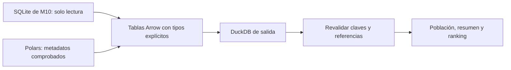
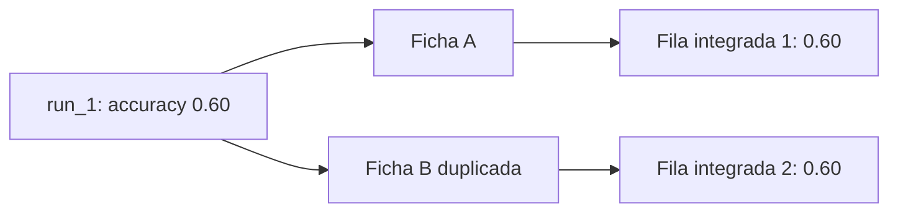
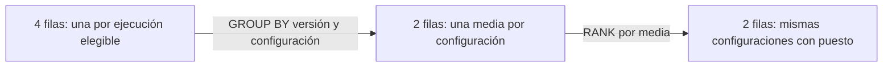

# 3. Integrar tablas y construir un ranking comparable

## Arrow: el formato común en memoria

Arrow representa datos tabulares con un esquema de columnas y tipos para intercambiarlos entre herramientas. En M11 permite entregar a DuckDB la tabla preparada en Polars mediante `to_arrow()`.

**Recuerda:** Polars prepara la tabla; Arrow representa la entrega; DuckDB ejecuta SQL. Arrow no calcula el ranking ni equivale a guardar un archivo Parquet. Conecta con [[../numpy pandas parquet arrow|tu nota sobre Arrow y Parquet]].

## Leer la fuente sin modificarla

El registro de M10 se abre en SQLite en modo solo lectura (`mode=ro` en el material). Se extraen `datasets`, `configs`, `runs` y `metrics` hacia una base DuckDB de salida separada. Se declaran esquemas explícitos, incluso para columnas anulables como `finished_at` y `failure_reason`.

Si una columna contiene únicamente NULL, mirar sus valores no basta para deducir si debería ser fecha o texto. El contrato decide el tipo. Además, exportar filas **no traslada automáticamente todas las restricciones** de la base original: claves y referencias se vuelven a comprobar en el destino.



## Registrar no es persistir

Estos fragmentos ilustran las tres operaciones de la p. 14; presuponen una conexión `con`, un DataFrame válido y un esquema `raw` preparado.

```python
con.register("metadata_input", metadata_frame.to_arrow())
con.execute("""
    CREATE OR REPLACE TABLE raw.dataset_metadata AS
    SELECT * FROM metadata_input
""")
con.unregister("metadata_input")
```

1. **register:** da al objeto un nombre consultable dentro de la conexión.
2. **CREATE TABLE AS SELECT (CTAS):** crea una tabla con el contenido; en la base de salida en disco del caso, permite conservarlo al cerrar la conexión.
3. **unregister:** retira el nombre temporal. No elimina la tabla creada.

Si se usara una base en memoria, cerrar la conexión no conservaría sus tablas en disco. La persistencia depende también de dónde abriste la base.

## La cadena de relaciones y su cardinalidad

Cardinalidad significa cuántas filas de un lado pueden corresponder con una fila del otro.

| Relación | Qué aporta | Condición que protege la población |
|---|---|---|
| runs → datasets | versión del dataset | una referencia válida por ejecución |
| runs → configs | identidad de configuración | una referencia válida por ejecución |
| runs → expected_design | pertenencia al plan | coincidencia exacta de dataset, versión, configuración y semilla |
| runs → metrics | valor objetivo | una medición de validation/accuracy por ejecución |
| dataset_origin_map → dataset_metadata | ficha del origen | dataset_key única y mapeo válido |

Filtrar `completed` no basta: también importan el diseño y la métrica seleccionada. Si se unen todas las métricas de cada ejecución, una corrida puede convertirse en varias filas. Por eso se restringe a `split = 'validation'` y `metric_name = 'accuracy'`.

## El peligro: cuatro ejecuciones pueden convertirse en ocho filas

![[assets/m11-p17.png|1000]]

Si cada ejecución encuentra dos fichas con `dataset_key = fashion_mnist`, cada una produce dos coincidencias:



Con cuatro ejecuciones se obtienen ocho filas, pero solo cuatro `run_id` distintos. Si todo se duplica simétricamente, la media puede ser idéntica:

$$\frac{a+b}{2}=\frac{a+a+b+b}{4}.$$

La media no revela ese defecto. Por eso se comprueban las claves **antes** del JOIN y la unidad de fila **después**. No se repara aplicando DISTINCT a ciegas: primero hay que establecer por qué la clave está duplicada y qué ficha respalda la evidencia.

## Cobertura antes de promedio

En el material se exige una ejecución elegible para cada combinación planificada. Por configuración se esperan semillas `{11, 22}`.

| Semillas observadas | Filas | Distintas | ¿Cumple el diseño? |
|---|---:|---:|---|
| 11, 22 | 2 | 2 | sí, si las demás condiciones pasan |
| 11, 11 | 2 | 1 | no: duplicación y falta de 22 |
| 11 | 1 | 1 | no: falta 22 |
| 33, 44 | 2 | 2 | no: son otras semillas |

La última fila explica por qué contar no basta. Primero se verifica pertenencia al diseño exacto; luego cantidad y unicidad. Un diseño esperado vacío o duplicado también es un defecto.

Tras agrupar, las condiciones del material incluyen:

```sql
HAVING COUNT(*) = e.expected_seed_count
   AND COUNT(DISTINCT s.seed) = e.expected_seed_count
```

Este es un **fragmento**, no una consulta independiente. Presupone JOIN con el diseño y agrupación correctos. Además, la prueba de cobertura global debe detectar las combinaciones desaparecidas: un HAVING puede simplemente excluir una configuración incompleta y devolver las restantes.

## Resumir cambia la fila; RANK añade una columna



Para accuracy, mayor es mejor. La ventana del caso usa:

```sql
RANK() OVER (
    PARTITION BY dataset_version
    ORDER BY mean_validation_accuracy DESC
) AS rank_in_version
```

Si hay medias `0.80, 0.80, 0.70`, los puestos son `1, 1, 3`. RANK conserva el empate. Un `ORDER BY` exterior puede incluir `config_id` para presentar filas de manera estable. **Meter config_id en el ORDER BY de la ventana** hace que configuraciones de igual media dejen de empatar si sus identificadores difieren.

La partición por versión es suficiente en el alcance de las diapositivas, donde la versión es inequívoca. En otro esquema puede hacer falta particionar por dataset y versión.

> [!question]- ¿Arrow sustituye las restricciones de SQLite?
> No. El esquema tipado facilita el intercambio, pero deben revalidarse claves y referencias en la salida.

> [!question]- ¿Cerrar la conexión después de register guarda el objeto?
> Registrar solo lo vuelve consultable. En el caso se crea una tabla dentro de la base de salida en disco para persistir el contenido.

> [!question]- Si COUNT(*) da 8 y COUNT(DISTINCT run_id) da 4, ¿hubo ocho entrenamientos?
> No. Hay ocho filas integradas y cuatro ejecuciones identificadas. Alguna relación pudo multiplicar coincidencias; hay que rastrear la cardinalidad.

> [!question]- ¿Dos semillas distintas son siempre cobertura completa?
> No. Deben ser las dos semillas del diseño esperado para esa configuración y versión, y cada combinación debe aparecer exactamente una vez.

> [!question]- ¿En qué operación cambia el significado de la fila?
> En GROUP BY: se pasa de ejecución a resumen por configuración. RANK agrega el puesto sin volver a agrupar.

Fuente: [[assets/module_11.pdf#page=13|PDF pp. 13–18]]. Sigue con [[04 dbt, dependencias y modelos SQL - M11]].
