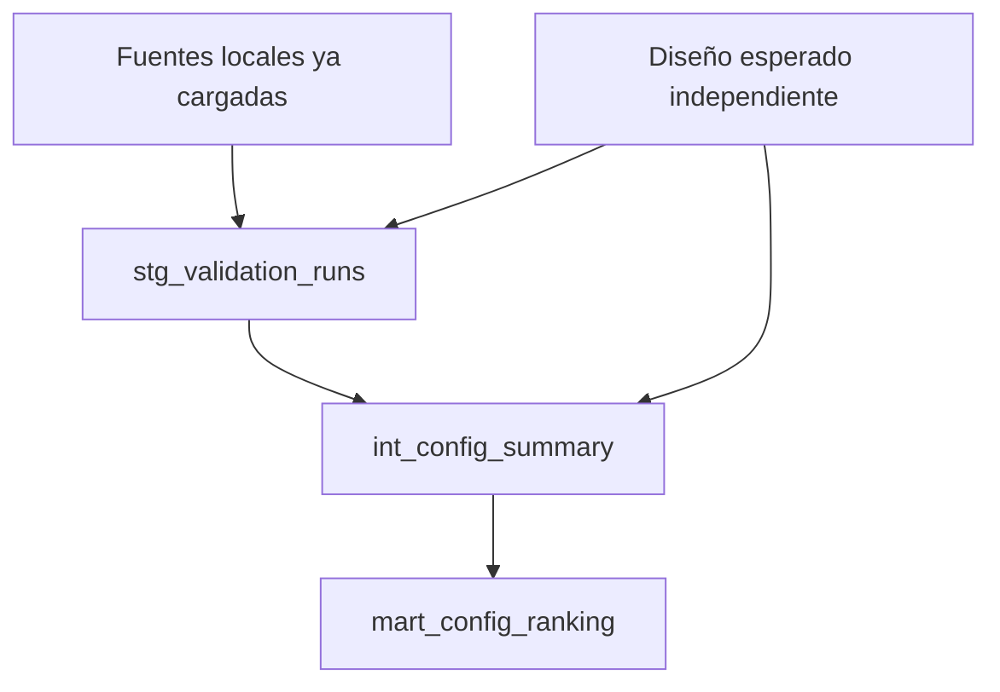
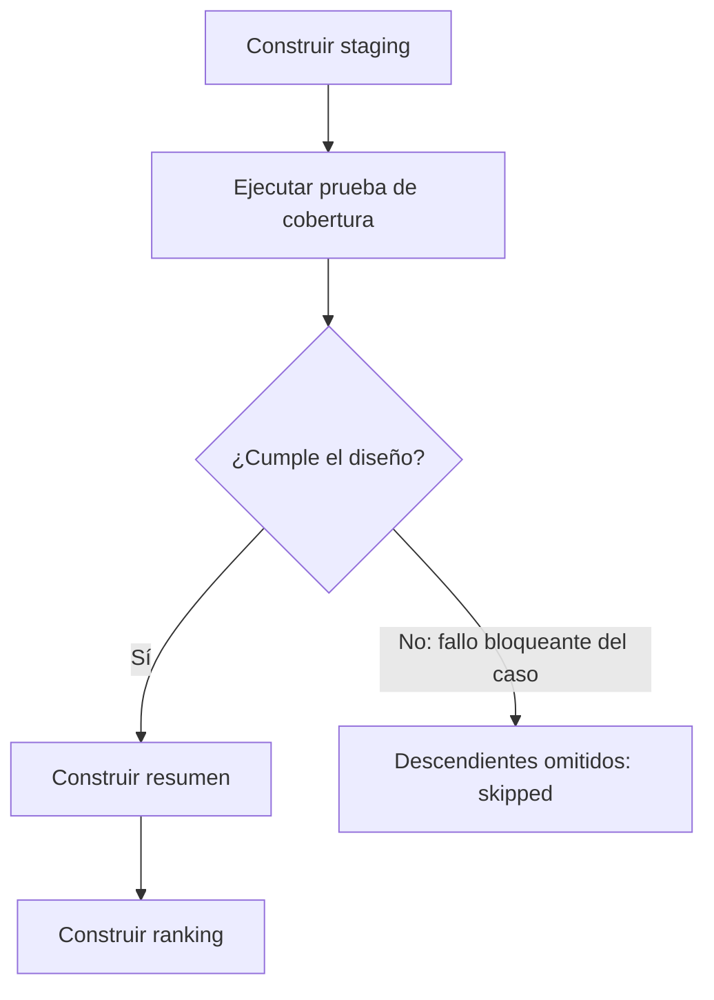

# 4. dbt: organizar la SQL y sus dependencias

## Qué problema resuelve

Si una consulta necesita una tabla que todavía no existe, no puede construir su resultado desde cero. En un notebook quizá funcione porque ejecutaste celdas antes y quedó estado en memoria. Ese orden accidental no sirve como especificación del proceso.

**dbt organiza transformaciones SQL, declara dependencias y ejecuta las pruebas seleccionadas. DuckDB ejecuta la SQL del caso.** Python conecta las etapas previas. dbt no descarga por sí solo el HTML ni reemplaza los controles de extracción y carga.

## Modelo SQL no significa modelo de Machine Learning

| Palabra “modelo” | Qué recibe | Qué produce |
|---|---|---|
| modelo de ML | características de una observación | predicciones |
| modelo SQL en dbt | relaciones o tablas | una relación transformada |

Aquí no hay un nuevo entrenamiento. Los resultados experimentales ya existen; dbt organiza cómo convertirlos en un producto analítico.

## Tres modelos y tres responsabilidades

![[assets/m11-p23.png|1000]]

| Modelo | Una fila representa | Responsabilidad |
|---|---|---|
| stg_validation_runs | ejecución elegible | integrar claves, diseño y métrica |
| int_config_summary | versión/configuración completa | comprobar cobertura para resumir y calcular la media |
| mart_config_ranking | versión/configuración con puesto | comparar los resúmenes |

`stg`, `int` y `mart` ayudan a identificar capas. No son certificados de calidad. La organización de staging integrado es una decisión docente del caso, no una arquitectura obligatoria para cualquier empresa.



Es un **grafo dirigido acíclico**: las flechas tienen dirección y no vuelven formando un ciclo. Para construir desde cero se requiere primero aquello de lo que depende el siguiente modelo. Escribir el archivo del resumen primero no crea sus entradas.

## source: nombrar una entrada preparada

En la plantilla del modelo:

```sql
FROM {{ source('raw', 'runs') }} AS r
```

En la SQL resuelta del ejemplo:

```sql
FROM raw.runs AS r
```

`source` identifica una fuente declarada. No descarga datos, no crea automáticamente la tabla y no valida todos sus valores. dbt resuelve la plantilla antes de enviar SQL a DuckDB; DuckDB no recibe Jinja sin resolver.

**Analogía:** source es la etiqueta del almacén donde está el ingrediente. Escribir la etiqueta no llena el almacén.

## ref: declarar dependencia de otro modelo

```sql
FROM {{ ref('stg_validation_runs') }} AS s
```

Esto referencia el resultado del modelo y permite a dbt reconocer que el consumidor depende de él. Para combinarlo con otra relación aún hay que escribir `JOIN ... ON ...` con las claves apropiadas.

| Expresión | Qué declara |
|---|---|
| source | “uso esta entrada declarada” |
| ref | “uso el resultado de este modelo” |
| JOIN | “combino estas relaciones” |
| ON | “estas son las correspondencias entre sus filas” |

`ref` no adivina el JOIN ni corrige su cardinalidad. Puedes declarar bien el grafo y escribir una unión equivocada: hacen falta ambas cosas.

## Qué significa construir y probar

En el caso documentado, `dbt build` construye los modelos y ejecuta las pruebas seleccionadas respetando sus dependencias. La construcción satisfactoria mostrada tiene tres modelos con `success` y pruebas seleccionadas con `pass`; el contenido coincide con el obtenido por SQL directa.

Eso es evidencia del caso del PDF, no una ejecución hecha con estas notas. Tampoco significa que cualquier selección o configuración de pruebas bloquee todos los resultados posibles: el comportamiento depende de las pruebas incluidas, su severidad y las dependencias.



## Por qué esto sirve fuera del curso

En un informe diario de ventas, el resumen por tienda necesita primero ventas válidas. En un sistema de evaluación de IA, la comparación necesita primero métricas completas. Declarar la dependencia evita producir un resultado nuevo sobre una entrada que todavía no se ha preparado o que no cumple el contrato comprobado.

> [!question]- ¿Un modelo dbt aprende pesos?
> No en este uso. Es una transformación SQL que produce una relación. El clasificador de ML pertenece al experimento previo.

> [!question]- ¿source crea raw.runs?
> No. Nombra una fuente declarada cuya relación física ya debe haberse preparado y cargado.

> [!question]- ¿ref y JOIN son equivalentes?
> No. ref referencia un modelo y declara dependencia; JOIN combina relaciones y ON establece las claves de correspondencia.

> [!question]- ¿Por qué no empezar por el ranking en una salida vacía?
> Necesita el resumen; el resumen necesita la población. Construir desde cero exige respetar ese orden.

> [!question]- ¿Una ejecución success garantiza que las reglas de negocio están bien?
> No. Significa que esa construcción terminó correctamente. Las pruebas solo cubren los predicados declarados y ejecutados; una regla equivocada puede seguir funcionando.

Fuente: [[assets/module_11.pdf#page=20|PDF pp. 20–26]]. Sigue con [[05 Pruebas, fallos y reconstrucción - M11]].
