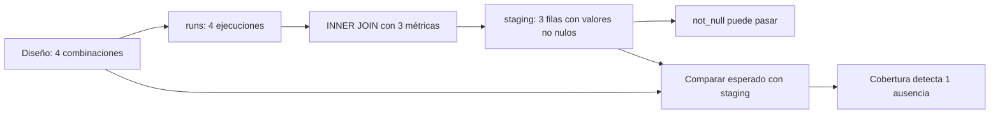
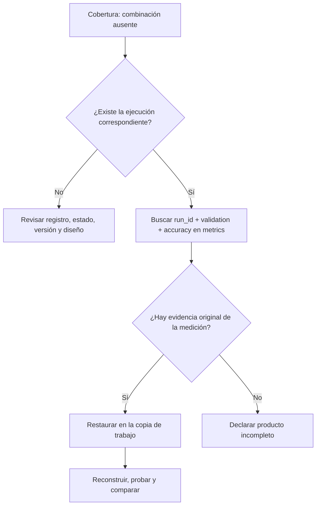

# 5. Pruebas, fallos y reconstrucción

## Cada prueba responde una pregunta concreta

Un **predicado** es una condición que puede cumplirse o no. Por ejemplo: “accuracy está entre 0 y 1 y es finita”. Una prueba evalúa ese predicado; no certifica todo el producto.

| Prueba | Pregunta | Lo que todavía puede fallar |
|---|---|---|
| not_null | ¿falta un valor requerido? | valor fuera de dominio |
| unique | ¿se repite la clave examinada? | ausencia de filas esperadas |
| dominio de accuracy | ¿es finita y está en [0,1]? | cobertura, sesgo o calidad del diseño |
| referencias | ¿las claves apuntan a entidades existentes? | medición objetivo ausente |
| cobertura esperada | ¿hay exactamente una ejecución elegible por combinación? | valores incorrectos dentro del dominio |
| hash de entrada | ¿coinciden sus bytes con la referencia? | referencia ya defectuosa |
| comparación de reconstrucciones | ¿coinciden esquema, claves, filas y valores? | error compartido por ambas ejecuciones |

## Auditar antes del INNER JOIN

Un INNER JOIN conserva solo coincidencias. Si una ejecución carece de `validation/accuracy`, puede desaparecer al unir con metrics. Una prueba `not_null` en la tabla resultante no ve esa ejecución: ya no hay fila que examinar.



Por eso se auditan claves, referencias y campos requeridos antes de unir, y se contrasta la salida con un diseño independiente después.

## La prueba de dominio busca filas que violan la regla

Fragmento del PDF para DuckDB dentro de dbt:

```sql
SELECT run_id, validation_accuracy
FROM {{ ref('stg_validation_runs') }}
WHERE validation_accuracy IS NULL
   OR NOT isfinite(validation_accuracy)
   OR validation_accuracy < 0
   OR validation_accuracy > 1
```

Una o más filas devueltas son casos que incumplen el predicado. Cero filas significa que no encontró violaciones **en los registros examinados**. No implica que se hayan recibido todas las ejecuciones ni que el modelo generalice bien.

Comprobar que el valor es finito excluye valores como infinito; el dominio de la métrica no queda definido solo por su tipo numérico.

## La trampa de la tabla vacía

![[assets/m11-p29.png|1000]]

Si no hay filas, tampoco hay claves repetidas: `unique` puede pasar. Una prueba de valores puede devolver cero violaciones porque no examinó ningún valor. Sin una regla de cobertura o de existencia, un producto vacío puede parecer válido.

**Recuerda el aula:** “ningún alumno presente repite matrícula” no significa “asistieron todos los alumnos esperados”.

## Cobertura: comenzar por lo esperado

La prueba parte de `expected_design` y hace LEFT JOIN hacia staging. Así conserva cada combinación planificada aunque no encuentre una ejecución elegible.

Lógica conceptual ampliada del extracto de la p. 29:

```sql
SELECT e.dataset_id, e.dataset_version, e.config_id, e.seed
FROM expected_design AS e
LEFT JOIN stg_validation_runs AS s
  ON s.dataset_id = e.dataset_id
 AND s.dataset_version = e.dataset_version
 AND s.config_id = e.config_id
 AND s.seed = e.seed
GROUP BY e.dataset_id, e.dataset_version, e.config_id, e.seed
HAVING COUNT(s.run_id) <> 1;
```

Esta consulta didáctica presupone nombres físicos sin plantillas y diseño previamente validado como único y no vacío. Cuenta `s.run_id`, que es no nulo en una ejecución válida: con cero coincidencias da cero; con una da uno; con dos detecta multiplicación. No uses `COUNT(*)` aquí para detectar ausencias: el LEFT JOIN conserva una fila del diseño aunque no encuentre pareja.

## El caso de la métrica omitida

![[assets/m11-p30.png|1000]]

Hay que distinguir dos afirmaciones:

- **Consultas aisladas:** staging pierde una ejecución; el resumen puede excluir la configuración incompleta; un ranking calculado sobre lo restante puede tener menos configuraciones.
- **Construcción comprobada del PDF:** staging se construye; `expected_coverage` falla; resumen y ranking aparecen como `skipped`. **No se construye un ranking nuevo** en esa ejecución fallida.

`skipped` no significa que una tabla antigua haya sido borrada. En un entorno con resultados previos, debe comprobarse a qué ejecución pertenece la salida antes de presentarla como actual.

## Cómo diagnosticar y reparar sin inventar datos



El caso docente encuentra la ejecución, pero falta su fila de métrica. Un LEFT JOIN sirve para conservar la combinación investigada y mostrar la ausencia. No se inventa un nuevo run_id ni se deduce la semilla del nombre.

Rellenar con cero o con la media quizá haga pasar una prueba de nulos; **no recupera la medición**. La reparación debe restaurar evidencia verificable en la copia didáctica, repetir las comprobaciones y reconstruir los descendientes. Para duplicados de metadatos, se investiga qué ficha es correcta; no se borra arbitrariamente una fila.

## Hash y calidad son evidencias distintas

Un hash resume los bytes de un archivo. Si una copia congelada ya contiene una clave duplicada, puede conservar exactamente su hash y seguir fallando la unicidad. El hash permite detectar cambios respecto de esa referencia; no afirma que la referencia esté bien.

$$\text{misma entrada} \not\Rightarrow \text{entrada válida}$$

## Dos reconstrucciones limpias

![[assets/m11-p33.png|1000]]

El orden descrito es: comprobar procedencia e integridad, extraer en solo lectura, normalizar, cargar tipos explícitos, validar, construir modelos con pruebas y comparar.

Se usan salidas independientes para evitar depender de tablas que ya estaban creadas. La comparación mira **esquema, claves, filas y valores**, con un orden de presentación definido. Las fuentes de M10 deben permanecer intactas.

Dos bases pueden contener la misma respuesta sin tener idénticos bytes o logs. Por eso no se exige igualdad de hash de los archivos de salida. Si otro problema necesita tolerancia para decimales, debe definirla y justificarla; no usarla para esconder diferencias de claves o registros.

> [!question]- ¿Cero filas devueltas por la prueba de accuracy demuestra cobertura?
> No. Solo indica que no encontró valores que violaran su regla. Incluso una tabla vacía puede devolver cero violaciones.

> [!question]- ¿Por qué la cobertura usa LEFT JOIN desde el diseño?
> Para conservar también lo esperado que no tiene coincidencia observada. Si empieza por las filas sobrevivientes, las ausencias pueden quedar invisibles.

> [!question]- ¿Qué significa COUNT(s.run_id) = 0 después del LEFT JOIN?
> Que para esa combinación del diseño no se encontró ejecución elegible en staging. Hay que investigar si falta la ejecución, si no cumple filtros o si falta la métrica.

> [!question]- Si falla expected_coverage en el build del PDF, ¿se produjo un ranking nuevo más corto?
> No. Los descendientes se omitieron. El ranking más corto describe una posible consecuencia de consultar por separado, no el resultado de esa construcción fallida.

> [!question]- ¿Basta con rellenar un NULL con 0.5 para seguir?
> No. Se estaría fabricando una medición. Se restaura evidencia original o se declara el producto incompleto.

> [!question]- ¿Mismo hash significa datos correctos?
> No. Puede preservarse un archivo defectuoso. El hash compara bytes; las pruebas evalúan propiedades de los datos.

> [!question]- ¿Dos reconstrucciones iguales demuestran superioridad general del clasificador?
> No. Demuestran igualdad del contenido reconstruido bajo esas entradas y reglas. La generalización requiere evidencia experimental adicional.

Fuente: [[assets/module_11.pdf#page=19|PDF p. 19 y pp. 27–33]]. Sigue con [[06 Laboratorio razonado y gráficos - M11]].
