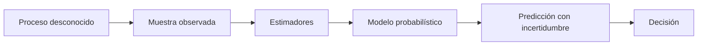

# Probabilidad para IA: índice y recordatorio

> [!abstract] Pregunta del módulo
> ¿Cómo describimos matemáticamente lo que puede ocurrir, cuánto creemos en cada resultado y qué aprendemos de una muestra finita?

## Recordatorio de símbolos

| Símbolo | Lectura | Ejemplo |
|---|---|---|
| $\Omega$ | resultados posibles | todas las sesiones posibles |
| $A$ | evento | “la sesión es impostora” |
| $P(A)$ | probabilidad marginal | frecuencia esperada de impostores |
| $P(A\mid B)$ | probabilidad condicional | impostor dado cierto patrón |
| $X$ | variable aleatoria | velocidad media futura |
| $x$ | valor observado | 420 px/s |
| $E[X]$ | esperanza | promedio teórico |
| $\operatorname{Var}(X)$ | dispersión cuadrática | variabilidad entre sesiones |
| $p(x\mid\theta)$ | modelo de datos | distribución dada una media |
| $\hat\theta$ | estimación | parámetro aprendido de la muestra |

## Ruta

1. [[01 Eventos, probabilidad condicional, independencia y Bayes]]
2. [[02 Variables aleatorias, distribuciones, esperanza y CLT]]
3. [[03 Verosimilitud, entropía, cross-entropy y KL]]
4. [[04 Laboratorio y autoevaluación - Probabilidad para IA]]

## Una idea que conecta todo

La probabilidad va del **modelo al dato**:

$$p(x\mid\theta):\quad \text{si conozco }\theta,\text{ ¿qué datos espero?}$$

La inferencia va del **dato al parámetro**:

$$p(\theta\mid x):\quad \text{después de observar }x,\text{ ¿qué creo sobre }\theta?$$

## Criterio de dominio

No basta decir “Bayes actualiza probabilidades”. Debes poder construir una tabla de frecuencias, distinguir $P(A\mid B)$ de $P(B\mid A)$ y comprobar el resultado con conteos.

---

Volver a [[../00 INICIO - Qué es cada cosa y ruta maestra de IA]] · Siguiente: [[01 Eventos, probabilidad condicional, independencia y Bayes]]

