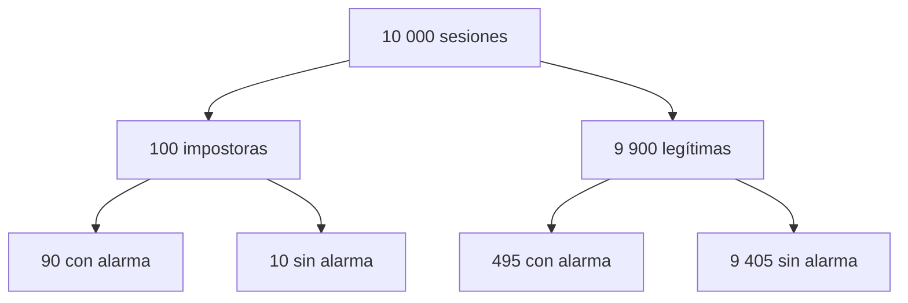

# Eventos, probabilidad condicional, independencia y Bayes

![[../assets/ruta maestra ia/02-bayes-tasa-base.gif|900]]

## De resultados a eventos

Un resultado es una posibilidad completa. Un evento es un conjunto de resultados que cumple una condición. Si elegimos una sesión al azar:

- $I$: la sesión es de un impostor;
- $A$: el detector produce alarma.

La probabilidad cumple $0\le P(A)\le1$ y $P(\Omega)=1$.

## Condicionar significa cambiar el universo

$$P(I\mid A)=\frac{P(I\cap A)}{P(A)}.$$

El denominador restringe la comparación a los casos con alarma. No es lo mismo que:

$$P(A\mid I)=\frac{P(I\cap A)}{P(I)}.$$

La primera pregunta es “entre las alarmas, ¿cuántas son impostores?”. La segunda es “entre los impostores, ¿cuántos generan alarma?”.

## Ejemplo de 10.000 sesiones

Supón:

- 100 sesiones impostoras;
- el detector encuentra 90;
- de 9.900 sesiones legítimas, 495 producen falsa alarma.

| realidad / alarma | alarma | sin alarma | total |
|---|---:|---:|---:|
| impostor | 90 | 10 | 100 |
| legítimo | 495 | 9.405 | 9.900 |
| total | 585 | 9.415 | 10.000 |

Entonces:

$$P(A\mid I)=90/100=0.90,$$

pero

$$P(I\mid A)=90/585\approx0.154.$$

> [!important] Efecto de la tasa base
> Aunque el detector tenga 90 % de sensibilidad, la mayoría de las alarmas pueden ser falsas cuando el evento buscado es poco frecuente.

## Regla del producto y probabilidad total

$$P(A\cap I)=P(A\mid I)P(I).$$

Si $I$ y $L$ particionan la realidad:

$$P(A)=P(A\mid I)P(I)+P(A\mid L)P(L).$$

Esta expansión produce Bayes:

$$P(I\mid A)=\frac{P(A\mid I)P(I)}{P(A\mid I)P(I)+P(A\mid L)P(L)}.$$

## Independencia

$A$ y $B$ son independientes si conocer uno no cambia la probabilidad del otro:

$$P(A\mid B)=P(A),$$

equivalentemente:

$$P(A\cap B)=P(A)P(B).$$

> [!warning] “Distinto” no significa independiente
> Dos filas pueden ser diferentes y seguir dependiendo del mismo usuario, sesión, dispositivo o instante. La independencia pertenece al proceso de generación y muestreo, no a la apariencia de la tabla.

## Bayes como actualización

| Parte | Papel |
|---|---|
| $P(I)$ | prior: creencia antes de la señal |
| $P(A\mid I)$ | likelihood: compatibilidad de la señal con impostor |
| $P(A)$ | evidencia: frecuencia total de la señal |
| $P(I\mid A)$ | posterior: creencia después de observar la señal |

## Ejemplo con odds

Las odds posteriores también pueden escribirse:

$$\frac{P(I\mid A)}{P(L\mid A)}=
\frac{P(I)}{P(L)}
\frac{P(A\mid I)}{P(A\mid L)}.$$

El segundo factor es una razón de verosimilitudes: mide cuánto favorece la alarma a una hipótesis sobre la otra.

## Errores frecuentes

- intercambiar $P(A\mid I)$ y $P(I\mid A)$;
- ignorar la tasa base $P(I)$;
- afirmar independencia porque no se observa correlación lineal;
- calcular porcentajes sin declarar el denominador;
- interpretar una probabilidad como garantía individual.

## Autoevaluación

1. Si $P(A\mid I)=0.95$, ¿por qué no puedes concluir $P(I\mid A)=0.95$?
2. ¿Qué cambia cuando condicionas?
3. ¿Cómo reconocerías dependencia por usuario?

> [!question]- Respuestas
> 1. Falta conocer la tasa base y las falsas alarmas. 2. El conjunto de casos que funciona como denominador. 3. Varias observaciones comparten una causa y deben agruparse o modelarse juntas.

---

Anterior: [[00 Índice y recordatorio - Probabilidad para IA]] · Siguiente: [[02 Variables aleatorias, distribuciones, esperanza y CLT]]
