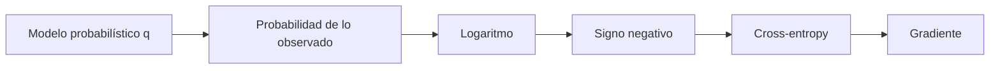

# Verosimilitud, entropía, cross-entropy y KL

## Probabilidad y verosimilitud usan la misma expresión con preguntas distintas

$$p(x\mid\theta).$$

- Como probabilidad, $\theta$ está fijo y varía el dato posible $x$.
- Como verosimilitud, el dato observado está fijo y comparamos valores de $\theta$.

## Máxima verosimilitud

Para datos independientes:

$$L(\theta)=\prod_{i=1}^n p(x_i\mid\theta).$$

Se usa el logaritmo porque convierte productos en sumas y mejora la estabilidad:

$$\ell(\theta)=\log L(\theta)=\sum_{i=1}^n\log p(x_i\mid\theta).$$

Maximizar $\ell$ equivale a minimizar la log-verosimilitud negativa:

$$\hat\theta_{MLE}=\arg\min_\theta -\sum_i\log p(x_i\mid\theta).$$

## Ejemplo Bernoulli

Con etiquetas $y_i\in\{0,1\}$ y probabilidad $p$:

$$p(y_i\mid p)=p^{y_i}(1-p)^{1-y_i}.$$

La pérdida media es:

$$-\frac1n\sum_i[y_i\log p+(1-y_i)\log(1-p)].$$

Esta es binary cross-entropy. No fue elegida arbitrariamente: aparece al modelar las etiquetas como Bernoulli y aplicar máxima verosimilitud.

## MAP: datos más creencia previa

Bayes dice:

$$p(\theta\mid x)\propto p(x\mid\theta)p(\theta).$$

El máximo a posteriori minimiza:

$$-\log p(x\mid\theta)-\log p(\theta).$$

Un prior gaussiano sobre pesos produce un término parecido a regularización L2. Por eso la regularización puede interpretarse como preferencia previa por parámetros pequeños.

## Información de un evento

$$I(x)=-\log p(x).$$

Un evento raro aporta más sorpresa. Si $p(x)=1$, su información es cero.

## Entropía

$$H(p)=-\sum_xp(x)\log p(x)=E_p[-\log p(X)].$$

Mide incertidumbre media de una distribución. Una categórica concentrada tiene baja entropía; una uniforme tiene entropía alta.

## Cross-entropy

Si los datos siguen $p$ y predecimos con $q$:

$$H(p,q)=-\sum_xp(x)\log q(x).$$

En clasificación one-hot, solo queda el logaritmo de la clase correcta:

$$H(y,q)=-\log q_y.$$

| probabilidad correcta | pérdida $-\log q_y$ |
|---:|---:|
| 0.9 | 0.105 |
| 0.5 | 0.693 |
| 0.1 | 2.303 |

La confianza equivocada recibe un castigo grande.

## Divergencia KL

$$D_{KL}(p\|q)=\sum_xp(x)\log\frac{p(x)}{q(x)}.$$

Y se cumple:

$$H(p,q)=H(p)+D_{KL}(p\|q).$$

Como $H(p)$ no depende del modelo $q$, minimizar cross-entropy respecto de $q$ equivale a minimizar $D_{KL}(p\|q)$.

> [!warning] KL no es distancia métrica
> Generalmente $D_{KL}(p\|q)\ne D_{KL}(q\|p)$ y no cumple simetría.

## Softmax y logits

$$q_i=\frac{e^{z_i}}{\sum_j e^{z_j}}.$$

Para estabilidad se resta $m=\max_jz_j$:

$$q_i=\frac{e^{z_i-m}}{\sum_je^{z_j-m}}.$$

La distribución no cambia porque numerador y denominador se multiplican por el mismo factor.

## Perplejidad

Para pérdida media en nats:

$$\operatorname{PPL}=e^{\text{cross-entropy media}}.$$

Puede interpretarse como tamaño efectivo de incertidumbre, pero depende del tokenizador y del dominio. No compares directamente modelos con unidades de token diferentes.

## Autoevaluación

1. ¿Por qué usamos log-verosimilitud?
2. ¿De dónde aparece binary cross-entropy?
3. ¿Por qué minimizar CE reduce KL?
4. ¿Qué diferencia hay entre alta entropía y alta pérdida?

> [!question]- Respuesta a la cuarta
> La entropía describe incertidumbre de la distribución real. La pérdida describe qué tan mal una predicción asignó masa al resultado observado. Un problema puede ser inherentemente incierto aunque el modelo sea óptimo.

---

Anterior: [[02 Variables aleatorias, distribuciones, esperanza y CLT]] · Siguiente: [[04 Laboratorio y autoevaluación - Probabilidad para IA]]

