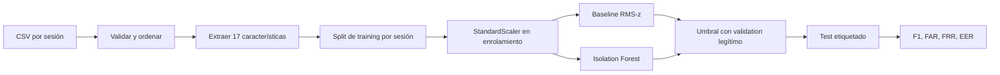

# Proyecto de dinámica de mouse: implementación y estudio

> [!abstract] Pregunta
> ¿Puede un perfil entrenado solo con sesiones legítimas asignar scores mayores a sesiones impostoras sin rechazar excesivamente la variación natural del propietario?

![[../assets/ruta maestra ia/11-proyecto-mouse.svg|900]]

## Antes de ejecutar: qué es cada cosa

| Elemento | Significado |
|---|---|
| evento | una fila $(t,x,y,botón,estado)$ |
| sesión | secuencia completa de eventos |
| usuario | cuenta cuyo comportamiento se modela |
| feature | resumen numérico de una sesión |
| enrolamiento | sesiones legítimas para ajustar el perfil |
| validation | sesiones legítimas para fijar tolerancia |
| test | sesiones legítimas/impostoras para medir una vez |
| score | número continuo; mayor = más anómalo |
| umbral | regla que convierte score en alarma |

## Pipeline



## Características

- cantidad de eventos, movimientos y clics;
- duración y frecuencia de eventos;
- distancia recorrida y desplazamiento neto;
- eficiencia de trayectoria;
- media, desviación y máximo de velocidad;
- media y desviación de aceleración;
- cambio angular medio;
- número y fracción de pausas.

## Convenciones

```text
label 1 = impostor
prediction 1 = alarma
score mayor = más anómalo
```

FAR es impostores aceptados; FRR es legítimos rechazados.

## Estructura ejecutable

```text
notebook/
├── 01_proyecto_dinamica_mouse.ipynb  # Notebook interactivo paso a paso
├── pyproject.toml
├── uv.lock
├── src/mouse_auth/
│   ├── features.py
│   ├── metrics.py
│   └── pipeline.py
├── tests/test_core.py
├── run_baseline.py
├── data/                             # ignorado en Git
└── reports/                          # resultados reproducibles
```

## Comandos

```bash
cd "Obsidian/posgrado/master/MATEMÁTICAS Y PROGRAMACIÓN IA/proyecto/notebook"
uv sync --locked
uv run python -m unittest discover -s tests -v
uv run python run_baseline.py --data data --output reports
```

## Qué no usa para calibrar

`public_labels.csv` se carga para evaluar el test. El umbral se obtiene únicamente de scores de validation legítimo separados de enrolamiento.

> [!important] Subconjunto evaluable
> `test_files/` contiene una partición pública y otra privada. El baseline calcula métricas únicamente para sesiones cuyo nombre aparece en `public_labels.csv`; las demás se cuentan como no etiquetadas, pero no reciben etiquetas inventadas ni intervienen en la evaluación.

> [!warning] Limitación de muestra
> Cada cuenta tiene pocas sesiones de training. El percentil de validation es inestable y el proyecto es una prueba de concepto, no un sistema biométrico listo para producción.

## Cómo interpretar resultados

1. Compara baseline e Isolation Forest.
2. Revisa macro por usuario y micro agregado.
3. Observa FAR y FRR simultáneamente.
4. Revisa usuarios extremos.
5. Inspecciona errores antes de cambiar features.
6. Repite con protocolo fijo; no ajustes mirando test.

## Evidencia generada

- Explicación de resultados: [[Resultados - Baseline de dinámica de mouse]].
- `reports/baseline_metrics.json`: configuración y métricas.
- `reports/baseline_predictions.csv`: score, umbral y decisión por sesión.

## Limitaciones y ética

- ataques son simulados con otros usuarios;
- comportamiento puede cambiar con dispositivo y tiempo;
- dinámica de mouse es dato biométrico conductual;
- un score anómalo no demuestra intención maliciosa;
- decisiones reales necesitarían consentimiento, seguridad y revisión de impacto.

## Checklist

- [x] Tests sintéticos pasan.
- [x] Ninguna sesión se mezcla entre enrolamiento y validation.
- [x] El scaler se ajusta solo con enrolamiento.
- [x] El test no define umbral.
- [x] Se registran resultados por usuario.
- [x] La conclusión limita la población y el tipo de ataque.

---

Resultados: [[Resultados - Baseline de dinámica de mouse]] · Fundamentos: [[../deteccion de anomalias y series temporales/06 Laboratorio del proyecto - dinámica de mouse]] · Inicio: [[../00 INICIO - Qué es cada cosa y ruta maestra de IA]]
