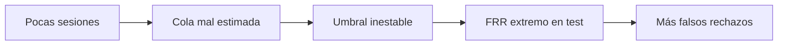

# Resultados del baseline de dinámica de mouse

> [!abstract] Conclusión breve
> El pipeline es reproducible y detecta señal, pero todavía no es un autenticador utilizable. Los dos métodos rechazan demasiadas sesiones legítimas. El cuello de botella principal no es escoger un modelo más sofisticado: es estimar un umbral estable con apenas una o dos sesiones legítimas de validación por usuario.

## Nota inicial: recuerda qué es cada cosa

- **Score de anomalía:** número continuo; más alto significa que la sesión se aleja más del perfil.
- **Umbral:** valor fijo que convierte el score en decisión.
- **Alarma:** predicción 1; la sesión se considera impostora.
- **FAR:** impostores aceptados por error. Más bajo es mejor para seguridad.
- **FRR:** legítimos rechazados por error. Más bajo es mejor para usabilidad.
- **F1 de impostor:** combina precisión y recall de la clase impostora, pero no reemplaza FAR y FRR.
- **Micro:** reúne todas las sesiones antes de calcular la métrica.
- **Macro:** calcula por usuario y luego promedia; da el mismo peso a cada persona.

![[../assets/ruta maestra ia/13-baseline-resultados.svg|900]]

## Qué se ejecutó

El experimento usó 10 usuarios:

| partición | sesiones | función |
|---|---:|---|
| training total | 65 | fuente de enrolamiento y validación |
| enrolamiento | 46 | ajustar scaler y modelo |
| validación legítima | 19 | elegir umbral por usuario |
| test público etiquetado | 816 | calcular métricas finales |
| test privado sin etiqueta | 795 | se cuenta, pero no se evalúa |

La configuración quedó fijada en `random_state=7`, `validation_fraction=0.25`, percentil legítimo `0.95` y 200 árboles para Isolation Forest.

> [!important] Separación correcta
> Las etiquetas públicas se consultan solo después de ajustar modelos y umbrales. Las 795 sesiones privadas no reciben etiquetas inventadas. Esto evita una evaluación artificial.

## Resultado agregado micro

| modelo | F1 impostor ↑ | accuracy ↑ | FAR ↓ | FRR ↓ |
|---|---:|---:|---:|---:|
| RMS-z | 0.657 | 0.516 | **0.064** | 0.898 |
| Isolation Forest | 0.611 | **0.572** | 0.323 | **0.530** |

### Matriz de confusión de RMS-z

| realidad / decisión | alarma | acepta | total |
|---|---:|---:|---:|
| impostor | TP = 379 | FN = 26 | 405 |
| legítimo | FP = 369 | TN = 42 | 411 |

RMS-z encuentra 379 de 405 impostores, pero solo acepta correctamente 42 de 411 sesiones legítimas. El F1 parece razonable porque favorece la detección de impostores; el FRR revela que la experiencia del propietario sería inaceptable.

### Matriz de confusión de Isolation Forest

| realidad / decisión | alarma | acepta | total |
|---|---:|---:|---:|
| impostor | TP = 274 | FN = 131 | 405 |
| legítimo | FP = 218 | TN = 193 | 411 |

Isolation Forest reduce el rechazo de legítimos, pero acepta 131 impostores. Es un compromiso diferente, no una solución definitiva.

## Resultado macro por usuario

| modelo | F1 macro ↑ | accuracy macro ↑ | FAR macro ↓ | FRR macro ↓ |
|---|---:|---:|---:|---:|
| RMS-z | 0.634 | 0.515 | 0.083 | 0.881 |
| Isolation Forest | 0.430 | 0.577 | 0.473 | 0.523 |

La diferencia entre micro y macro confirma heterogeneidad: algunos usuarios son mucho más fáciles de modelar que otros. Un promedio global puede ocultar una persona para la cual el sistema falla casi siempre.

## Por qué el umbral falló

El percentil 95 de validación pretende dejar pasar aproximadamente 95 % del comportamiento legítimo. Sin embargo:

1. cada usuario aporta solo 5–7 sesiones de training;
2. después del split quedan apenas 1–2 sesiones para estimar el umbral;
3. con dos números, un percentil alto es casi el máximo observado, no una estimación estable de una cola;
4. las sesiones legítimas del test pueden venir de otro momento, dispositivo o contexto;
5. si el score cambia de distribución, el umbral deja de representar el FRR esperado.

> [!warning] EER exploratorio
> El JSON incluye un EER calculado sobre test solo para estudiar separabilidad. No debe copiarse como umbral operativo, porque hacerlo usaría el examen final para elegir la respuesta.

## Qué profundizar ahora, en orden

1. **Calibración out-of-fold:** rota qué sesión legítima queda fuera, genera scores no vistos para todas las sesiones de training y estima el umbral con más evidencia.
2. **Intervalos de confianza:** usa bootstrap por sesión o por usuario; no trates una cifra puntual como certeza.
3. **Transformaciones robustas:** prueba logaritmos para velocidad/duración, medianas, MAD y winsorización definida solo con enrolamiento.
4. **Ventanas temporales:** una sesión completa puede mezclar varios comportamientos; compara ventanas de 10–30 segundos sin permitir que ventanas hermanas crucen particiones.
5. **Ablaciones:** elimina por grupos velocidad, ángulos, clics y pausas para saber qué señal realmente aporta.
6. **Cambio de dominio:** registra dispositivo, resolución, frecuencia de muestreo y tiempo entre sesiones si esos metadatos existen.
7. **Curvas por usuario:** grafica distribuciones de scores legítimos e impostores; la superposición explica mejor el fallo que un único F1.
8. **Costo operativo:** decide primero cuánto cuesta aceptar un impostor y cuánto cuesta bloquear al propietario; luego selecciona el umbral.

## Criterio de avance

No pases a redes neuronales hasta lograr que un protocolo simple y sin fuga produzca:

- métricas por usuario con intervalos;
- umbral elegido sin test;
- comparación contra baselines simples;
- análisis de errores y cambio temporal;
- resultado reproducible desde `uv sync --locked`.

## Evidencia verificable

- Métricas completas: `notebook/reports/baseline_metrics.json`.
- Predicciones por sesión y modelo: `notebook/reports/baseline_predictions.csv`.
- Implementación: `notebook/src/mouse_auth/`.
- Pruebas: `notebook/tests/test_core.py`.

---

Anterior: [[README - Proyecto de dinámica de mouse]] · Fundamentos: [[../deteccion de anomalias y series temporales/00 Índice y recordatorio - Anomalías y secuencias]] · Inicio: [[../00 INICIO - Qué es cada cosa y ruta maestra de IA]]
