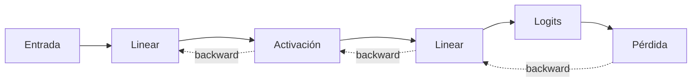

# Redes neuronales desde cero: índice y recordatorio

> [!abstract] Idea central
> Una red neuronal es una composición de transformaciones afines y no lineales cuyos parámetros se ajustan para reducir una pérdida.

![[../assets/ruta maestra ia/06-red-forward-backward.gif|900]]

## Recordatorio del bloque básico

$$Z=XW+b,\qquad H=\phi(Z).$$

| Símbolo | Forma | Significado |
|---|---|---|
| $X$ | $(B,D)$ | lote de entradas |
| $W$ | $(D,H)$ | pesos aprendibles |
| $b$ | $(H,)$ | sesgo por unidad |
| $Z$ | $(B,H)$ | preactivaciones |
| $\phi$ | elemento a elemento | no linealidad |

## Ruta

1. [[01 Neurona, MLP, activaciones y formas]]
2. [[02 Inicialización y flujo del gradiente]]
3. [[03 Normalización, dropout y conexiones residuales]]
4. [[04 Entrenamiento, datos y puente a CNN, RNN y Transformer]]
5. [[05 Laboratorio y autoevaluación - Red neuronal desde cero]]

---

Volver a [[../00 INICIO - Qué es cada cosa y ruta maestra de IA]] · Siguiente: [[01 Neurona, MLP, activaciones y formas]]
