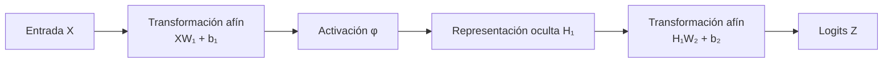

# Neurona, MLP, activaciones y formas

> [!abstract] Idea central
> Una red neuronal recibe números, los combina mediante **pesos** y **sesgos**, y aplica funciones no lineales. Durante el entrenamiento aprende los valores de esos pesos y sesgos para que su salida reduzca una función de pérdida.

## 1. Antes de empezar: vocabulario mínimo

| Término | Significado |
|---|---|
| **Característica** o *feature* | Cada variable de entrada: edad, precio, píxel, temperatura, etc. |
| **Neurona** | Unidad que combina entradas y produce un número. |
| **Capa** | Conjunto de neuronas que procesan la misma entrada en paralelo. |
| **Peso** | Número aprendible que determina cuánto influye una entrada. |
| **Sesgo** o *bias* | Número aprendible que desplaza la respuesta de una neurona. |
| **Activación** | Función no lineal aplicada después de la combinación lineal. |
| **Parámetro** | Cualquier valor que el entrenamiento modifica; aquí son los pesos y sesgos. |
| **Logit** | Salida numérica sin convertir todavía en probabilidad. |
| **Lote** o *batch* | Grupo de ejemplos procesados simultáneamente. |

## 2. Una sola neurona

Supongamos que un ejemplo tiene $D$ características:

$$x=\begin{bmatrix}x_1\\x_2\\\vdots\\x_D\end{bmatrix},
\qquad
w=\begin{bmatrix}w_1\\w_2\\\vdots\\w_D\end{bmatrix}.$$

La neurona realiza dos pasos:

$$\underbrace{z=w^Tx+b}_{\text{preactivación}},
\qquad
\underbrace{h=\phi(z)}_{\text{activación o salida}}.$$

Desarrollado componente a componente:

$$z=w_1x_1+w_2x_2+\cdots+w_Dx_D+b.$$

### ¿Qué hace cada elemento?

- **Las entradas $x_i$** contienen la información del ejemplo.
- **Cada peso $w_i$** controla la influencia de $x_i$:
  - si $w_i$ es positivo, aumentar $x_i$ tiende a aumentar $z$;
  - si $w_i$ es negativo, aumentar $x_i$ tiende a disminuir $z$;
  - si $w_i$ está cerca de cero, esa característica influye poco.
- **El sesgo $b$** desplaza el valor de $z$. Permite que la neurona produzca algo distinto de cero incluso cuando todas las entradas valen cero.
- **La función $\phi$** transforma $z$. Es la activación y, normalmente, introduce la no linealidad.

> [!note] “Lineal” frente a “afín”
> Técnicamente, $w^Tx$ es una transformación lineal, mientras que $w^Tx+b$ es una transformación **afín** debido al sesgo. En aprendizaje automático se suele llamar “capa lineal” a ambas.

### Ejemplo numérico

Consideremos:

$$x=\begin{bmatrix}2\\-1\\3\end{bmatrix},
\qquad
w=\begin{bmatrix}0.5\\1\\-0.25\end{bmatrix},
\qquad b=0.1.$$

Entonces:

$$
\begin{aligned}
z
&=0.5(2)+1(-1)-0.25(3)+0.1\\
&=1-1-0.75+0.1\\
&=-0.65.
\end{aligned}
$$

Si usamos ReLU, $\phi(z)=\max(0,z)$:

$$h=\operatorname{ReLU}(-0.65)=0.$$

La neurona no “decidió” manualmente esos pesos. Durante el entrenamiento, un optimizador los modifica utilizando los gradientes de la pérdida.

## 3. Interpretación geométrica

La ecuación

$$w^Tx+b=0$$

define una frontera lineal:

- una recta si la entrada tiene dos dimensiones;
- un plano si tiene tres;
- un hiperplano si tiene más dimensiones.

El vector $w$ es perpendicular a esa frontera y determina su orientación. El sesgo $b$ desplaza la frontera sin cambiar su orientación.

Por ejemplo, antes de aplicar una sigmoid:

- $w^Tx+b>0$ coloca el punto a un lado de la frontera;
- $w^Tx+b<0$ lo coloca al otro lado;
- cuanto mayor sea $|w^Tx+b|$, más alejado está de la frontera en la escala definida por $w$.

Una sola neurona solo puede construir una frontera lineal. Varias neuronas y activaciones permiten combinar muchas regiones y representar fronteras más complejas.

## 4. De una neurona a una capa completa

Una capa con $H$ neuronas calcula $H$ resultados en paralelo. Si procesamos un lote de $B$ ejemplos, organizamos los datos así:

$$X:(B,D).$$

- $B$: número de ejemplos del lote;
- $D$: número de características por ejemplo.

Los pesos de las $H$ neuronas se agrupan en una matriz:

$$W:(D,H).$$

Cada **columna** de $W$ contiene los $D$ pesos de una neurona. Hay además un sesgo por neurona:

$$b:(H,).$$

La capa completa calcula:

$$Z=XW+b,$$

con las siguientes formas:

$$X:(B,D),\quad W:(D,H),\quad b:(H,),\quad Z:(B,H).$$

### Cómo comprobar las formas

En el producto de matrices se cancelan las dimensiones interiores:

$$\underbrace{(B,D)}_X\underbrace{(D,H)}_W=(B,H).$$

El resultado contiene:

- una fila por ejemplo;
- una columna por neurona.

> [!tip] Regla práctica para multiplicar matrices
> $(a,b)(b,c)=(a,c)$. Las dos dimensiones del centro deben coincidir y desaparecen del resultado.

### ¿Cómo se suma el sesgo?

$Z$ tiene forma $(B,H)$, pero $b$ tiene forma $(H,)$. El sesgo se suma a todas las filas mediante **broadcasting**:

$$
\begin{bmatrix}
z_{11}&\cdots&z_{1H}\\
z_{21}&\cdots&z_{2H}\\
\vdots&&\vdots\\
z_{B1}&\cdots&z_{BH}
\end{bmatrix}
+
\begin{bmatrix}b_1&\cdots&b_H\end{bmatrix}.
$$

El mismo $b_j$ se suma a la neurona $j$ para todos los ejemplos. Por eso, durante *backpropagation*, el gradiente del sesgo suma las contribuciones de los $B$ ejemplos:

$$\frac{\partial L}{\partial b_j}
=\sum_{i=1}^{B}\frac{\partial L}{\partial Z_{ij}}.$$

## 5. Por qué necesitamos activaciones no lineales

Imaginemos dos capas sin activación:

$$H=XW_1+b_1,$$

$$Z=HW_2+b_2.$$

Al sustituir $H$ en la segunda expresión:

$$
\begin{aligned}
Z&=(XW_1+b_1)W_2+b_2\\
 &=X(W_1W_2)+(b_1W_2+b_2).
\end{aligned}
$$

Podemos definir:

$$W'=W_1W_2,\qquad b'=b_1W_2+b_2,$$

y obtener:

$$Z=XW'+b'.$$

Es decir, dos capas afines sin activación equivalen a **una sola capa afín**. Lo mismo ocurre con 10 o 100 capas: sin no linealidades, la profundidad no aporta la capacidad esperada.

Al insertar una activación:

$$H=\phi(XW_1+b_1),$$

ya no podemos absorber fácilmente toda la operación en una sola matriz. Cada capa puede construir características intermedias, y las capas posteriores pueden combinarlas. Esto permite aproximar relaciones curvas, regiones separadas y patrones jerárquicos.

> [!example] Intuición
> Una capa puede detectar condiciones simples; la siguiente puede combinarlas. Por ejemplo, unas neuronas podrían detectar diferentes bordes de una imagen y otras combinarlos para detectar formas.

## 6. Funciones de activación

### 6.1 Sigmoid

$$\sigma(x)=\frac{1}{1+e^{-x}}.$$

Transforma cualquier número al intervalo $(0,1)$:

- si $x\to+\infty$, $\sigma(x)\to1$;
- si $x=0$, $\sigma(x)=0.5$;
- si $x\to-\infty$, $\sigma(x)\to0$.

Es útil para interpretar la salida de una clasificación binaria como probabilidad. Su derivada es:

$$\sigma'(x)=\sigma(x)(1-\sigma(x)).$$

La derivada nunca supera $0.25$ y se aproxima a cero para valores muy positivos o negativos. Esto produce **saturación**: el gradiente se vuelve muy pequeño y la neurona aprende lentamente. Por esa razón, sigmoid no suele ser la primera opción en capas ocultas profundas.

### 6.2 Tanh

$$\tanh(x)=\frac{e^x-e^{-x}}{e^x+e^{-x}}.$$

Produce valores en $(-1,1)$ y está centrada en cero. Esto puede ser preferible a sigmoid en ciertos estados internos, pero también se satura cuando $|x|$ es grande.

### 6.3 ReLU

$$\operatorname{ReLU}(x)=\max(0,x).$$

- para $x>0$, devuelve $x$ y su derivada es $1$;
- para $x<0$, devuelve $0$ y su derivada es $0$.

Es simple, rápida y ha sido muy utilizada en capas ocultas. Su riesgo es la **ReLU muerta**: si una neurona permanece siempre en la región negativa, su salida y su gradiente son cero, de modo que puede dejar de actualizarse.

### 6.4 GELU

$$\operatorname{GELU}(x)=x\Phi(x),$$

donde $\Phi(x)$ es la función de distribución acumulada de una normal estándar. Se parece a una versión suave de ReLU: no corta bruscamente todos los valores negativos. Es común en arquitecturas Transformer.

### 6.5 SiLU o Swish

$$\operatorname{SiLU}(x)=x\sigma(x).$$

Es suave y permite pequeñas salidas negativas. Se usa con frecuencia en modelos modernos, aunque cuesta algo más que ReLU.

### Comparación rápida

| Función | Rango de salida | Ventaja | Riesgo o coste | Uso común |
|---|---:|---|---|---|
| sigmoid | $(0,1)$ | interpretable como probabilidad binaria | saturación | salida binaria |
| tanh | $(-1,1)$ | centrada en cero | saturación | algunos estados recurrentes |
| ReLU | $[0,\infty)$ | simple y rápida | unidades muertas | capas ocultas |
| GELU | aprox. $(-0.17,\infty)$ | transición suave | más cálculo | Transformers |
| SiLU | aprox. $(-0.28,\infty)$ | suave y buen flujo de gradiente | más cálculo | redes modernas |

> [!important] La activación depende del lugar
> No se elige una única activación para toda la red por costumbre. En las capas ocultas son comunes ReLU, GELU o SiLU. La capa de salida depende de la tarea y de la función de pérdida.

## 7. Qué es un MLP

**MLP** significa *Multi-Layer Perceptron* o perceptrón multicapa. Es una red formada por capas densas o completamente conectadas: cada neurona de una capa recibe todas las salidas de la capa anterior.

Un MLP con una capa oculta calcula:

$$H_1=\phi(XW_1+b_1),$$

$$Z=H_1W_2+b_2.$$

El flujo es:



La capa oculta no tiene una interpretación impuesta. Durante el entrenamiento aprende una representación interna útil para reducir la pérdida.

### Ejemplo de formas: $(D,H,K)=(3,4,2)$

- $D=3$: tres características de entrada;
- $H=4$: cuatro neuronas ocultas;
- $K=2$: dos salidas.

| Tensor | Forma | Explicación |
|---|---:|---|
| $X$ | $(B,3)$ | $B$ ejemplos, cada uno con 3 características |
| $W_1$ | $(3,4)$ | conecta 3 entradas con 4 neuronas ocultas |
| $b_1$ | $(4,)$ | un sesgo por neurona oculta |
| $H_1$ | $(B,4)$ | cuatro activaciones por ejemplo |
| $W_2$ | $(4,2)$ | conecta 4 activaciones con 2 salidas |
| $b_2$ | $(2,)$ | un sesgo por salida |
| $Z$ | $(B,2)$ | dos logits por ejemplo |

Comprobación paso a paso:

```text
XW1:  (B,3) @ (3,4) = (B,4)
+ b1: (B,4) + (4,)  = (B,4)
φ:    (B,4)          = (B,4)
H1W2: (B,4) @ (4,2) = (B,2)
+ b2: (B,2) + (2,)  = (B,2)
```

La activación aplicada elemento a elemento **no cambia la forma** del tensor.

## 8. Conteo de parámetros

Las dimensiones del lote $B$ no aparecen en el número de parámetros. Procesar más ejemplos no crea nuevos pesos: todos los ejemplos usan la misma red.

Para la primera capa:

$$W_1:(D,H)\Rightarrow DH\text{ pesos},$$

$$b_1:(H,)\Rightarrow H\text{ sesgos}.$$

Por tanto:

$$P_1=DH+H=H(D+1).$$

Para la segunda capa:

$$P_2=HK+K=K(H+1).$$

En el ejemplo $(D,H,K)=(3,4,2)$:

$$P_1=3\cdot4+4=16,$$

$$P_2=4\cdot2+2=10,$$

$$P_{\text{total}}=16+10=26.$$

> [!tip] Método seguro
> Cuenta primero todos los elementos de cada matriz de pesos y después suma un sesgo por neurona de destino.

## 9. Anchura, profundidad y capacidad

- **Anchura**: número de neuronas de una capa.
- **Profundidad**: número de capas sucesivas con parámetros.
- **Capacidad**: variedad y complejidad de funciones que el modelo puede representar.

Aumentar la anchura o la profundidad suele aumentar la capacidad, pero no garantiza un modelo mejor. También incrementa:

- el coste computacional y la memoria;
- el riesgo de memorizar el entrenamiento y generalizar mal;
- la sensibilidad a la inicialización y a la optimización;
- la cantidad de datos y regularización necesarias;
- la dificultad de mantener activaciones y gradientes en escalas adecuadas.

> [!warning] Más parámetros no reemplazan buenos datos
> Un modelo grande no corrige etiquetas erróneas, variables irrelevantes, fuga de información ni una función de pérdida mal elegida.

## 10. Capa de salida y función de pérdida

La última capa produce normalmente **logits**. La interpretación posterior depende de la tarea.

| Tarea | Salida del modelo | Conversión conceptual | Pérdida habitual |
|---|---|---|---|
| regresión | uno o más números | se usan directamente | MSE o MAE |
| clasificación binaria | un logit | sigmoid → probabilidad de clase positiva | BCE con logits |
| clasificación multiclase | $K$ logits | softmax → probabilidades que suman 1 | cross-entropy |
| clasificación multilabel | $K$ logits independientes | una sigmoid por etiqueta | BCE por etiqueta |

### Binaria frente a multiclase y multilabel

- **Binaria**: una de dos posibilidades, por ejemplo fraude/no fraude.
- **Multiclase**: exactamente una clase entre $K$, por ejemplo gato/perro/caballo. Las clases compiten entre sí.
- **Multilabel**: varias etiquetas pueden ser verdaderas a la vez, por ejemplo una foto puede contener “persona”, “bicicleta” y “calle”. Cada etiqueta se evalúa de manera independiente.

### Qué es softmax

Para logits $z_1,\ldots,z_K$:

$$\operatorname{softmax}(z_i)
=\frac{e^{z_i}}{\sum_{j=1}^{K}e^{z_j}}.$$

Convierte los $K$ logits en números positivos que suman 1. Importa la diferencia relativa entre los logits, no su valor aislado.

> [!warning] Logits no son probabilidades
> En PyTorch, `CrossEntropyLoss` recibe directamente los logits y aplica internamente una operación numéricamente estable equivalente a `log_softmax` más la pérdida. No se debe aplicar `softmax` antes. Del mismo modo, `BCEWithLogitsLoss` ya incorpora sigmoid.

## 11. Correspondencia con código

Este MLP:

$$H_1=\operatorname{ReLU}(XW_1+b_1),$$

$$Z=H_1W_2+b_2$$

se representa conceptualmente en PyTorch así:

```python
import torch.nn as nn

model = nn.Sequential(
    nn.Linear(in_features=D, out_features=H),
    nn.ReLU(),
    nn.Linear(in_features=H, out_features=K),
)
```

`nn.Linear(D, H)` almacena una matriz de pesos y un vector de sesgos. PyTorch muestra internamente el peso con forma `(H, D)`, aunque matemáticamente aquí usamos la convención $XW$ con $W:(D,H)$. Las dos notaciones describen la misma operación; la implementación usa la transpuesta internamente.

Si la tarea es multiclase:

```python
loss_fn = nn.CrossEntropyLoss()
logits = model(X)          # forma: (B, K)
loss = loss_fn(logits, y)  # y suele tener forma (B,)
```

## 12. Ejemplo completo de razonamiento

Supongamos un MLP para clasificar cada ejemplo en una de cuatro clases:

$$D=10,\qquad H=32,\qquad K=4.$$

Las formas son:

```text
X    (B,10)
W1   (10,32)
b1   (32,)
H1   (B,32)
W2   (32,4)
b2   (4,)
Z    (B,4)
```

Los parámetros son:

$$P_1=10\cdot32+32=352,$$

$$P_2=32\cdot4+4=132,$$

$$P_{\text{total}}=352+132=484.$$

Para un lote de $B=64$, la salida tendrá forma $(64,4)$: cuatro logits por cada uno de los 64 ejemplos. El modelo sigue teniendo 484 parámetros; cambiar $B$ solo cambia cuántos ejemplos se procesan juntos.

## 13. Errores conceptuales frecuentes

1. **Confundir neuronas con capas.** Una capa de tamaño $H$ contiene $H$ neuronas.
2. **Incluir el lote en el conteo de parámetros.** $B$ no crea parámetros.
3. **Multiplicar matrices con dimensiones incompatibles.** Las dimensiones interiores deben coincidir.
4. **Olvidar el sesgo.** Una capa $D\to H$ tiene $DH$ pesos y $H$ sesgos.
5. **Apilar capas lineales sin activación.** Toda la composición sigue siendo una transformación afín.
6. **Tratar logits como probabilidades.** Primero debe aplicarse la transformación apropiada, explícita o internamente en la pérdida.
7. **Aplicar softmax antes de `CrossEntropyLoss`.** La pérdida espera logits.
8. **Usar sigmoid para multiclase exclusiva.** Sigmoid trata cada salida de manera independiente; softmax modela competencia entre clases.

## 14. Resumen mental

```text
Un ejemplo x
    ↓ combinación ponderada
z = wᵀx + b
    ↓ activación no lineal
h = φ(z)

Muchas neuronas en paralelo
    ↓
Z = XW + b

Varias capas con activaciones
    ↓
MLP capaz de representar relaciones no lineales

Salida final
    ↓
logits + pérdida apropiada para la tarea
```

> [!summary] Lo que debes recordar
> 1. Los pesos determinan cómo se combinan las entradas y el sesgo desplaza la respuesta.
> 2. Una capa transforma $(B,D)$ en $(B,H)$ mediante $XW+b$.
> 3. Sin activaciones, muchas capas colapsan en una sola transformación afín.
> 4. La activación oculta introduce no linealidad; la salida se elige según la tarea.
> 5. El número de parámetros depende de los tamaños de las capas, no del lote.
> 6. Las pérdidas “con logits” esperan valores sin sigmoid ni softmax previos.

## Autoevaluación

1. ¿Qué diferencia funcional existe entre un peso y un sesgo?
2. ¿Por qué varias capas lineales sin activación equivalen a una sola?
3. Para un MLP $(D,H,K)=(10,32,4)$, ¿qué forma tiene cada tensor?
4. ¿Cuántos parámetros tiene cada capa y cuántos hay en total?
5. ¿Por qué sigmoid puede producir gradientes pequeños?
6. ¿Cuál es la diferencia entre clasificación multiclase y multilabel?
7. ¿Por qué `CrossEntropyLoss` debe recibir logits?

> [!success]- Respuestas
> 1. Un peso escala la influencia de una entrada; el sesgo desplaza la preactivación de la neurona.
> 2. Porque la composición de transformaciones afines puede reescribirse como otra transformación afín: $Z=XW'+b'$.
> 3. $X:(B,10)$, $W_1:(10,32)$, $b_1:(32,)$, $H_1:(B,32)$, $W_2:(32,4)$, $b_2:(4,)$ y $Z:(B,4)$.
> 4. Primera capa: $10\cdot32+32=352$. Segunda: $32\cdot4+4=132$. Total: $484$.
> 5. Porque su derivada se aproxima a cero cuando la entrada es muy positiva o muy negativa.
> 6. En multiclase se selecciona exactamente una de $K$ clases; en multilabel varias etiquetas pueden estar activas simultáneamente.
> 7. Porque ya combina internamente `log_softmax` con el cálculo estable de la pérdida.

---

Anterior: [[00 Índice y recordatorio - Redes neuronales desde cero]] · Siguiente: [[02 Inicialización y flujo del gradiente]]
