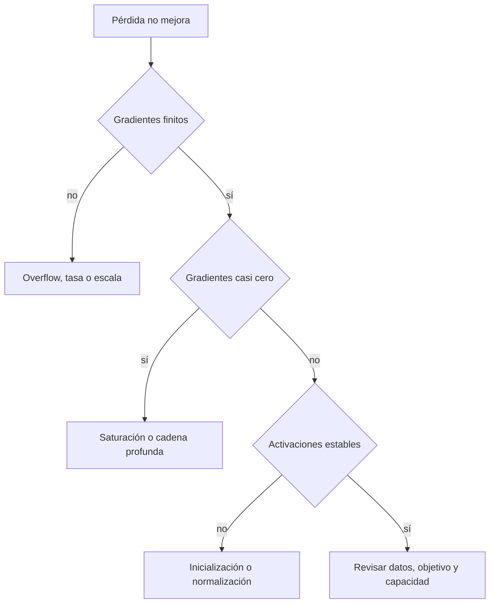

# Inicialización y flujo del gradiente

## El problema de muchas capas

La regla de la cadena multiplica Jacobianos. Si sus escalas son repetidamente menores que 1, el gradiente desaparece; si son mayores, explota.

$$\frac{\partial h_L}{\partial h_0}
=J_LJ_{L-1}\cdots J_1.$$

## Simetría

Inicializar todos los pesos de una capa iguales hace que sus neuronas reciban el mismo gradiente y permanezcan idénticas. Se necesita aleatoriedad para romper simetría.

## Preservar varianza

Para $z_j=\sum_{i=1}^{D}w_{ij}x_i$, si términos son aproximadamente independientes:

$$\operatorname{Var}(z_j)\approx D\operatorname{Var}(w)\operatorname{Var}(x).$$

Si $\operatorname{Var}(w)$ no disminuye con $D$, las activaciones crecen con el ancho.

## Xavier

Adecuada para activaciones aproximadamente simétricas:

$$\operatorname{Var}(w)\approx\frac{2}{fan_{in}+fan_{out}}.$$

## He/Kaiming

Para ReLU, que elimina aproximadamente la mitad de activaciones:

$$\operatorname{Var}(w)\approx\frac{2}{fan_{in}}.$$

## Saturación

Sigmoid:

$$\sigma'(z)=\sigma(z)(1-\sigma(z))\le0.25.$$

Para $|z|$ grande la derivada se acerca a cero. Una mala escala inicial coloca muchas unidades en saturación.

## ReLU muerta

Si una unidad permanece con $z<0$, ReLU produce salida y gradiente cero. Puede ocurrir con tasas excesivas o sesgos desfavorables.

## Diagnóstico por capa

Registra:

- media y desviación de activaciones;
- fracción de ceros;
- norma del gradiente;
- norma de pesos;
- razón actualización/peso.

## Gradient clipping

Por norma global:

$$g\leftarrow g\min\left(1,\frac{c}{\lVert g\rVert}\right).$$

Evita pasos extremos, pero no corrige la causa de gradientes persistentemente inestables.

## Tasa e inicialización interactúan

Una inicialización razonable controla escalas iniciales; la tasa controla cuánto se alteran después. Ambas deben permitir que el modelo permanezca en una región numéricamente estable.

## Autoevaluación

1. ¿Por qué pesos iguales conservan simetría?
2. ¿Qué intenta preservar Xavier?
3. ¿Por qué He usa un factor cercano a 2?
4. ¿Qué diferencia hay entre clipping y solucionar explosión estructural?

---

Anterior: [[01 Neurona, MLP, activaciones y formas]] · Siguiente: [[03 Normalización, dropout y conexiones residuales]]

