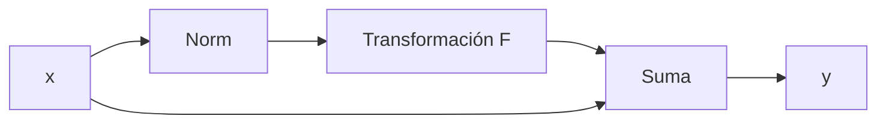

# Normalización, dropout y conexiones residuales

## Normalización: declarar el eje

Normalizar significa calcular estadísticas sobre ciertos ejes. Sin declarar el eje, la frase está incompleta.

## BatchNorm

En datos tabulares $(B,D)$, normaliza cada característica usando el lote:

$$\hat x_{ij}=\frac{x_{ij}-\mu_j^{batch}}{\sqrt{(\sigma_j^{batch})^2+\epsilon}}.$$

Mantiene estadísticas móviles para evaluación. Por eso `train()` y `eval()` cambian su comportamiento.

## LayerNorm

Normaliza características dentro de cada observación o token. No depende de mezclar ejemplos del lote.

$$\hat x_{i,:}=\frac{x_{i,:}-\mu_i}{\sqrt{\sigma_i^2+\epsilon}}.$$

## RMSNorm

Escala por raíz cuadrática media sin restar la media:

$$\operatorname{RMSNorm}(x)=\gamma\odot
\frac{x}{\sqrt{D^{-1}\sum_jx_j^2+\epsilon}}.$$

## Dropout

Durante entrenamiento:

$$\tilde h=\frac{m\odot h}{1-p},\qquad m_j\sim\operatorname{Bernoulli}(1-p).$$

La división conserva la esperanza. En evaluación no se eliminan unidades.

> [!warning] `eval()` no apaga gradientes
> Cambia módulos como dropout y BatchNorm. `torch.no_grad()` controla si se registra autograd. Son interruptores independientes.

## Conexión residual

$$y=x+F(x).$$

Gradiente:

$$\frac{\partial y}{\partial x}=I+J_F(x).$$

La ruta identidad permite que información y gradientes eviten depender por completo de una cadena de transformaciones.

## Pre-norm y post-norm

Pre-norm:

$$y=x+F(\operatorname{Norm}(x)).$$

Post-norm:

$$y=\operatorname{Norm}(x+F(x)).$$

En Transformers modernos es frecuente pre-norm porque facilita el flujo de gradientes en redes profundas.

## Qué problema resuelve cada mecanismo

| Mecanismo | Problema principal | No garantiza |
|---|---|---|
| normalización | escala de activaciones | generalización por sí sola |
| dropout | coadaptación/regularización | calibración perfecta |
| residual | profundidad y ruta de identidad | ausencia de explosión |
| clipping | pasos extremos | buen objetivo |

## Autoevaluación

1. ¿Qué eje normaliza BatchNorm y cuál LayerNorm?
2. ¿Por qué dropout divide por $1-p$?
3. ¿Cómo ayuda la identidad al backward?
4. ¿Por qué `eval()` y `no_grad()` no son equivalentes?

---

Anterior: [[02 Inicialización y flujo del gradiente]] · Siguiente: [[04 Entrenamiento, datos y puente a CNN, RNN y Transformer]]

