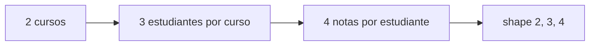
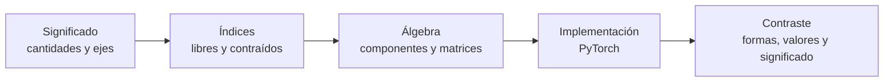

# Tensores y álgebra computacional con PyTorch

> [!abstract] Objetivo
> Aprender a pasar de una relación matemática a código verificable sin perder el significado de los datos. Al terminar deberías poder explicar **qué representa cada eje**, predecir una forma sin ejecutar, reconocer qué índices sobreviven o se suman y detectar código que produce una forma válida pero un resultado semánticamente incorrecto.

> [!summary] La idea en una frase
> En PyTorch, un tensor es **un recipiente de números organizado por ejes**. Para entenderlo no basta con mirar los números: hay que saber qué significa cada eje.

## Empieza aquí: la escalera de los tensores

No imagines un tensor como un objeto completamente nuevo. Es la continuación de una secuencia conocida:

| Datos | Ejemplo | Ejes | Forma |
|---|---|---:|---:|
| un número | temperatura de hoy | 0 | `()` |
| una lista | notas de un estudiante | 1 | `(materias,)` |
| una tabla | notas de varios estudiantes | 2 | `(estudiantes, materias)` |
| varias tablas | notas de varios cursos | 3 | `(cursos, estudiantes, materias)` |

Por ejemplo, una forma `(2, 3, 4)` puede leerse como:

> “Hay 2 cursos; en cada curso hay 3 estudiantes; para cada estudiante se guardan 4 notas”.

Eso ya es un tensor de tres ejes. No es necesario visualizarlo como un cubo: basta con leerlo como **grupos dentro de grupos**.

> [!important] Pregunta más importante
> `shape = (2, 3, 4)` solo informa tamaños. Los nombres “curso”, “estudiante” y “materia” los aporta el problema. Otro tensor con la misma forma podría representar 2 videos, 3 fotogramas y 4 características.

## Idea central del módulo

Una ejecución correcta no basta. La misma relación debe ser coherente en cuatro niveles:

La cadena conductora será:

$$
Y_{ih}=\sum_{d=1}^{D}X_{id}W_{dh}+b_h
\quad\Longleftrightarrow\quad
Y=XW+\mathbf 1_Bb^{\mathsf T}
\quad\Longleftrightarrow\quad
\texttt{Y = X @ W + b}.
$$

Con la convención de **observaciones por filas**:

| Símbolo | Forma | Ejes | Índices |
|---|---:|---|---|
| $X$ | $(B,D)$ | observación, característica de entrada | $i,d$ |
| $W$ | $(D,H)$ | entrada, salida | $d,h$ |
| $b$ | $(H,)$ | salida | $h$ |
| $Y$ | $(B,H)$ | observación, salida | $i,h$ |

No necesitas comprender esta fórmula completa en la primera lectura. Al avanzar por las notas aprenderás a leerla así:

1. cada fila de `X` es una observación;
2. `W` contiene una “receta” para producir cada salida;
3. `X @ W` aplica esas recetas a todas las observaciones;
4. `b` agrega un ajuste final a cada salida.

## Ruta recomendada

1. [[01 Prerrequisitos - vectores, matrices, índices y formas]]
2. [[02 Tensor matemático y tensor computacional]]
3. [[03 Índices, selección y predicción de formas]]
4. [[04 Operaciones tensoriales y efecto sobre los índices]]
5. [[05 Broadcasting con significado]]
6. [[06 Transformaciones lineales y afines por lotes]]
7. [[07 Producto matricial y contracciones con contexto]]
8. [[08 dtype, device, memoria, view, reshape y permute]]
9. [[09 Laboratorio PyTorch - formular, predecir y verificar]]
10. [[10 Clínica de errores y pruebas semánticas]]
11. [[11 Resumen, mapa mental y autoevaluación]]
12. [[12 Taller integrador - reconocimiento de actividad humana]]

> [!tip] Cómo estudiar estas notas
> En cada ejemplo sigue este orden: **formular → predecir → implementar → contrastar → explicar**. Tapa el código hasta haber escrito la forma esperada y el significado de cada eje.

Haz dos pasadas si es tu primer encuentro con tensores:

1. **Primera pasada:** quédate con la intuición, las formas y los ejemplos pequeños.
2. **Segunda pasada:** estudia los índices, las sumas y la notación matemática.

No continúes si todavía confundes estos cuatro términos:

- **eje:** una dirección de organización, como estudiantes o materias;
- **tamaño de un eje:** cuántos elementos hay en esa dirección;
- **forma:** los tamaños de todos los ejes en orden;
- **componente:** un número concreto localizado mediante índices.

## Qué no cubre este módulo

No estudia gradientes, autodiferenciación, funciones de pérdida, optimizadores ni entrenamiento. Aquí se construye la base para entender esos temas después.

## Material fuente

- Diapositivas: ![[assets/module_07.pdf]]
- Notebook ejecutable: [[assets/01_demo_M07.ipynb]]
- Taller integrador HAR: [[assets/04_taller_integrador_har.ipynb]]

---

Siguiente: [[01 Prerrequisitos - vectores, matrices, índices y formas]]
