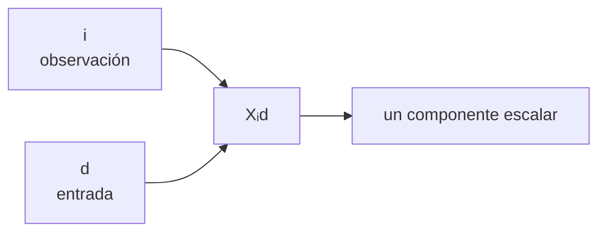

# Prerrequisitos: vectores, matrices, índices y formas

Esta es la nota que conviene recordar antes de entrar al módulo. No necesitas memorizar toda la notación; necesitas poder **leerla como una descripción de datos y operaciones**.

> [!summary] Modelo mental
> Un tensor es como un archivador. Los **ejes** son los niveles de clasificación; la **forma** dice cuántas opciones existen en cada nivel; los **índices** indican la ruta hasta un dato concreto.

## 1. Escalar, vector, matriz y tensor

En programación, **todos los siguientes pueden ser tensores**. Los nombres escalar, vector y matriz solo especifican cuántos ejes tienen:

| Nombre tradicional | Ejemplo | Número de ejes (`ndim`) | Forma (`shape`) |
|---|---|---:|---:|
| escalar | `3` | 0 | `()` |
| vector | `[8, 7, 9]` | 1 | `(3,)` |
| matriz | `[[8, 7, 9], [6, 10, 8]]` | 2 | `(2, 3)` |
| tensor de 3 ejes | dos matrices apiladas | 3 | por ejemplo `(4, 2, 3)` |

La palabra **dimensión** puede confundir. En este módulo diremos:

- “número de ejes” para `ndim`;
- “tamaño de un eje” para valores como 2, 3 o 4;
- “forma” para la tupla completa, por ejemplo `(4, 2, 3)`.

Ejemplo:

$$
X=
\begin{bmatrix}
1&2\\
0&-1\\
3&1
\end{bmatrix}
\in\mathbb R^{3\times2}.
$$

Tiene forma $(3,2)$, pero esa forma no dice por sí sola qué representan los ejes. En este curso declaramos:

- eje 0: tres observaciones;
- eje 1: dos características por observación.

La lectura correcta es:

> “`X` contiene 3 observaciones y cada observación tiene 2 características”.

Las filas podrían ser tres viviendas y las columnas podrían ser `(metros cuadrados, número de habitaciones)`. En ese caso:

$$X_{1,2}$$

significa “segunda característica de la primera vivienda” si usamos índices matemáticos que comienzan en 1. En Python, el mismo dato se consulta como `X[0, 1]` porque Python comienza en 0.

## 2. Eje, índice, tamaño y componente

Para $T\in\mathbb R^{n_1\times\cdots\times n_k}$:

| Concepto | Pregunta que responde | Ejemplo |
|---|---|---|
| orden o número de ejes | ¿cuántos ejes hay? | $k=3$ |
| forma | ¿cuánto mide cada eje? | $(B,T,D)$ |
| tamaño de un eje | ¿cuánto mide un eje concreto? | $D$ |
| componente | ¿qué valor seleccionan índices concretos? | $T_{itd}$ |

### Ejemplo leído de principio a fin

Supón que:

```python
notas.shape == (2, 3, 4)
```

y el contrato es `(curso, estudiante, materia)`. Entonces:

- `notas.ndim == 3`: hay tres ejes;
- `notas.shape[0] == 2`: hay dos cursos;
- `notas.shape[1] == 3`: hay tres estudiantes por curso;
- `notas.shape[2] == 4`: hay cuatro materias por estudiante;
- `notas[1, 2, 0]`: selecciona **un número**, la nota de una materia concreta;
- `notas[1, 2, :]`: selecciona las cuatro notas de un estudiante y tiene forma `(4,)`;
- `notas[1, :, :]`: selecciona todo un curso y tiene forma `(3, 4)`.

> [!tip] Lee una forma como una oración
> `(2, 3, 4)` no se memoriza como tres números aislados. Léela: “2 grupos, cada uno con 3 elementos, cada uno con 4 valores”. Después reemplaza “grupo”, “elemento” y “valor” por los nombres reales del problema.

> [!warning] Dos ambigüedades frecuentes
> En álgebra lineal, el **rango** de una matriz mide dimensiones de espacios generados; no es el número de ejes. Para el número de ejes usa “orden”, `ndim` o “número de dimensiones”. Tampoco confundas la forma completa `(B,T,D)` con el tamaño de un eje, por ejemplo `D`.

## 3. Los índices son etiquetas con significado

Usaremos:

- $i$: observación;
- $t$: instante o posición temporal;
- $d$: característica de entrada;
- $h$: característica de salida.

Así, $X_{id}$ significa: “valor de la característica $d$ de la observación $i$”. El índice no es solo una letra para contar: recuerda **qué cantidad varía**.

La letra podría cambiar y la matemática sería la misma. Usamos $i,d,t,h$ para recordar el significado:

```text
X[i, d]
  │  └── cuál característica
  └───── cuál observación
```



## 4. Filas y columnas: convención del módulo

Primero demos significado a las letras:

- $B$: número de observaciones del lote;
- $D$: número de características de **entrada** de cada observación;
- $H$: número de características de **salida** que queremos calcular.

### Una observación es una fila

Si una observación tiene $D$ características, la escribimos horizontalmente:

$$
x=
\begin{bmatrix}
x_1&x_2&\cdots&x_D
\end{bmatrix}
\in\mathbb R^{1\times D}.
$$

Por ejemplo, si una observación tiene dos características, entonces $D=2$ y podría representarse como:

$$x=\begin{bmatrix}2&3\end{bmatrix}.$$

Si reunimos $B$ observaciones, colocamos una debajo de otra:

$$
X=
\begin{bmatrix}
x_1^{(1)}&\cdots&x_D^{(1)}\\
x_1^{(2)}&\cdots&x_D^{(2)}\\
\vdots&\ddots&\vdots\\
x_1^{(B)}&\cdots&x_D^{(B)}
\end{bmatrix}
\in\mathbb R^{B\times D}.
$$

Por tanto, en $X$:

- cada **fila** es una observación;
- cada **columna** es una característica de entrada.

### ¿Por qué $W$ tiene forma $(D,H)$?

Queremos transformar las $D$ entradas de cada observación en $H$ salidas. Para calcular **una** salida necesitamos un peso por cada una de las $D$ entradas. Esos $D$ pesos forman una columna de $W$:

$$
W=
\begin{bmatrix}
\vert&\vert&&\vert\\
w^{(1)}&w^{(2)}&\cdots&w^{(H)}\\
\vert&\vert&&\vert
\end{bmatrix}
\in\mathbb R^{D\times H}.
$$

- $W$ tiene $D$ **filas**: una por cada característica de entrada;
- $W$ tiene $H$ **columnas**: una por cada salida que queremos producir.

Cada columna de $W$ es una **receta completa para una salida**. Si existen $D=2$ entradas, cada receta necesita exactamente dos pesos. Si queremos $H=3$ salidas, necesitamos tres recetas:

$$
x=\begin{bmatrix}2&3\end{bmatrix},
\qquad
W=
\begin{bmatrix}
10&1&-1\\
4&2&5
\end{bmatrix}.
$$

La primera columna de $W$, $\begin{bmatrix}10&4\end{bmatrix}^{\mathsf T}$, es la receta de la primera salida; la segunda columna es la receta de la segunda salida, y así sucesivamente. El producto calcula:

$$
\begin{aligned}
y_1&=2(10)+3(4)=32,\\
y_2&=2(1)+3(2)=8,\\
y_3&=2(-1)+3(5)=13.
\end{aligned}
$$

Por eso:

$$
xW=
\begin{bmatrix}32&8&13\end{bmatrix}
\in\mathbb R^{1\times3}.
$$

La fila $x$ tiene dos valores y cada columna de $W$ también tiene dos valores. Podemos emparejarlos, multiplicarlos y sumarlos. Esa es la razón concreta por la que los dos tamaños $D$ deben coincidir.

### ¿Qué ocurre con un lote completo?

El mismo cálculo se aplica independientemente a cada una de las $B$ filas de $X$:

$$
\underbrace{X}_{B\text{ observaciones}\times D\text{ entradas}}
\underbrace{W}_{D\text{ entradas}\times H\text{ salidas}}
=
\underbrace{Y}_{B\text{ observaciones}\times H\text{ salidas}}.
$$

En términos de formas:

$$
(B,\cancel D)@(\cancel D,H)\longrightarrow(B,H).
$$

El producto conserva las $B$ observaciones, consume las $D$ entradas y produce $H$ valores nuevos para cada observación.

> [!tip] Regla para recordarlo
> **Una fila de $X$ conversa con una columna de $W$.** Ambas deben tener $D$ componentes. El resultado de esa conversación es un solo número. Como $W$ tiene $H$ columnas, obtenemos $H$ números por cada fila de $X$.

## 5. Producto matricial desde componentes

Si $A\in\mathbb R^{m\times n}$ y $B\in\mathbb R^{n\times p}$, entonces:

$$
C=AB\in\mathbb R^{m\times p},
\qquad
C_{ik}=\sum_{j=1}^{n}A_{ij}B_{jk}.
$$

Lectura:

1. $i$ queda libre y aporta las filas de $C$.
2. $k$ queda libre y aporta las columnas de $C$.
3. $j$ aparece en ambos factores, se suma y desaparece.

Otra lectura útil: **cada celda de `C` es el producto punto entre una fila de `A` y una columna de `B`**.

$$
C_{11}=\underbrace{A_{11}B_{11}}_{\text{primer par}}
+\underbrace{A_{12}B_{21}}_{\text{segundo par}}+\cdots+
\underbrace{A_{1n}B_{n1}}_{\text{último par}}.
$$

Regla visual:

$$
(m,\cancel n)@(\cancel n,p)\longrightarrow(m,p).
$$

> [!important] Compatibilidad matemática y semántica
> Que los tamaños interiores coincidan permite la multiplicación. Todavía debes justificar que ambos ejes representan la misma cantidad, por ejemplo “característica de entrada”.

## 6. Suma, multiplicación y reducción

No toda operación con matrices es un producto matricial:

- `A + B`: suma posiciones correspondientes;
- `A * B`: producto elemento a elemento o Hadamard;
- `A @ B`: producto matricial;
- `A.sum(dim=...)`: suma los valores que se encuentran a lo largo del eje indicado.

### ¿Qué significa sumar “a lo largo de un eje”?

Considera una matriz con forma `(2, 3)`:

$$
A=
\begin{bmatrix}
1&2&3\\
4&5&6
\end{bmatrix}.
$$

Sus ejes son:

- `dim=0`: eje de las filas, de tamaño 2;
- `dim=1`: eje de las columnas, de tamaño 3.

Al ejecutar `A.sum(dim=0)`, recorremos las filas y sumamos los valores que tienen la misma columna:

$$
A.\operatorname{sum}(\text{dim}=0)
=\left[1+4,\;2+5,\;3+6\right]
=\left[5,\;7,\;9\right].
$$

El resultado tiene forma `(3,)`: queda un total por cada columna.

Al ejecutar `A.sum(dim=1)`, recorremos las columnas y sumamos los valores de cada fila:

$$
A.\operatorname{sum}(\text{dim}=1)
=\left[1+2+3,\;4+5+6\right]
=\left[6,\;15\right].
$$

El resultado tiene forma `(2,)`: queda un total por cada fila.

> [!important] ¿Por qué desaparece el eje sumado?
> Antes de sumar, el eje permitía elegir una posición concreta. Por ejemplo, en el eje de columnas podíamos elegir la columna 0, 1 o 2. Después de sumar esas tres posiciones en un único total, ya no queda ninguna columna que elegir: **las tres posiciones fueron reducidas a un solo número**. Por eso `sum` es una operación de **reducción** y, por defecto, elimina el eje recorrido.

La misma idea aparece en notación matemática. Si:

$$
s_i=\sum_j A_{ij},
$$

el índice $j$ desaparece porque fue sumado; solo queda $i$. En PyTorch esto corresponde a `A.sum(dim=1)`.

### ¿Qué cambia con `keepdim=True`?

`keepdim=True` conserva el eje reducido, pero su tamaño pasa a ser 1:

| Operación | Forma del resultado | Explicación |
|---|---:|---|
| `A.sum(dim=0)` | `(3,)` | elimina el eje 0 |
| `A.sum(dim=0, keepdim=True)` | `(1, 3)` | conserva el eje 0 con tamaño 1 |
| `A.sum(dim=1)` | `(2,)` | elimina el eje 1 |
| `A.sum(dim=1, keepdim=True)` | `(2, 1)` | conserva el eje 1 con tamaño 1 |

Conservar ese eje facilita operaciones posteriores con **broadcasting**, porque el resultado mantiene el mismo número de ejes que el tensor original.

> [!tip] Regla para predecir la forma
> En la forma original, localiza el eje indicado por `dim`. Sin `keepdim`, borra su tamaño; con `keepdim=True`, sustitúyelo por 1.

## 7. Comprobación rápida

Para $S\in\mathbb R^{4\times5\times2}$ con ejes $(i,t,d)$, responde sin ejecutar. Después despliega cada bloque para comprobar no solo la respuesta, sino también el porqué.

**1. ¿Cuántos ejes tiene?**

> [!success]- Ver respuesta
> **Respuesta: 3 ejes.**
>
> La expresión $\mathbb R^{4\times5\times2}$ contiene tres tamaños separados por $\times$: 4, 5 y 2. Cada tamaño corresponde a un eje distinto. Por eso `S.ndim == 3`.

**2. ¿Cuál es su forma?**

> [!success]- Ver respuesta
> **Respuesta: $(4,5,2)$.**
>
> La forma enumera el tamaño de cada eje respetando su orden. El primer eje mide 4, el segundo mide 5 y el tercero mide 2; en PyTorch, `S.shape` sería `torch.Size([4, 5, 2])`.

**3. ¿Cuánto mide el eje temporal?**

> [!success]- Ver respuesta
> **Respuesta: 5.**
>
> Declaramos que los ejes tienen el significado $(i,t,d)$: observación, tiempo y característica. El eje temporal $t$ ocupa la segunda posición de la forma $(4,5,2)$, por lo que su tamaño es 5. En PyTorch es el eje `dim=1` porque la numeración empieza en 0.

**4. ¿Qué es $S_{1,3,0}$?**

> [!success]- Ver respuesta
> **Respuesta: un escalar.**
>
> Se especifica una posición concreta para cada uno de los tres ejes: una observación, un instante y una característica. Como no queda ningún eje libre, el resultado es un único número y su forma en PyTorch es `()`.

**5. ¿Qué forma tiene una observación completa $S_{1,:,:}$?**

> [!success]- Ver respuesta
> **Respuesta: $(5,2)$.**
>
> El índice `1` selecciona una sola posición del primer eje, así que el tamaño 4 desaparece. Los dos `:` conservan completos los ejes temporal y de características, cuyos tamaños son 5 y 2. Por eso quedan los ejes $(t,d)$ con forma $(5,2)$.

**6. ¿Qué forma tiene `S.sum(dim=1)`?**

> [!success]- Ver respuesta
> **Respuesta: $(4,2)$.**
>
> `dim=1` selecciona el segundo eje, que es el eje temporal $t$ y tiene tamaño 5. La operación suma los cinco instantes para cada pareja fija $(i,d)$:
>
> $$R_{id}=\sum_t S_{itd}.$$
>
> El índice $t$ desaparece porque fue recorrido y reducido a una suma. Permanecen $i$ y $d$, cuyos tamaños son 4 y 2. Visualmente:
>
> $$(4,\cancel 5,2)\longrightarrow(4,2).$$

**7. ¿Qué forma tiene `S.sum(dim=1, keepdim=True)`?**

> [!success]- Ver respuesta
> **Respuesta: $(4,1,2)$.**
>
> Se realiza la misma suma sobre los cinco instantes, pero `keepdim=True` impide que el eje temporal sea eliminado. Como sus cinco posiciones ya se combinaron en un solo total, el eje no puede seguir midiendo 5: se conserva con tamaño 1. Visualmente:
>
> $$(4,5,2)\longrightarrow(4,1,2).$$
>
> Mantener ese eje de tamaño 1 resulta útil para operaciones posteriores con broadcasting y permite que el resultado siga teniendo tres ejes.

---

Anterior: [[00 Índice - Tensores y álgebra computacional con PyTorch]] · Siguiente: [[02 Tensor matemático y tensor computacional]]
