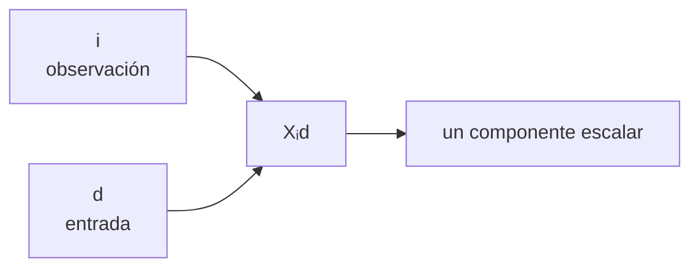

# Prerrequisitos: vectores, matrices, índices y formas

Esta es la nota que conviene recordar antes de entrar al módulo. No necesitas memorizar toda la notación; necesitas poder **leerla como una descripción de datos y operaciones**.

> [!summary] Modelo mental
> Un tensor es como un archivador. Los **ejes** son los niveles de clasificación; la **forma** dice cuántas opciones existen en cada nivel; los **índices** indican la ruta hasta un dato concreto.

## 1. Escalar, vector, matriz y tensor

En programación, **todos los siguientes pueden ser tensores**. Los nombres escalar, vector y matriz solo especifican cuántos ejes tienen:

| Nombre tradicional | Ejemplo | Número de ejes (`ndim`) | Forma (`shape`) |
|---|---|---:|---:|
| escalar | `3` | 0 | `()` |
| vector | `[8, 7, 9]` | 1 | `(3,)` |
| matriz | `[[8, 7, 9], [6, 10, 8]]` | 2 | `(2, 3)` |
| tensor de 3 ejes | dos matrices apiladas | 3 | por ejemplo `(4, 2, 3)` |

La palabra **dimensión** puede confundir. En este módulo diremos:

- “número de ejes” para `ndim`;
- “tamaño de un eje” para valores como 2, 3 o 4;
- “forma” para la tupla completa, por ejemplo `(4, 2, 3)`.

Ejemplo:

$$
X=
\begin{bmatrix}
1&2\\
0&-1\\
3&1
\end{bmatrix}
\in\mathbb R^{3\times2}.
$$

Tiene forma $(3,2)$, pero esa forma no dice por sí sola qué representan los ejes. En este curso declaramos:

- eje 0: tres observaciones;
- eje 1: dos características por observación.

La lectura correcta es:

> “`X` contiene 3 observaciones y cada observación tiene 2 características”.

Las filas podrían ser tres viviendas y las columnas podrían ser `(metros cuadrados, número de habitaciones)`. En ese caso:

$$X_{1,2}$$

significa “segunda característica de la primera vivienda” si usamos índices matemáticos que comienzan en 1. En Python, el mismo dato se consulta como `X[0, 1]` porque Python comienza en 0.

## 2. Eje, índice, tamaño y componente

Para $T\in\mathbb R^{n_1\times\cdots\times n_k}$:

| Concepto | Pregunta que responde | Ejemplo |
|---|---|---|
| orden o número de ejes | ¿cuántos ejes hay? | $k=3$ |
| forma | ¿cuánto mide cada eje? | $(B,T,D)$ |
| tamaño de un eje | ¿cuánto mide un eje concreto? | $D$ |
| componente | ¿qué valor seleccionan índices concretos? | $T_{itd}$ |

### Ejemplo leído de principio a fin

Supón que:

```python
notas.shape == (2, 3, 4)
```

y el contrato es `(curso, estudiante, materia)`. Entonces:

- `notas.ndim == 3`: hay tres ejes;
- `notas.shape[0] == 2`: hay dos cursos;
- `notas.shape[1] == 3`: hay tres estudiantes por curso;
- `notas.shape[2] == 4`: hay cuatro materias por estudiante;
- `notas[1, 2, 0]`: selecciona **un número**, la nota de una materia concreta;
- `notas[1, 2, :]`: selecciona las cuatro notas de un estudiante y tiene forma `(4,)`;
- `notas[1, :, :]`: selecciona todo un curso y tiene forma `(3, 4)`.

> [!tip] Lee una forma como una oración
> `(2, 3, 4)` no se memoriza como tres números aislados. Léela: “2 grupos, cada uno con 3 elementos, cada uno con 4 valores”. Después reemplaza “grupo”, “elemento” y “valor” por los nombres reales del problema.

> [!warning] Dos ambigüedades frecuentes
> En álgebra lineal, el **rango** de una matriz mide dimensiones de espacios generados; no es el número de ejes. Para el número de ejes usa “orden”, `ndim` o “número de dimensiones”. Tampoco confundas la forma completa `(B,T,D)` con el tamaño de un eje, por ejemplo `D`.

## 3. Los índices son etiquetas con significado

Usaremos:

- $i$: observación;
- $t$: instante o posición temporal;
- $d$: característica de entrada;
- $h$: característica de salida.

Así, $X_{id}$ significa: “valor de la característica $d$ de la observación $i$”. El índice no es solo una letra para contar: recuerda **qué cantidad varía**.

La letra podría cambiar y la matemática sería la misma. Usamos $i,d,t,h$ para recordar el significado:

```text
X[i, d]
  │  └── cuál característica
  └───── cuál observación
```



## 4. Filas y columnas: convención del módulo

Una observación será una fila:

$$x\in\mathbb R^{1\times D}.$$

Un lote de $B$ observaciones apila $B$ filas:

$$X\in\mathbb R^{B\times D}.$$

Esto determina que una transformación con $H$ salidas use:

$$W\in\mathbb R^{D\times H},\qquad XW\in\mathbb R^{B\times H}.$$

La dimensión interior $D$ debe coincidir porque cada salida combina las $D$ entradas.

Imagina que cada columna de $W$ es una receta. Si una observación tiene dos entradas, cada receta debe indicar qué peso dar a esas dos entradas. Por eso el primer tamaño de $W$ también es $D$.

## 5. Producto matricial desde componentes

Si $A\in\mathbb R^{m\times n}$ y $B\in\mathbb R^{n\times p}$, entonces:

$$
C=AB\in\mathbb R^{m\times p},
\qquad
C_{ik}=\sum_{j=1}^{n}A_{ij}B_{jk}.
$$

Lectura:

1. $i$ queda libre y aporta las filas de $C$.
2. $k$ queda libre y aporta las columnas de $C$.
3. $j$ aparece en ambos factores, se suma y desaparece.

Otra lectura útil: **cada celda de `C` es el producto punto entre una fila de `A` y una columna de `B`**.

$$
C_{11}=\underbrace{A_{11}B_{11}}_{\text{primer par}}
+\underbrace{A_{12}B_{21}}_{\text{segundo par}}+\cdots+
\underbrace{A_{1n}B_{n1}}_{\text{último par}}.
$$

Regla visual:

$$
(m,\cancel n)@(\cancel n,p)\longrightarrow(m,p).
$$

> [!important] Compatibilidad matemática y semántica
> Que los tamaños interiores coincidan permite la multiplicación. Todavía debes justificar que ambos ejes representan la misma cantidad, por ejemplo “característica de entrada”.

## 6. Suma, multiplicación y reducción

No toda operación con matrices es un producto matricial:

- `A + B`: suma posiciones correspondientes;
- `A * B`: producto elemento a elemento o Hadamard;
- `A @ B`: producto matricial;
- `A.sum(dim=...)`: agrega valores a lo largo de un eje y elimina ese eje, salvo que se use `keepdim=True`.

## 7. Comprobación rápida

Para $S\in\mathbb R^{4\times5\times2}$ con ejes $(i,t,d)$, responde sin ejecutar:

1. ¿Cuántos ejes tiene? **3**.
2. ¿Cuál es su forma? **$(4,5,2)$**.
3. ¿Cuánto mide el eje temporal? **5**.
4. ¿Qué es $S_{1,3,0}$? **Un escalar**.
5. ¿Qué forma tiene una observación completa $S_{1,:,:}$? **$(5,2)$**.

---

Anterior: [[00 Índice - Tensores y álgebra computacional con PyTorch]] · Siguiente: [[02 Tensor matemático y tensor computacional]]
