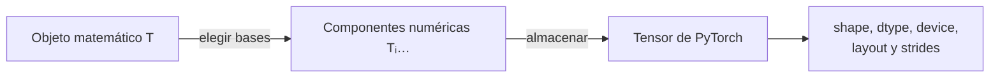

# Tensor matemático y tensor computacional

## Respuesta corta: qué significa “tensor” en PyTorch

> [!summary] Definición práctica
> Un tensor de PyTorch es un conjunto de números organizado mediante cero o más ejes, acompañado por información sobre su forma, tipo numérico y dispositivo.

Un tensor **no tiene que verse como un cubo**. Esta es una fuente frecuente de confusión. Lo importante no es dibujarlo en el espacio, sino saber cómo están agrupados sus datos.

```python
temperatura = torch.tensor(25.0)                 # shape ()
notas = torch.tensor([8.0, 7.0, 9.0])           # shape (3,)
tabla = torch.tensor([[8.0, 7.0], [9.0, 6.0]])  # shape (2, 2)
```

Los tres objetos son tensores. El primero es además un escalar, el segundo un vector y el tercero una matriz.

## Cómo nace un tensor de más ejes

Construyámoslo sin saltos:

1. Una persona descrita por 2 características tiene forma `(2,)`.
2. Un grupo de 3 personas tiene forma `(3, 2)`.
3. Dos grupos, cada uno con 3 personas, tienen forma `(2, 3, 2)`.

```text
grupo 0
  persona 0 -> [edad, ingreso]
  persona 1 -> [edad, ingreso]
  persona 2 -> [edad, ingreso]

grupo 1
  persona 0 -> [edad, ingreso]
  persona 1 -> [edad, ingreso]
  persona 2 -> [edad, ingreso]
```

La forma `(2, 3, 2)` significa `(grupos, personas, características)`. Para llegar al ingreso de una persona concreta hacen falta tres decisiones: grupo, persona y característica. Por eso se usan tres índices.

```python
datos[1, 2, 1]
```

El resultado es un escalar: ya fijamos los tres ejes.

## El tensor no conoce el significado de sus ejes

Dos tensores pueden tener exactamente la misma forma `(2, 3, 2)` y representar cosas distintas:

- `(grupos, personas, características)`;
- `(videos, fotogramas, coordenadas)`;
- `(experimentos, mediciones, sensores)`.

PyTorch conoce los tamaños, pero no esos nombres. El programador debe conservarlos mediante documentación, nombres y pruebas.

## La separación matemática que evita confusiones

Un objeto matemático y su representación numérica no son exactamente lo mismo.



En matemáticas, “tensor” tiene una definición más estricta que “arreglo multidimensional”. Un tensor matemático representa una relación geométrica o multilineal independiente de las coordenadas usadas para describirla. Cuando elegimos bases, aparecen sus componentes numéricas. Si cambiamos de base, esas componentes pueden cambiar de una manera determinada aunque el objeto representado siga siendo el mismo.

> [!example] La idea sin formalismo
> Una flecha física no cambia porque giremos el papel. Sí cambian los números con los que expresamos sus componentes horizontal y vertical. De manera parecida, un tensor matemático es el objeto; el arreglo de componentes es su descripción en unas bases elegidas.

> [!important] Qué necesitas para este módulo
> Para programar con PyTorch, puedes comenzar con la definición práctica: “arreglo de números con ejes”. La definición matemática avanzada explica el origen del nombre, pero no es requisito para entender `shape`, indexación, broadcasting o `matmul`.

> [!note] Alcance práctico
> En aprendizaje automático se usa “tensor” también para el arreglo multidimensional almacenado por una librería. Es un uso válido, pero conviene recordar que el arreglo incorpora decisiones de representación: bases, orden de ejes, tipo numérico y almacenamiento.

## Qué sabe PyTorch y qué no sabe

```python
X = torch.tensor(
    [[1.0, 2.0],
     [0.0, -1.0],
     [3.0, 1.0]],
    dtype=torch.float32,
    device="cpu",
)
```

PyTorch puede observar:

```python
X.shape    # torch.Size([3, 2])
X.ndim     # 2
X.dtype    # torch.float32
X.device   # cpu
X.layout   # torch.strided
```

Pero esos metadatos no contienen:

- “eje 0 = observación”;
- “eje 1 = característica”;
- las unidades de cada magnitud;
- si una fila es una persona, una imagen o un instante;
- si el valor `0` significa ausencia, una medida real o dato faltante codificado.

Ese significado pertenece al **contrato semántico** del problema.

La diferencia se resume así:

| PyTorch sí puede comprobar | PyTorch no puede deducir |
|---|---|
| hay 3 filas y 2 columnas | las filas son observaciones |
| los valores son `float32` | la primera columna mide edad |
| el tensor está en CPU | la segunda columna mide ingreso |
| `X @ W` tiene formas compatibles | los ejes que coinciden significan lo mismo |

## Registro semántico

Antes de operar, escribe una tabla como esta:

| tensor | forma | eje 0 | eje 1 | índices |
|---|---:|---|---|---|
| `X` | $(B,D)$ | observación | entrada | $i,d$ |
| `W` | $(D,H)$ | entrada | salida | $d,h$ |
| `Y` | $(B,H)$ | observación | salida | $i,h$ |

En código puedes registrar y comprobar estructura:

```python
register = {
    "X": {"shape": (3, 2), "axes": ("observación", "entrada")},
    "W": {"shape": (2, 3), "axes": ("entrada", "salida")},
}

assert tuple(X.shape) == register["X"]["shape"]
```

La aserción comprueba `(3,2)`. No comprueba por sí sola que el eje 0 contenga observaciones; eso debe reflejarse en nombres, documentación, construcción de los datos y pruebas de valores.

## Tres niveles que debes distinguir

| Nivel | Ejemplo | Pregunta |
|---|---|---|
| cantidad | lote de observaciones | ¿qué objeto representa? |
| estructura matemática | $X\in\mathbb R^{B\times D}$ | ¿qué ejes e índices tiene? |
| representación | `float32`, CPU, `torch.strided` | ¿cómo se almacena y calcula? |

Un cambio de `float32` a `float64` modifica la precisión de la representación, no convierte observaciones en características. Una permutación cambia el orden de ejes y por ello obliga a actualizar el contrato, aunque conserve los mismos números.

## Ejemplo completo: de significado a dato concreto

Supón que `X` representa tres viviendas mediante dos características:

| fila | característica 0 | característica 1 |
|---:|---:|---:|
| vivienda 0 | 80 m² | 2 habitaciones |
| vivienda 1 | 120 m² | 3 habitaciones |
| vivienda 2 | 60 m² | 1 habitación |

```python
X = torch.tensor([
    [80.0, 2.0],
    [120.0, 3.0],
    [60.0, 1.0],
])
```

Ahora sí podemos leer cada expresión:

- `X.shape == (3, 2)`: tres viviendas, dos características;
- `X[1]`: todas las características de la vivienda 1, forma `(2,)`;
- `X[:, 0]`: los metros cuadrados de todas las viviendas, forma `(3,)`;
- `X[1, 0]`: los metros cuadrados de la vivienda 1, un escalar de valor `120`.

Si olvidamos el contrato `(vivienda, característica)`, los mismos números dejan de ser interpretables.

## Pregunta guía

Cada vez que veas un tensor, intenta completar esta frase:

> “Este tensor representa ___; su eje 0 recorre ___; su eje 1 recorre ___; su componente $T_{ij}$ significa ___”.

Si no puedes completarla, conocer `.shape` todavía no basta para razonar sobre el código.

## Comprobación de comprensión

Para un tensor `imagenes` con forma `(32, 28, 28, 3)` y ejes `(imagen, alto, ancho, color)`:

1. ¿Cuántos ejes tiene? **4**.
2. ¿Cuántas imágenes contiene? **32**.
3. ¿Qué representa `imagenes[0]`? **Una imagen completa**, forma `(28, 28, 3)`.
4. ¿Qué representa `imagenes[0, 10, 20]`? **Los tres canales de color de un píxel**, forma `(3,)`.
5. ¿Qué representa `imagenes[0, 10, 20, 1]`? **Un solo valor de color**, un escalar.

---

Anterior: [[01 Prerrequisitos - vectores, matrices, índices y formas]] · Siguiente: [[03 Índices, selección y predicción de formas]]
