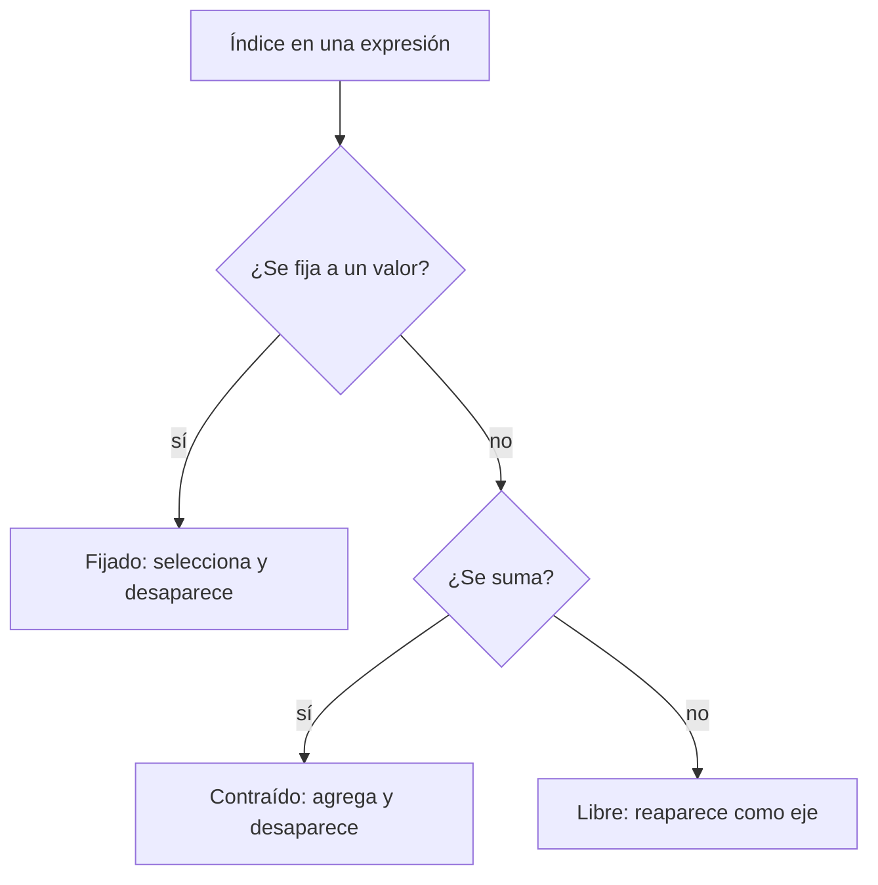

# Índices, selección y predicción de formas

> [!summary] Idea sencilla
> Indexar significa responder “¿qué parte quiero conservar?”. Un número fijo selecciona una posición y elimina ese eje; `:` deja que el eje siga variando; un intervalo selecciona varias posiciones y conserva el eje.

## Antes de usar letras: una ruta entre cajas

Para `S.shape == (4, 5, 2)` con ejes `(observación, tiempo, característica)`, imagina esta estructura:

```text
4 observaciones
└── cada observación tiene 5 instantes
    └── cada instante tiene 2 características
```

Entonces:

- `S[2, 3, 1]` sigue una ruta completa y llega a un número;
- `S[2, 3, :]` deja variar la característica y obtiene 2 números;
- `S[2, :, :]` deja variar tiempo y característica y obtiene una tabla `(5, 2)`;
- `S[:, :, :]` no fija nada y conserva todo `(4, 5, 2)`.

> [!note] Matemática frente a Python
> En las fórmulas suele numerarse desde 1; Python numera desde 0. La idea de los ejes no cambia. `S[0]` es la primera observación en Python.

## Libre, fijado y sumado

Los índices pueden desempeñar tres papeles:

| Papel | Qué ocurre | Ejemplo |
|---|---|---|
| libre | aparece en el resultado y crea un eje | $Y_{ih}$ contiene $i,h$ |
| fijado | selecciona una sección y deja de variar | $S_{0td}$ fija $i=0$ |
| sumado o contraído | se agrega y desaparece | $\sum_dX_{id}W_{dh}$ |

La palabra **libre** significa “todavía puede variar”. La palabra **fijado** significa “elegimos un valor concreto”. La palabra **sumado** significa “recorremos todos sus valores, los agregamos y ya no necesitamos conservar ese eje”.



## Derivar la forma desde índices libres

En

$$Y_{ih}=\sum_{d=1}^D X_{id}W_{dh}+b_h,$$

- $d$ está sumado y no aparece en $Y$;
- $i$ queda libre y aporta $B$ observaciones;
- $h$ queda libre y aporta $H$ salidas.

Por tanto, $Y\in\mathbb R^{B\times H}$.

## Indexar un tensor de secuencias

Sea

$$S\in\mathbb R^{B\times T\times D},$$

con ejes `(observación, tiempo, característica)` e índices $(i,t,d)$.

| Selección | Índice fijado | Índices libres | Forma |
|---|---|---|---:|
| `S[0]` | $i$ | $t,d$ | $(T,D)$ |
| `S[:, 0, :]` | $t$ | $i,d$ | $(B,D)$ |
| `S[:, :, 0]` | $d$ | $i,t$ | $(B,T)$ |
| `S[0, 0, 0]` | $i,t,d$ | ninguno | escalar |

Con $(B,T,D)=(4,5,2)$:

```python
assert S[0].shape == (5, 2)
assert S[:, 0, :].shape == (4, 2)
assert S[:, :, 0].shape == (4, 5)
```

## Indexar no es lo mismo que cortar

Un índice entero elimina un eje:

```python
S[0].shape       # (T, D)
```

Un intervalo puede seleccionar un solo elemento y conservar el eje:

```python
S[0:1].shape     # (1, T, D)
```

Esto importa porque `(T,D)` y `(1,T,D)` no tienen el mismo contrato. El segundo todavía expresa un lote de tamaño 1.

La diferencia no está en cuántas observaciones fueron seleccionadas —en ambos casos es una—, sino en si el eje “observación” sigue explícito:

| Expresión | Lectura | Forma |
|---|---|---:|
| `S[0]` | dame **la observación** 0 | `(T,D)` |
| `S[0:1]` | dame **un lote** que va de 0 a 1 sin incluir 1 | `(1,T,D)` |

Esto suele importar cuando la siguiente función espera recibir siempre un lote.

También puedes conservar un eje con una lista o tensor de índices:

```python
S[[0]].shape     # (1, T, D)
```

## `None` crea un eje de tamaño 1

```python
r = torch.tensor([10.0, 20.0, 30.0])  # (B,)
r[:, None].shape                        # (B, 1)
r[None, :].shape                        # (1, B)
```

`None` no cambia valores: cambia la estructura desde la cual se alinearán otras operaciones. Por eso es decisivo en broadcasting.

Podemos leerlo así:

- `r` con forma `(B,)`: una lista de `B` valores;
- `r[:, None]` con forma `(B,1)`: `B` filas, cada una con un valor;
- `r[None, :]` con forma `(1,B)`: una fila con `B` valores.

Los números son los mismos, pero su orientación para operaciones posteriores no lo es.

## Método antes de consultar `.shape`

1. Escribe los ejes originales.
2. Marca los índices fijados.
3. Conserva, en orden, los índices que siguen libres.
4. Convierte sus tamaños en la forma predicha.
5. Solo entonces comprueba `.shape`.

> [!example] Ejemplo
> Para `S[1:3, -1, :]`, $i$ se corta pero se conserva con tamaño 2; $t$ se fija y desaparece; $d$ permanece. La forma es `(2,D)`.

Desglose:

1. `1:3` selecciona las observaciones 1 y 2: el eje se conserva con tamaño 2;
2. `-1` selecciona únicamente el último instante: el eje temporal desaparece;
3. `:` conserva todas las características: el eje mantiene tamaño `D`.

Solo sobreviven `(observación, característica)`, por eso la forma final es `(2,D)`.

## Una aserción no reemplaza la explicación

`assert S[:, 0, :].shape == (4, 2)` confirma la forma observada. La explicación es: “se fijó $t$; los índices $i,d$ permanecieron libres”. Necesitas ambas cosas.

---

Anterior: [[02 Tensor matemático y tensor computacional]] · Siguiente: [[04 Operaciones tensoriales y efecto sobre los índices]]
