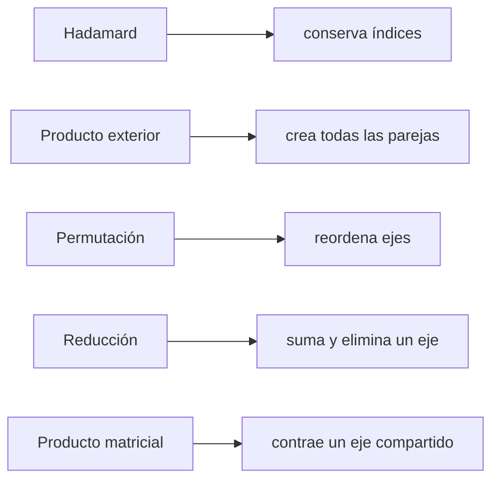

# Operaciones tensoriales y efecto sobre los índices

La forma final no identifica por sí sola la operación. Para saber qué cálculo se realizó, observa el patrón de índices.

> [!summary] Pregunta guía
> Antes de elegir una operación, pregunta qué relación quieres: ¿combinar posiciones correspondientes, formar todas las parejas, cambiar el orden, resumir un eje o mezclar entradas para producir salidas?

## La operación depende de la intención

| Intención en palabras | Operación |
|---|---|
| multiplicar cada dato por su correspondiente | Hadamard, `A * B` |
| relacionar cada valor de `u` con cada valor de `v` | exterior, `torch.outer(u, v)` |
| ver los mismos datos con otro orden de ejes | permutación, `permute` |
| resumir muchos valores en uno | reducción, `sum` o `mean` |
| combinar todas las entradas de una fila para obtener salidas | producto matricial, `@` |

Dos operaciones pueden terminar con la misma forma y aun así calcular relaciones completamente distintas. Por eso “la forma coincide” nunca es la única prueba.

## Mapa de mecanismos



## 1. Producto de Hadamard

$$C_{ij}=A_{ij}B_{ij}.$$

No hay suma. $i$ y $j$ permanecen libres. Para matrices de igual forma:

$$
A=
\begin{bmatrix}1&2\\3&4\end{bmatrix},\quad
B=
\begin{bmatrix}2&0\\-1&5\end{bmatrix}
\Rightarrow
A\odot B=
\begin{bmatrix}2&0\\-3&20\end{bmatrix}.
$$

```python
hadamard = A * B
```

Pregunta que responde: “¿qué obtengo al multiplicar posiciones correspondientes?”.

Ejemplo cotidiano: si `cantidad[i,j]` indica cuántos productos se vendieron y `precio[i,j]` su precio, `cantidad * precio` calcula el ingreso de cada posición sin mezclarla con las demás.

## 2. Producto exterior

$$O_{ij}=u_iv_j.$$

Si $u\in\mathbb R^m$ y $v\in\mathbb R^n$, crea todas las parejas $(i,j)$ y produce $(m,n)$.

$$
u=\begin{bmatrix}1\\2\end{bmatrix},\quad
v=\begin{bmatrix}3&-1&4\end{bmatrix}
\Rightarrow
uv^{\mathsf T}=
\begin{bmatrix}3&-1&4\\6&-2&8\end{bmatrix}.
$$

```python
outer = torch.outer(u, v)
```

Hadamard y exterior pueden producir una matriz, pero Hadamard empareja índices ya existentes; el exterior crea el par libre.

Ejemplo cotidiano: si `u_i` representa horas trabajadas por persona y `v_j` una tarifa por tipo de tarea, el exterior construye el pago posible para **cada combinación** persona–tarea.

## 3. Permutación

Si $S_{itd}$ tiene forma $(B,T,D)$, podemos definir:

$$P_{dit}=S_{itd}.$$

No se suman valores. Solo cambia el orden de ejes:

```python
P = S.permute(2, 0, 1)   # (B,T,D) -> (D,B,T)
```

La componente `P[d,i,t]` contiene el mismo valor que `S[i,t,d]`. El contrato debe actualizarse: el eje 0 ya no es observación, sino característica.

No se ordenan los valores de menor a mayor. Se cambia la pregunta que responde cada posición. Es parecido a girar una tabla para que las columnas pasen a ser filas, pero generalizado a cualquier número de ejes.

## 4. Reducción

$$R_{id}=\sum_{t=1}^{T}S_{itd}.$$

$t$ se suma y desaparece; quedan $(i,d)$:

```python
R = S.sum(dim=1)                 # (B,T,D) -> (B,D)
R_keep = S.sum(dim=1, keepdim=True)  # (B,1,D)
```

La reducción cambia valores y normalmente elimina un eje. `keepdim=True` conserva una posición de tamaño 1 útil para broadcasting, pero el eje ya representa un agregado, no un instante original.

Si `S[i,t,d]` contiene una medición por instante, `S.sum(dim=1)` responde: “¿cuál es el total temporal de cada característica para cada observación?”. Se pierde el detalle de cada `t`, pero se conservan `i` y `d`.

## 5. Producto matriz-vector

Para $A\in\mathbb R^{m\times n}$ y $u\in\mathbb R^n$:

$$y_i=\sum_{j=1}^{n}A_{ij}u_j.$$

$j$ se contrae y solo queda $i$, por lo que $y\in\mathbb R^m$.

```python
y = A @ u
```

No confundas con `A * u`: por broadcasting, eso suele conservar $j$ y producir otra matriz.

La diferencia puede leerse así:

- `A * u`: conserva una contribución separada para cada `j`;
- `A @ u`: multiplica las contribuciones y después las suma sobre `j`, produciendo un solo resultado por fila.

## Tabla comparativa

| Operación | Componentes | Efecto | Ejemplo de forma |
|---|---|---|---|
| Hadamard | $C_{ij}=A_{ij}B_{ij}$ | conserva $i,j$ | $(m,n)$ |
| exterior | $O_{ij}=u_iv_j$ | crea $i,j$ | $(m,n)$ |
| permutar | $P_{dit}=S_{itd}$ | reordena | $(B,T,D)\to(D,B,T)$ |
| reducir | $R_{id}=\sum_tS_{itd}$ | elimina $t$ | $(B,T,D)\to(B,D)$ |
| matmul | $C_{ik}=\sum_jA_{ij}B_{jk}$ | contrae $j$ | $(m,n)@(n,p)\to(m,p)$ |

> [!important] Regla de lectura
> Sin signo de suma, un índice escrito en la salida permanece. Un índice sobre el que se suma desaparece. Una permutación cambia el orden, no el conjunto de índices.

---

Anterior: [[03 Índices, selección y predicción de formas]] · Siguiente: [[05 Broadcasting con significado]]
