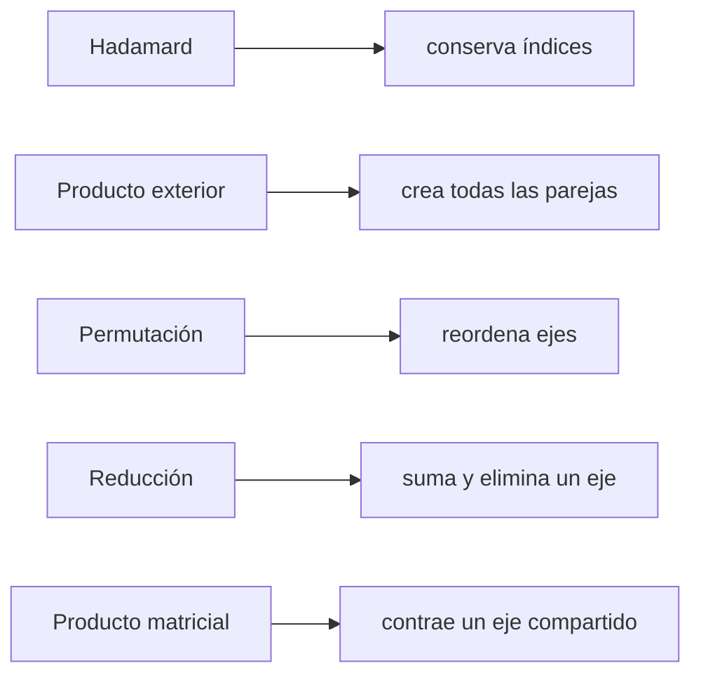

# Operaciones tensoriales y efecto sobre los índices

La forma final no identifica por sí sola la operación. Para saber qué cálculo se realizó, observa el patrón de índices.

> [!summary] Pregunta guía
> Antes de elegir una operación, pregunta qué relación quieres: ¿combinar posiciones correspondientes, formar todas las parejas, cambiar el orden, resumir un eje o mezclar entradas para producir salidas?

## La operación depende de la intención

| Intención en palabras | Operación |
|---|---|
| multiplicar cada dato por su correspondiente | Hadamard, `A * B` |
| relacionar cada valor de `u` con cada valor de `v` | exterior, `torch.outer(u, v)` |
| ver los mismos datos con otro orden de ejes | permutación, `permute` |
| resumir muchos valores en uno | reducción, `sum` o `mean` |
| combinar todas las entradas de una fila para obtener salidas | producto matricial, `@` |

Dos operaciones pueden terminar con la misma forma y aun así calcular relaciones completamente distintas. Por eso “la forma coincide” nunca es la única prueba.

## Mapa de mecanismos



## 1. Producto de Hadamard

$$C_{ij}=A_{ij}B_{ij}.$$

No hay suma. $i$ y $j$ permanecen libres. Para matrices de igual forma:

$$
A=
\begin{bmatrix}1&2\\3&4\end{bmatrix},\quad
B=
\begin{bmatrix}2&0\\-1&5\end{bmatrix}
\Rightarrow
A\odot B=
\begin{bmatrix}2&0\\-3&20\end{bmatrix}.
$$

```python
hadamard = A * B
```

Pregunta que responde: “¿qué obtengo al multiplicar posiciones correspondientes?”.

Ejemplo cotidiano: si `cantidad[i,j]` indica cuántos productos se vendieron y `precio[i,j]` su precio, `cantidad * precio` calcula el ingreso de cada posición sin mezclarla con las demás.

## 2. Producto exterior

El producto exterior toma **dos vectores** y construye una tabla con **todas las combinaciones posibles** entre sus elementos.

Si $u\in\mathbb R^m$ y $v\in\mathbb R^n$, se define como:

$$O_{ij}=u_i v_j.$$

Los índices $i$ y $j$ son independientes:

- $i$ elige un elemento de $u$ y determina la **fila**;
- $j$ elige un elemento de $v$ y determina la **columna**;
- no aparece $\sum$, por lo que no se elimina ningún índice.

Por eso, el resultado tiene forma $(m,n)$. Cada casilla $(i,j)$ responde: **“¿cuánto vale el elemento $i$ de $u$ multiplicado por el elemento $j$ de $v$?”**

### Ejemplo paso a paso

Sean:

$$
u=\begin{bmatrix}1\\2\end{bmatrix},\qquad
v=\begin{bmatrix}3\\-1\\4\end{bmatrix}.
$$

Como $u$ tiene 2 elementos y $v$ tiene 3, el resultado tendrá forma $(2,3)$:

$$
uv^{\mathsf T}=
\begin{bmatrix}
u_1v_1 & u_1v_2 & u_1v_3\\
u_2v_1 & u_2v_2 & u_2v_3
\end{bmatrix}
=
\begin{bmatrix}
1\cdot3 & 1\cdot(-1) & 1\cdot4\\
2\cdot3 & 2\cdot(-1) & 2\cdot4
\end{bmatrix}
=
\begin{bmatrix}3&-1&4\\6&-2&8\end{bmatrix}.
$$

Otra forma de verlo: cada fila es el vector $v$ multiplicado por el elemento correspondiente de $u$:

- primera fila: $1v=[3,-1,4]$;
- segunda fila: $2v=[6,-2,8]$.

> [!tip] Modelo mental
> Imagina que colocas $u$ en vertical y $v$ en horizontal. En cada cruce multiplicas el valor de la fila por el valor de la columna.

### En PyTorch

```python
u = torch.tensor([1, 2])
v = torch.tensor([3, -1, 4])

outer = torch.outer(u, v)       # shape: (2, 3)

# La misma operación escrita con broadcasting:
outer_2 = u[:, None] * v[None, :]
```

`u[:, None]` tiene forma $(2,1)$ y `v[None, :]` forma $(1,3)$. El broadcasting extiende ambos hasta $(2,3)$ y genera todas las parejas.

### Diferencia clave: Hadamard empareja; exterior cruza

Supongamos ahora que ambos vectores tienen dos elementos:

$$u=[2,5],\qquad v=[10,20].$$

El **producto de Hadamard** utiliza la misma posición en ambos vectores:

$$
u\odot v=[u_1v_1,\;u_2v_2]
=[2\cdot10,\;5\cdot20]
=[20,100].
$$

Solo hace dos parejas:

- primera posición con primera posición;
- segunda posición con segunda posición.

En cambio, el **producto exterior** cruza cada elemento de $u$ con **todos** los elementos de $v$:

$$
uv^{\mathsf T}=
\begin{bmatrix}
2\cdot10 & 2\cdot20\\
5\cdot10 & 5\cdot20
\end{bmatrix}
=
\begin{bmatrix}
20 & 40\\
50 & 100
\end{bmatrix}.
$$

Hace cuatro parejas: $(u_1,v_1)$, $(u_1,v_2)$, $(u_2,v_1)$ y $(u_2,v_2)$.

| Operación | Regla | Con vectores de longitud 2 |
|---|---|---|
| Hadamard | **misma posición con misma posición** | 2 productos → vector de forma $(2,)$ |
| exterior | **cada posición con todas las posiciones** | 4 productos → matriz de forma $(2,2)$ |

> [!important] Pregunta para distinguirlos
> - Si cada dato ya tiene una pareja definida, usa Hadamard.
> - Si quieres construir una tabla con todas las parejas posibles, usa el producto exterior.

### Ejemplo cotidiano aclarado

Imagina estas horas trabajadas:

- Ana trabajó 2 horas;
- Luis trabajó 5 horas.

Por tanto, $u=[2,5]$. También existen dos tarifas según el tipo de tarea:

- tarea básica: 10 dólares por hora;
- tarea especializada: 20 dólares por hora.

Por tanto, $v=[10,20]$. El producto exterior construye una **tabla de pagos posibles**:

| | Tarea básica: $10/h$ | Tarea especializada: $20/h$ |
|---|---:|---:|
| Ana: $2h$ | $2\cdot10=20$ | $2\cdot20=40$ |
| Luis: $5h$ | $5\cdot10=50$ | $5\cdot20=100$ |

Aquí $O_{ij}$ significa: **pago de la persona $i$ si sus horas se cobran con la tarifa de la tarea $j$**. Por ejemplo:

- $O_{1,2}=40$: Ana recibiría 40 dólares si sus 2 horas fueran de tarea especializada;
- $O_{2,1}=50$: Luis recibiría 50 dólares si sus 5 horas fueran de tarea básica.

El producto exterior no afirma que todas esas situaciones ocurrieron; muestra todas las combinaciones. Si ya sabemos que Ana hizo la tarea básica y Luis la especializada, solo necesitamos las parejas elegidas $(2\cdot10)$ y $(5\cdot20)$: ese emparejamiento corresponde a Hadamard y produce $[20,100]$.

## 3. Permutación

Si $S_{itd}$ tiene forma $(B,T,D)$, podemos definir:

$$P_{dit}=S_{itd}.$$

No se suman valores. Solo cambia el orden de ejes:

```python
P = S.permute(2, 0, 1)   # (B,T,D) -> (D,B,T)
```

La componente `P[d,i,t]` contiene el mismo valor que `S[i,t,d]`. El contrato debe actualizarse: el eje 0 ya no es observación, sino característica.

No se ordenan los valores de menor a mayor. Se cambia la pregunta que responde cada posición. Es parecido a girar una tabla para que las columnas pasen a ser filas, pero generalizado a cualquier número de ejes.

## 4. Reducción

$$R_{id}=\sum_{t=1}^{T}S_{itd}.$$

$t$ se suma y desaparece; quedan $(i,d)$:

```python
R = S.sum(dim=1)                 # (B,T,D) -> (B,D)
R_keep = S.sum(dim=1, keepdim=True)  # (B,1,D)
```

La reducción cambia valores y normalmente elimina un eje. `keepdim=True` conserva una posición de tamaño 1 útil para broadcasting, pero el eje ya representa un agregado, no un instante original.

Si `S[i,t,d]` contiene una medición por instante, `S.sum(dim=1)` responde: “¿cuál es el total temporal de cada característica para cada observación?”. Se pierde el detalle de cada `t`, pero se conservan `i` y `d`.

## 5. Producto matriz-vector

Para $A\in\mathbb R^{m\times n}$ y $u\in\mathbb R^n$:

$$y_i=\sum_{j=1}^{n}A_{ij}u_j.$$

$j$ se contrae y solo queda $i$, por lo que $y\in\mathbb R^m$.

```python
y = A @ u
```

No confundas con `A * u`: por broadcasting, eso suele conservar $j$ y producir otra matriz.

La diferencia puede leerse así:

- `A * u`: conserva una contribución separada para cada `j`;
- `A @ u`: multiplica las contribuciones y después las suma sobre `j`, produciendo un solo resultado por fila.

## Tabla comparativa

| Operación | Componentes | Efecto | Ejemplo de forma |
|---|---|---|---|
| Hadamard | $C_{ij}=A_{ij}B_{ij}$ | conserva $i,j$ | $(m,n)$ |
| exterior | $O_{ij}=u_iv_j$ | crea $i,j$ | $(m,n)$ |
| permutar | $P_{dit}=S_{itd}$ | reordena | $(B,T,D)\to(D,B,T)$ |
| reducir | $R_{id}=\sum_tS_{itd}$ | elimina $t$ | $(B,T,D)\to(B,D)$ |
| matmul | $C_{ik}=\sum_jA_{ij}B_{jk}$ | contrae $j$ | $(m,n)@(n,p)\to(m,p)$ |

> [!important] Regla de lectura
> Sin signo de suma, un índice escrito en la salida permanece. Un índice sobre el que se suma desaparece. Una permutación cambia el orden, no el conjunto de índices.

---

Anterior: [[03 Índices, selección y predicción de formas]] · Siguiente: [[05 Broadcasting con significado]]
