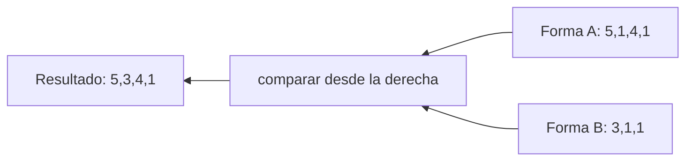

# Broadcasting con significado

Broadcasting permite operar tensores de formas distintas sin copiar explícitamente todos los valores. Es útil, pero puede ocultar un error de eje.

> [!summary] Intuición
> Broadcasting actúa **como si** un valor o un eje de tamaño 1 se repitiera las veces necesarias. PyTorch normalmente no necesita construir todas esas copias; aplica la operación siguiendo esa regla.

## Ejemplo antes de la regla

Queremos sumar el mismo número `10` a una matriz:

$$
\begin{bmatrix}1&2&3\\4&5&6\end{bmatrix}+10
=
\begin{bmatrix}11&12&13\\14&15&16\end{bmatrix}.
$$

Conceptualmente, el `10` se reutiliza en cada posición. Con un vector ocurre algo parecido, pero importa **en qué eje se repite**.

```python
Z = torch.tensor([[1., 2., 3.],
                  [4., 5., 6.]])       # (2,3)
b = torch.tensor([10., 20., 30.])      # (3,)
Z + b
```

PyTorch trata `b` como `(1,3)` y lo repite sobre las dos filas:

$$
\begin{bmatrix}1&2&3\\4&5&6\end{bmatrix}
+
\begin{bmatrix}10&20&30\\10&20&30\end{bmatrix}
=
\begin{bmatrix}11&22&33\\14&25&36\end{bmatrix}.
$$

## Regla mecánica

PyTorch compara las formas **desde el último eje hacia la izquierda**. Dos tamaños son compatibles si:

1. son iguales;
2. uno de ellos vale 1;
3. uno de los ejes no existe.

El tamaño resultante por eje es el mayor compatible.

### Alineación escrita paso a paso

Para `(2,3) + (3,)`, completa el eje que falta por la izquierda:

```text
Z:  (2, 3)
b:  (   3)  -> se interpreta como (1, 3)
     ------
     (2, 3)
```

- por la derecha: `3` coincide con `3`;
- por la izquierda: `1` puede expandirse a `2`.

Para `(B,H) + (B,1)`:

```text
Z:  (B, H)
r:  (B, 1)
     ------
     (B, H)
```

El `1` del último eje se expande a `H`. Así, cada fila recibe su propio valor.



Ejemplos:

| Forma A | Forma B | Resultado | ¿compatible? |
|---:|---:|---:|---|
| $(3,3)$ | $(3,)$ | $(3,3)$ | sí |
| $(3,3)$ | $(3,1)$ | $(3,3)$ | sí |
| $(4,5,2)$ | $(2,)$ | $(4,5,2)$ | sí |
| $(4,5,2)$ | $(5,)$ | — | no: $2\neq5$ |

## Caso correcto: sesgo por salida

Sea $Z=XW\in\mathbb R^{B\times H}$ y $b\in\mathbb R^H$. Queremos:

$$Y_{ih}=Z_{ih}+b_h.$$

`b` se alinea con el último eje $h$ y se replica sobre $i$:

```python
Y = Z + b
```

La expansión explícita es:

$$Y=Z+\mathbf 1_Bb^{\mathsf T}.$$

En PyTorch:

```python
ones = torch.ones((B, 1), dtype=Z.dtype, device=Z.device)
explicit = Z + ones @ b[None, :]
broadcasted = Z + b
assert torch.equal(explicit, broadcasted)
```

La frase semántica es: “para cada observación `i` y salida `h`, suma el sesgo correspondiente a esa salida”. Como `b` depende de `h`, debe alinearse con el eje `H`.

## Caso peligroso: ajuste por observación

Ahora $r_i$ significa un ajuste distinto para cada observación:

$$Q_{ih}=Z_{ih}+r_i.$$

Para expresar $i$ como primer eje y replicar sobre $h$, necesitamos forma $(B,1)$:

```python
right = Z + r[:, None]
```

Si escribimos `Z + r`, el vector de forma `(B,)` se alinea con el último eje. Cuando $B=H$, el código ejecuta, pero calcula:

$$\text{wrong}_{ih}=Z_{ih}+r_h.$$

Ejemplo con $Z=0_{3\times3}$ y $r=[10,20,30]$:

$$
\text{wrong}=
\begin{bmatrix}
10&20&30\\10&20&30\\10&20&30
\end{bmatrix},
\qquad
\text{right}=
\begin{bmatrix}
10&10&10\\20&20&20\\30&30&30
\end{bmatrix}.
$$

Ambos tienen forma `(3,3)`. Solo uno respeta la intención.

Lee las dos orientaciones visualmente:

```text
r          = [10, 20, 30]    -> una fila; cambia por columna
r[:, None] = [[10],           -> una columna; cambia por fila
              [20],
              [30]]
```

```mermaid
flowchart TD
    R[r forma B] --> Q{¿qué índice representa?}
    Q -->|salida h| H[usar Z + r]
    Q -->|observación i| I[usar Z + r[:, None]]
    H --> V[verificar orientación y valores]
    I --> V
```

## Por qué $B=H$ es una trampa

Si $B\neq H$, muchas alineaciones equivocadas producen una excepción visible. Si $B=H$, los tamaños coinciden accidentalmente y el error queda oculto. Por eso conviene probar con dimensiones distintas durante el desarrollo, por ejemplo $B=2$, $H=3$.

## Protocolo seguro

Antes de aceptar una operación broadcast:

1. nombra los índices de ambos tensores;
2. escribe la relación por componentes;
3. agrega ejes de tamaño 1 donde el significado lo exija;
4. predice una fila y una columna concretas;
5. comprueba valores, no solo `.shape`.

> [!example] Prueba semántica
> Si `r` varía por observación, comprueba que `right[:, 0] == r`. Si `b` varía por salida, comprueba que `Y[0] - Z[0] == b`.

---

Anterior: [[04 Operaciones tensoriales y efecto sobre los índices]] · Siguiente: [[06 Transformaciones lineales y afines por lotes]]
