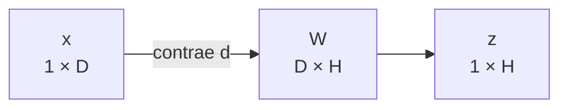
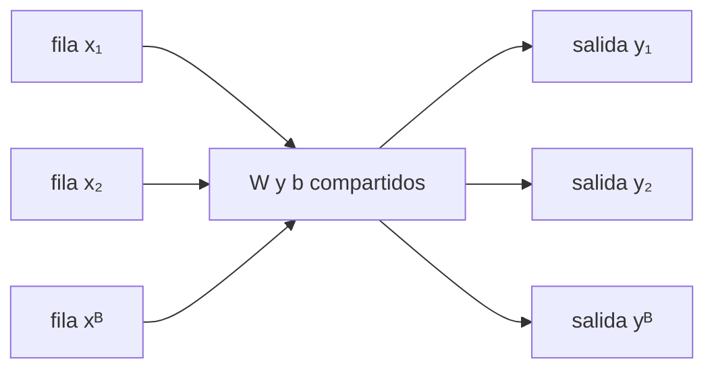

# Transformaciones lineales y afines por lotes

> [!summary] Idea sencilla
> Una transformación toma características de entrada y fabrica características de salida mediante recetas numéricas. `W` guarda las recetas y `b` guarda los ajustes finales.

## Qué representan realmente `X`, `W` y `b`

Supón que cada vivienda tiene dos entradas:

$$x=[\text{tamaño},\text{habitaciones}].$$

Queremos producir tres puntuaciones de salida. Entonces necesitamos tres recetas. Cada receta debe indicar cuánto usa de las dos entradas:

$$
W=\begin{bmatrix}w^{(1)}&w^{(2)}&w^{(3)}\end{bmatrix},
\qquad w^{(h)}\in\mathbb R^2,
\qquad W\in\mathbb R^{2\times3}.
$$

Cada columna $w^{(h)}$ es una receta de dos pesos: uno para tamaño y otro para habitaciones.

Por eso:

- las **filas de `W`** corresponden a entradas;
- las **columnas de `W`** corresponden a salidas;
- `x @ W` produce un valor por columna de `W`;
- `b` agrega un ajuste independiente a cada salida.

## Una observación fila

Adoptamos la convención:

$$x\in\mathbb R^{1\times D},\qquad W\in\mathbb R^{D\times H}.$$

Entonces:

$$z=xW\in\mathbb R^{1\times H}.$$

Por componentes:

$$z_h=\sum_{d=1}^{D}x_dW_{dh}.$$

$d$ conecta las entradas de $x$ con las filas de $W$ y se suma; $h$ organiza las salidas y permanece.

Para una salida concreta $h$, la operación es un producto punto:

$$
z_h=x_1W_{1h}+x_2W_{2h}+\cdots+x_DW_{Dh}.
$$

Es decir: multiplica cada entrada por el peso que esa receta le asigna y suma todas las contribuciones.

## Del mapa lineal al mapa afín

Una transformación lineal es:

$$L(x)=xW.$$

Cumple necesariamente $L(0)=0$. Al agregar un sesgo:

$$f(x)=xW+b,$$

obtenemos $f(0)=b$. Si $b\neq0$, la transformación ya no es lineal: es **afín**.

Ejemplo en una dimensión:

$$L(x)=2x,\qquad f(x)=2x+3.$$

- `L` estira los valores y mantiene el origen: $L(0)=0$;
- `f` primero estira y luego desplaza: $f(0)=3$.

En una capa neuronal, `W` realiza la combinación y `b` permite desplazar el resultado aunque todas las entradas sean cero.

> [!important] Intuición geométrica
> $W$ puede rotar, escalar, reflejar o proyectar; $b$ desplaza todo el espacio. La parte lineal decide cómo cambian direcciones; el sesgo decide dónde queda el origen transformado.

En la convención de fila, `b` se representa como `(H,)` o `(1,H)`. La notación $b^{\mathsf T}$ de algunas diapositivas solo enfatiza que se agrega como fila; en código, `b[None, :]` hace explícita esa orientación.

## El lote aplica la misma transformación a cada fila

Para $B$ observaciones:

$$X\in\mathbb R^{B\times D},\qquad Y\in\mathbb R^{B\times H}.$$

La relación es:

$$Y_{ih}=\sum_{d=1}^{D}X_{id}W_{dh}+b_h.$$

- $i$ identifica la observación y sobrevive;
- $d$ se contrae;
- $h$ identifica la salida y sobrevive;
- $W$ y $b$ no dependen de $i$: son compartidos por todas las filas.

“Compartidos” significa que no entrenamos una matriz distinta para cada observación. La fila 0, la fila 1 y todas las demás pasan por las mismas recetas. El eje de observación atraviesa la operación sin mezclarse con otras observaciones.

## Ejemplo numérico completo

$$
X=\begin{bmatrix}1&2\\0&-1\\3&1\end{bmatrix},\quad
W=\begin{bmatrix}2&-1&0\\1&1&2\end{bmatrix},\quad
b=\begin{bmatrix}1&0&-2\end{bmatrix}.
$$

Primero:

$$
XW=
\begin{bmatrix}
4&1&4\\
-1&-1&-2\\
7&-2&2
\end{bmatrix}.
$$

Luego se agrega el mismo sesgo a cada fila:

$$
Y=
\begin{bmatrix}
5&1&2\\
0&-1&-4\\
8&-2&0
\end{bmatrix}.
$$

Comprueba la primera componente manualmente:

$$Y_{11}=1\cdot2+2\cdot1+1=5.$$

Y la tercera salida de la segunda observación:

$$Y_{23}=0\cdot0+(-1)\cdot2-2=-4.$$

Para comprender la matriz completa, repite siempre esta pregunta:

> “¿Qué fila de `X` estoy usando y qué columna de `W` estoy usando?”.

Cada pareja `(fila de X, columna de W)` produce una celda de `XW`.

## Forma explícita del sesgo

$$
\mathbf1_Bb^{\mathsf T}=
\begin{bmatrix}1\\1\\1\end{bmatrix}
\begin{bmatrix}1&0&-2\end{bmatrix}
=
\begin{bmatrix}
1&0&-2\\1&0&-2\\1&0&-2
\end{bmatrix}.
$$

Esto revela lo que broadcasting abrevia: $b_h$ se replica sobre $i$.

## Conexión con una capa densa

Una capa totalmente conectada, antes de su activación, calcula precisamente una transformación afín. En PyTorch, `nn.Linear(D, H)` guarda pesos y sesgo, aunque internamente su peso se expone con forma `(H,D)` y la operación conceptual equivale a $xW^{\mathsf T}+b$ según la convención de la API. No confundas ese detalle de almacenamiento con la relación matemática elegida en este módulo.

---

Anterior: [[05 Broadcasting con significado]] · Siguiente: [[07 Producto matricial y contracciones con contexto]]
