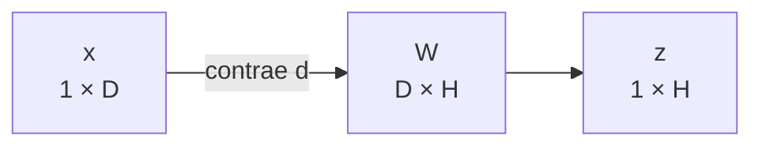
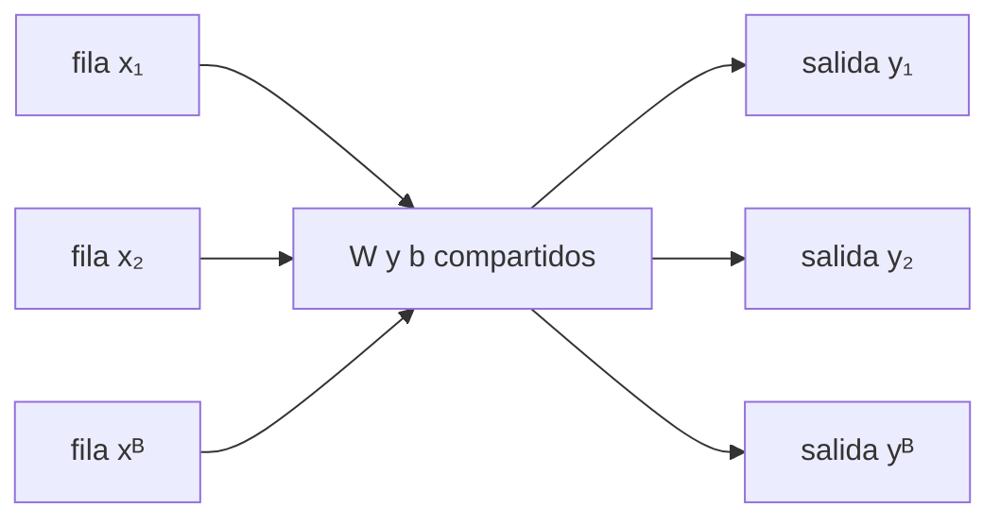

# Transformaciones lineales y afines por lotes

> [!summary] Idea sencilla
> Una transformación toma características de entrada y fabrica características de salida mediante recetas numéricas. `W` guarda las recetas y `b` guarda los ajustes finales.

## Qué representan realmente `X`, `W` y `b`

Supón que cada vivienda tiene dos entradas:

$$x=[\text{tamaño},\text{habitaciones}].$$

Queremos producir tres puntuaciones de salida. Entonces necesitamos tres recetas. Cada receta debe indicar cuánto usa de las dos entradas:

$$
W=\begin{bmatrix}w^{(1)}&w^{(2)}&w^{(3)}\end{bmatrix},
\qquad w^{(h)}\in\mathbb R^2,
\qquad W\in\mathbb R^{2\times3}.
$$

Cada columna $w^{(h)}$ es una receta de dos pesos: uno para tamaño y otro para habitaciones.

Por eso:

- las **filas de `W`** corresponden a entradas;
- las **columnas de `W`** corresponden a salidas;
- `x @ W` produce un valor por columna de `W`;
- `b` agrega un ajuste independiente a cada salida.

## Una observación fila

Adoptamos la convención:

$$x\in\mathbb R^{1\times D},\qquad W\in\mathbb R^{D\times H}.$$

Entonces:

$$z=xW\in\mathbb R^{1\times H}.$$

Por componentes:

$$z_h=\sum_{d=1}^{D}x_dW_{dh}.$$

$d$ conecta las entradas de $x$ con las filas de $W$ y se suma; $h$ organiza las salidas y permanece.

Para una salida concreta $h$, la operación es un producto punto:

$$
z_h=x_1W_{1h}+x_2W_{2h}+\cdots+x_DW_{Dh}.
$$

Es decir: multiplica cada entrada por el peso que esa receta le asigna y suma todas las contribuciones.

## Qué significa exactamente "lineal"

En álgebra lineal, "lineal" **no** significa "parece una recta". Es una definición con dos reglas. Una función $L$ es lineal si para todo par de vectores $x,x'$ y todo escalar $\alpha$:

$$
\textbf{(1) Aditividad: } L(x+x')=L(x)+L(x')
\qquad
\textbf{(2) Homogeneidad: } L(\alpha x)=\alpha\,L(x).
$$

En palabras: **puedes repartir la operación**. Sumar primero y transformar después da lo mismo que transformar primero y sumar después. Y escalar la entrada escala la salida en la misma proporción.

### $L(x)=xW$ sí es lineal

La demostración es directa, porque el producto matricial ya distribuye:

$$
L(x+x')=(x+x')W=xW+x'W=L(x)+L(x'),
$$
$$
L(\alpha x)=(\alpha x)W=\alpha (xW)=\alpha L(x).
$$

Una consecuencia obligatoria: si tomas $\alpha=0$,

$$L(0)=0.$$

**Toda transformación lineal deja el origen quieto.** Esto no es opcional: se deduce de la definición. Si una transformación mueve el cero, ya no es lineal.

## Qué significa "afín"

Un mapa **afín** es una transformación lineal **más una traslación fija**:

$$f(x)=\underbrace{xW}_{\text{parte lineal}}+\underbrace{b}_{\text{traslación}}.$$

Ahora:

$$f(0)=b.$$

Si $b\neq 0$, el origen se mueve, y por lo tanto **$f$ no es lineal**. Es afín.

> [!warning] El error frecuente
> $f(x)=2x+3$ se dibuja como una recta, y en el colegio se le llama "función lineal". En álgebra lineal **no lo es**: es afín. Lineal exige pasar por el origen.

### Contraejemplo numérico en 1D

Con $f(x)=2x+3$:

| comprobación | lado izquierdo | lado derecho | ¿coinciden? |
|---|---|---|---|
| $f(1+2)$ vs $f(1)+f(2)$ | $f(3)=9$ | $5+7=12$ | no |
| $f(2\cdot 1)$ vs $2f(1)$ | $f(2)=7$ | $2\cdot 5=10$ | no |

Falla por $3$ y por $5$: exactamente por copias sobrantes del sesgo. Con $L(x)=2x$ ambas comprobaciones dan igualdad.

### Contraejemplo con las matrices de esta nota

Usando $W$ y $b$ del ejemplo de más abajo, con $x=[1,\,2]$ y $x'=[0,\,-1]$:

$$
f(x)=[5,\,1,\,2],\qquad f(x')=[0,\,-1,\,-4],\qquad f(x)+f(x')=[5,\,0,\,-2].
$$

Pero sumando primero, $x+x'=[1,\,1]$:

$$
f(x+x')=[1,\,1]W+b=[3,\,0,\,2]+[1,\,0,\,-2]=[4,\,0,\,0].
$$

No coinciden. Y la diferencia es reveladora:

$$
f(x)+f(x')-f(x+x')=[1,\,0,\,-2]=b.
$$

Al sumar dos salidas, el sesgo se cuenta **dos veces**; al transformar la suma, solo **una**. Ese sobrante es precisamente lo que rompe la linealidad.

### Lo que sí conserva un mapa afín

Aunque pierda la aditividad, un mapa afín conserva la estructura importante:

- **Diferencias**: $f(x)-f(x')=(x-x')W$. El sesgo se cancela; entre dos puntos vuelve a comportarse como lineal.
- **Combinaciones cuyos coeficientes suman 1**: si $\sum_i\lambda_i=1$, entonces $f\!\left(\sum_i \lambda_i x_i\right)=\sum_i \lambda_i f(x_i)$. Esta es, de hecho, la definición alternativa de "afín".
- **Rectas, planos y paralelismo**: las rectas siguen siendo rectas y las paralelas siguen siendo paralelas. Solo se pierde el privilegio del origen.

> [!important] Intuición geométrica
> $W$ puede rotar, escalar, reflejar, cizallar o proyectar el espacio, pero clava el origen en su sitio. $b$ toma todo el espacio ya deformado y lo desliza en bloque.
> **Lineal = deformar. Afín = deformar y luego mover.**

### Truco: toda afín es lineal en una dimensión más

Si añades una coordenada constante igual a 1 a la entrada y apilas $b$ como una fila extra de la matriz, la traslación se convierte en una columna de pesos más:

$$
\tilde x=[\,x\ \ 1\,]\in\mathbb R^{1\times(D+1)},\qquad
\tilde W=\begin{bmatrix}W\\ b\end{bmatrix}\in\mathbb R^{(D+1)\times H},
\qquad
\tilde x\tilde W = xW+b.
$$

Comprobación con $x=[1,2]$:

$$
[\,1\ \ 2\ \ 1\,]
\begin{bmatrix}2&-1&0\\1&1&2\\1&0&-2\end{bmatrix}
=[\,5\ \ 1\ \ 2\,],
$$

que es justamente la primera fila de $Y$. Esto se llama **coordenadas homogéneas** y es lo que usan gráficos por computador y robótica para tratar rotación y traslación con una sola matriz.

## Por qué esto importa en una red neuronal

`W` combina las entradas; `b` permite que la salida sea distinta de cero **aunque todas las entradas valgan cero**, y desplaza el umbral a partir del cual una activación se enciende. Sin sesgo, todas las fronteras de decisión estarían obligadas a pasar por el origen.

Detalle de nomenclatura: `nn.Linear(D, H)` de PyTorch calcula por defecto una transformación **afín**, no lineal. Solo con `bias=False` es lineal en sentido estricto.

En la convención de fila, `b` se representa como `(H,)` o `(1,H)`. La notación $b^{\mathsf T}$ de algunas diapositivas solo enfatiza que se agrega como fila; en código, `b[None, :]` hace explícita esa orientación.

## El lote aplica la misma transformación a cada fila

Para $B$ observaciones:

$$X\in\mathbb R^{B\times D},\qquad Y\in\mathbb R^{B\times H}.$$

La relación es:

$$Y_{ih}=\sum_{d=1}^{D}X_{id}W_{dh}+b_h.$$

- $i$ identifica la observación y sobrevive;
- $d$ se contrae;
- $h$ identifica la salida y sobrevive;
- $W$ y $b$ no dependen de $i$: son compartidos por todas las filas.

“Compartidos” significa que no entrenamos una matriz distinta para cada observación. La fila 0, la fila 1 y todas las demás pasan por las mismas recetas. El eje de observación atraviesa la operación sin mezclarse con otras observaciones.

## Ejemplo numérico completo

$$
X=\begin{bmatrix}1&2\\0&-1\\3&1\end{bmatrix},\quad
W=\begin{bmatrix}2&-1&0\\1&1&2\end{bmatrix},\quad
b=\begin{bmatrix}1&0&-2\end{bmatrix}.
$$

Primero:

$$
XW=
\begin{bmatrix}
4&1&4\\
-1&-1&-2\\
7&-2&2
\end{bmatrix}.
$$

Luego se agrega el mismo sesgo a cada fila:

$$
Y=
\begin{bmatrix}
5&1&2\\
0&-1&-4\\
8&-2&0
\end{bmatrix}.
$$

Comprueba la primera componente manualmente:

$$Y_{11}=1\cdot2+2\cdot1+1=5.$$

Y la tercera salida de la segunda observación:

$$Y_{23}=0\cdot0+(-1)\cdot2-2=-4.$$

Para comprender la matriz completa, repite siempre esta pregunta:

> “¿Qué fila de `X` estoy usando y qué columna de `W` estoy usando?”.

Cada pareja `(fila de X, columna de W)` produce una celda de `XW`.

## Forma explícita del sesgo

$$
\mathbf1_Bb^{\mathsf T}=
\begin{bmatrix}1\\1\\1\end{bmatrix}
\begin{bmatrix}1&0&-2\end{bmatrix}
=
\begin{bmatrix}
1&0&-2\\1&0&-2\\1&0&-2
\end{bmatrix}.
$$

Esto revela lo que broadcasting abrevia: $b_h$ se replica sobre $i$.

## Conexión con una capa densa

Una capa totalmente conectada, antes de su activación, calcula precisamente una transformación afín. En PyTorch, `nn.Linear(D, H)` guarda pesos y sesgo, aunque internamente su peso se expone con forma `(H,D)` y la operación conceptual equivale a $xW^{\mathsf T}+b$ según la convención de la API. No confundas ese detalle de almacenamiento con la relación matemática elegida en este módulo.

---

Anterior: [[05 Broadcasting con significado]] · Siguiente: [[07 Producto matricial y contracciones con contexto]]
