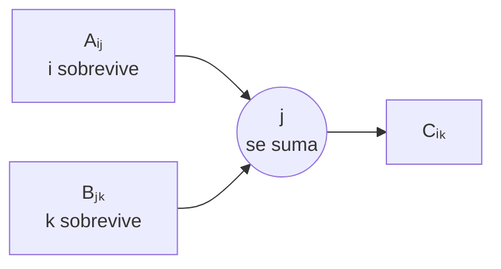
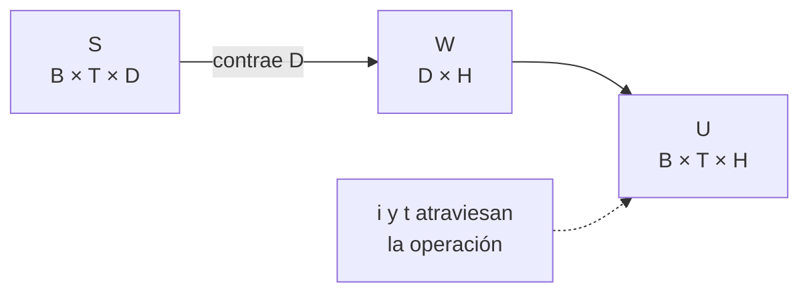

# Producto matricial y contracciones con contexto

> [!summary] Puente conceptual
> El producto matricial repite muchos productos punto. Cada celda del resultado toma una fila del primer tensor, una columna del segundo, multiplica sus elementos correspondientes y los suma.

## Del producto punto al producto matricial

Con:

$$
a=[1,2],\qquad b=[3,4],
$$

el producto punto es:

$$a\cdot b=1\cdot3+2\cdot4=11.$$

Ahora considera:

$$
A=\begin{bmatrix}1&2\\5&6\end{bmatrix},
\qquad
B=\begin{bmatrix}3&7\\4&8\end{bmatrix}.
$$

La primera celda de `A @ B` toma la primera fila de `A` y la primera columna de `B`:

$$C_{11}=1\cdot3+2\cdot4=11.$$

La segunda celda de la primera fila usa la misma fila de `A`, pero la segunda columna de `B`:

$$C_{12}=1\cdot7+2\cdot8=23.$$

El eje compartido tiene dos elementos. Se recorren, se multiplican y se suman; por eso desaparece del resultado.

## Contracción: una suma estructurada

El producto matricial es una contracción porque un índice compartido se suma:

$$C_{ik}=\sum_{j=1}^{n}A_{ij}B_{jk}.$$



La coincidencia de tamaños en $j$ es necesaria. Además, ambos $j$ deben representar la misma clase de cantidad.

> [!warning] Coincidir en tamaño no basta
> Dos ejes de tamaño 3 podrían representar colores y ciudades. PyTorch permitiría ciertas operaciones porque ve dos números 3; el problema matemático podría seguir siendo absurdo. La contracción solo tiene sentido cuando ambos ejes describen la misma clase de cantidad.

## Ejes de contexto

Considera secuencias por lotes:

$$S\in\mathbb R^{B\times T\times D},\qquad W\in\mathbb R^{D\times H}.$$

Queremos aplicar la misma transformación a cada observación $i$ y a cada tiempo $t$:

$$U_{ith}=\sum_{d=1}^{D}S_{itd}W_{dh}.$$

- $i$ y $t$ no participan en la suma: son **ejes de contexto** y sobreviven;
- $d$ se contrae;
- $h$ aparece como eje de salida.

“Contexto” significa que esos ejes identifican **dónde** se aplica la transformación, pero no se suman. Aquí se aplica una transformación independiente en cada pareja `(observación, tiempo)`.

```text
S[0,0,:] @ W -> U[0,0,:]
S[0,1,:] @ W -> U[0,1,:]
S[1,0,:] @ W -> U[1,0,:]
...
```

Por tanto:

$$U\in\mathbb R^{B\times T\times H}.$$



## Qué hace `torch.matmul`

Cuando recibe tensores con más de dos ejes, `matmul` usa los dos últimos ejes como dimensiones matriciales. Los ejes anteriores se tratan como lote o contexto y pueden participar en broadcasting.

```python
B, T, D, H = 4, 5, 2, 3
S = torch.arange(B * T * D, dtype=torch.float32).reshape(B, T, D)
W = torch.tensor([[1.0, 0.0, -1.0],
                  [0.5, 2.0,  1.0]])

U = torch.matmul(S, W)
assert U.shape == (B, T, H)
```

Lectura de formas:

$$
(B,T,\cancel D)@(\cancel D,H)\longrightarrow(B,T,H).
$$

Método para predecir:

1. separa los dos últimos ejes de cada operando;
2. comprueba que el último del primero coincide con el penúltimo del segundo;
3. elimina ese eje compartido;
4. conserva los ejes de contexto;
5. conserva el último eje del segundo como salida.

## Verificación local

Una forma global correcta puede esconder un error de valores. Comprueba una posición:

```python
assert torch.equal(U[0, 0], S[0, 0] @ W)
```

Y, de forma todavía más explícita:

```python
manual = torch.stack([
    S[0, 0] @ W[:, h]
    for h in range(H)
])
assert torch.equal(U[0, 0], manual)
```

## `matmul`, `mm`, `bmm` y `einsum`

| Función | Uso típico |
|---|---|
| `torch.mm(A, B)` | dos matrices 2D |
| `torch.bmm(A, B)` | lotes 3D con el mismo tamaño de lote |
| `torch.matmul(A, B)` o `A @ B` | comportamiento general con vectores, matrices y lotes |
| `torch.einsum(...)` | escribir explícitamente el patrón de índices |

La misma contracción anterior puede expresarse como:

```python
U_einsum = torch.einsum("btd,dh->bth", S, W)
assert torch.equal(U, U_einsum)
```

Aquí `b,t,h` aparecen en la salida y `d` no: `d` se contrae. `einsum` vuelve visible la regla de índices, aunque en este módulo `matmul` es la ruta principal.

## Si ambos operandos tienen ejes de lote

Ejemplo: `A.shape == (B,m,n)` y `Bmat.shape == (B,n,p)`. Cada lote tiene su propia pareja de matrices:

$$C_{bik}=\sum_j A_{bij}B_{bjk},\qquad C\in\mathbb R^{B\times m\times p}.$$

No se suma sobre $b$; $b$ permanece como contexto.

> [!warning] Error conceptual frecuente
> “`matmul` multiplica los dos últimos ejes” es una abreviación incompleta. En realidad, los interpreta como matrices: contrae el último eje del primer operando con el penúltimo del segundo. Los ejes anteriores se alinean como lote.

---

Anterior: [[06 Transformaciones lineales y afines por lotes]] · Siguiente: [[08 dtype, device, memoria, view, reshape y permute]]
