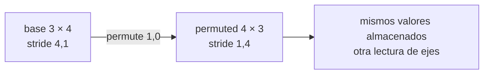

# `dtype`, `device`, memoria, `view`, `reshape` y `permute`

Estas propiedades describen cómo se representa o reorganiza un tensor. No asignan por sí solas significado a sus ejes.

> [!summary] Cuatro preguntas distintas
> 1. `shape`: ¿cómo están organizados los valores?
> 2. `dtype`: ¿qué tipo de número guarda cada posición?
> 3. `device`: ¿dónde se realiza el cálculo?
> 4. `stride`: ¿cómo se recorren los valores en memoria?

Cambiar una de estas propiedades no implica necesariamente cambiar las demás.

## `dtype`: tipo numérico

```python
T = torch.tensor([[1, 2], [3, 4]], dtype=torch.int64)
T_float = T.to(dtype=torch.float32)
```

- `int64`: números enteros; no representa decimales.
- `float32`: reales aproximados con precisión simple; común en aprendizaje profundo.
- `float64`: mayor precisión y mayor costo de memoria/cómputo.
- `bool`: valores lógicos.

La conversión cambia cómo se almacenan y calculan los valores. No cambia qué representa el eje 0.

## `device`: dónde se calcula

```python
T.device                  # cpu
T_gpu = T.to("cuda")      # solo si CUDA está disponible
```

Los operandos de una operación normalmente deben estar en el mismo dispositivo. Mover a GPU no cambia la relación matemática, aunque puede cambiar pequeños detalles numéricos por precisión y orden de ejecución.

## Forma, número de elementos y almacenamiento

```python
base = torch.arange(12).reshape(3, 4)
base.shape   # (3, 4)
base.numel() # 12
```

Cambiar la forma debe conservar el número de elementos:

$$3\cdot4=12.$$

Pero conservar `numel()` no garantiza conservar la semántica. Transformar una matriz `(observación, característica)` en un vector `(12,)` borra la separación explícita entre esos ejes.

Ejemplo:

```python
base = torch.tensor([
    [0, 1, 2, 3],
    [4, 5, 6, 7],
    [8, 9, 10, 11],
])
```

- forma `(3,4)`: tres grupos de cuatro valores;
- forma `(2,6)`: dos grupos de seis valores;
- forma `(12,)`: una sola secuencia de doce valores.

El contenido puede ser el mismo, pero las agrupaciones visibles —y posiblemente su significado— son diferentes.

## Strides: cómo avanzar por memoria

> [!note] Detalle de implementación
> Puedes comprender tensores y operaciones sin dominar `stride` en la primera lectura. Estúdialo cuando necesites entender por qué una vista es posible o por qué `view` falla después de `permute`.

Un *stride* indica cuántas posiciones de almacenamiento hay que avanzar para aumentar un índice en 1.

```python
base.stride()  # normalmente (4, 1)
```

En una matriz contigua de forma `(3,4)`:

- avanzar una fila salta 4 elementos;
- avanzar una columna salta 1 elemento.

## `permute`: cambia la vista lógica de ejes

```python
permuted = base.permute(1, 0)
permuted.shape          # (4, 3)
permuted.stride()       # normalmente (1, 4)
permuted.is_contiguous() # False
```

`permute` no transpone físicamente todos los valores; suele crear una vista con otros tamaños y strides. Por eso el resultado puede no ser contiguo.

Con un tensor de imágenes `(lote, alto, ancho, color)`, la operación:

```python
channels_first = images.permute(0, 3, 1, 2)
```

cambia el contrato a `(lote, color, alto, ancho)`. No mezcla colores ni píxeles: mueve el eje completo “color” de la última posición a la segunda.



## `view`: exige almacenamiento compatible

```python
flat_view = base.view(12)
```

`view` intenta reinterpretar el mismo almacenamiento sin copiar. Por eso falla si forma y strides no permiten la nueva vista:

```python
permuted.view(12)  # puede lanzar RuntimeError
```

Una solución explícita es:

```python
flat = permuted.contiguous().view(12)
```

`contiguous()` puede crear una copia organizada en el orden actual.

Piensa en `view` como: “interpreta el mismo recorrido de memoria con otros separadores”. Si el tensor fue permutado, ese recorrido puede haber dejado de ser compatible con la forma solicitada.

## `reshape`: prioriza obtener la forma

```python
flat = permuted.reshape(12)
```

`reshape` devuelve una vista cuando es posible y una copia cuando es necesario. Por eso no bases la lógica del programa en que un `reshape` comparta memoria.

Regla práctica:

- usa `reshape` cuando lo importante es obtener una forma;
- usa `view` cuando necesitas explícitamente una vista compatible;
- usa `permute` cuando quieres cambiar el orden de ejes;
- usa `clone` cuando necesitas una copia independiente.

## ¿Comparten almacenamiento?

Puedes investigar, pero no usarlo como contrato accidental:

```python
flat = base.view(12)
flat[0] = 99
assert base[0, 0] == 99  # comparten almacenamiento
```

En cambio, si una operación creó una copia, modificarla no cambia el original. Para código claro, documenta cuándo deseas una vista, una copia independiente o simplemente una forma concreta.

## Protocolo seguro al reorganizar

Comprueba cuatro dimensiones del problema:

1. **forma**: ¿es la esperada?;
2. **semántica**: ¿qué significa ahora cada eje?;
3. **número de elementos**: ¿se conserva cuando debe?;
4. **almacenamiento**: ¿necesitas una vista, una copia o contigüidad?

> [!important] Distinción clave
> `permute` reordena ejes; `reshape` reorganiza la forma; `view` reinterpreta almacenamiento compatible. Ninguna operación decide por ti qué significa el resultado.

---

Anterior: [[07 Producto matricial y contracciones con contexto]] · Siguiente: [[09 Laboratorio PyTorch - formular, predecir y verificar]]
