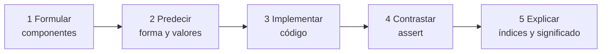

# Laboratorio PyTorch: formular, predecir y verificar

Esta nota convierte el notebook adjunto en una práctica razonada. Ejecuta el archivo [[assets/01_demo_M07.ipynb]] por bloques, pero completa primero cada predicción.

> [!important] Regla del laboratorio
> No ejecutes para averiguar qué forma sale. Primero escribe qué representa cada eje y cuál debería ser la forma. Después usa PyTorch para comprobar tu razonamiento.

## Preparación

```python
import sys
import torch

torch.set_printoptions(precision=4, sci_mode=False)
print("Python:", sys.version.split()[0])
print("PyTorch:", torch.__version__)
print("Dispositivo usado: cpu")
```

## Protocolo de cinco pasos



Si empiezas por ejecutar, solo descubres qué aceptó la API. Si empiezas por formular, puedes decidir si la API calculó lo que querías.

## Experimento 0: reconocer tensores sin operaciones

Antes de multiplicar, aprende a leer:

```python
escalar = torch.tensor(7.0)
vector = torch.tensor([10.0, 20.0, 30.0])
matriz = torch.tensor([
    [1.0, 2.0, 3.0],
    [4.0, 5.0, 6.0],
])
secuencias = torch.zeros((2, 4, 3))
```

Predicciones:

| tensor | interpretación posible | `ndim` | `shape` |
|---|---|---:|---:|
| `escalar` | una medición | 0 | `()` |
| `vector` | tres características | 1 | `(3,)` |
| `matriz` | dos observaciones, tres características | 2 | `(2,3)` |
| `secuencias` | dos observaciones, cuatro tiempos, tres características | 3 | `(2,4,3)` |

Comprueba:

```python
assert escalar.ndim == 0 and escalar.shape == ()
assert vector.ndim == 1 and vector.shape == (3,)
assert matriz.ndim == 2 and matriz.shape == (2, 3)
assert secuencias.ndim == 3 and secuencias.shape == (2, 4, 3)
```

Ahora predice antes de ejecutar:

```python
secuencias[0].shape        # ¿?
secuencias[:, 0, :].shape  # ¿?
secuencias[:, :, 0].shape  # ¿?
```

Respuestas: `(4,3)`, `(2,3)` y `(2,4)`. En cada caso, el índice entero fija y elimina un eje.

## Experimento 1: transformación afín

### Formular y predecir

$$Y_{ih}=\sum_dX_{id}W_{dh}+b_h.$$

Formas: $(3,2)@(2,3)+(3,)\to(3,3)$.

```python
X = torch.tensor([[1., 2.], [0., -1.], [3., 1.]])
W = torch.tensor([[2., -1., 0.], [1., 1., 2.]])
b = torch.tensor([1., 0., -2.])
```

Antes de seguir, calcula a mano la primera fila. Debe resultar `[5, 1, 2]` después del sesgo.

Hazlo columna por columna:

```text
salida 0: 1·2  + 2·1 + 1  = 5
salida 1: 1·-1 + 2·1 + 0  = 1
salida 2: 1·0  + 2·2 - 2  = 2
```

La primera fila de `X` se combina con cada una de las tres columnas de `W`. Por eso produce tres salidas.

### Implementar y contrastar

```python
expected_XW = torch.tensor([
    [ 4.,  1.,  4.],
    [-1., -1., -2.],
    [ 7., -2.,  2.],
])
expected_Y = torch.tensor([
    [5.,  1.,  2.],
    [0., -1., -4.],
    [8., -2.,  0.],
])

XW = X @ W
Y = XW + b

assert XW.shape == (3, 3)
assert torch.equal(XW, expected_XW)
assert torch.equal(Y, expected_Y)
```

### Explicar

`d` se contrae; `i,h` permanecen. `b_h` se replica sobre `i`.

## Experimento 2: cuatro mecanismos

Predice formas y valores antes de ejecutar:

```python
A = torch.tensor([[1., 2.], [3., 4.]])
B = torch.tensor([[2., 0.], [-1., 5.]])
u = torch.tensor([1., 2.])
v = torch.tensor([3., -1., 4.])
S = torch.arange(4 * 5 * 2, dtype=torch.float32).reshape(4, 5, 2)

hadamard = A * B
outer = torch.outer(u, v)
permuted = S.permute(2, 0, 1)
reduced = S.sum(dim=1)

assert hadamard.shape == (2, 2)
assert outer.shape == (2, 3)
assert permuted.shape == (2, 4, 5)
assert reduced.shape == (4, 2)
```

Completa verbalmente: Hadamard ___ índices; exterior ___ el par; permutar ___ ejes; reducir ___ el índice sumado. Respuestas: conserva, crea, reordena, elimina.

No te limites a las formas. Calcula al menos estos valores:

```python
assert hadamard[1, 0] == 3 * -1
assert outer[1, 2] == 2 * 4
assert permuted[1, 0, 0] == S[0, 0, 1]
assert torch.equal(reduced[0], S[0].sum(dim=0))
```

Cada prueba expresa el significado de una operación, no solo su tamaño.

## Experimento 3: broadcasting semántico

```python
Z = torch.zeros((3, 3))
r = torch.tensor([10., 20., 30.])

wrong = Z + r
right = Z + r[:, None]
```

Antes de imprimir, predice:

- `wrong[0]`: `[10,20,30]`;
- `right[0]`: `[10,10,10]`;
- `right[:,0]`: `[10,20,30]`.

```python
assert wrong.shape == right.shape == (3, 3)
assert torch.equal(wrong[0], r)
assert torch.equal(right[:, 0], r)
assert not torch.equal(wrong, right)
```

## Experimento 4: contexto temporal

```python
B, T, D, H = 4, 5, 2, 3
S = torch.arange(B * T * D, dtype=torch.float32).reshape(B, T, D)
W_seq = torch.tensor([[1., 0., -1.], [0.5, 2., 1.]])

U = torch.matmul(S, W_seq)
assert U.shape == (B, T, H)
assert torch.equal(U[0, 0], S[0, 0] @ W_seq)
```

Explicación: `i,t` son contexto, `d` se contrae y `h` emerge.

## Experimento 5: almacenamiento

```python
base = torch.arange(12).reshape(3, 4)
permuted = base.permute(1, 0)

assert base.is_contiguous()
assert not permuted.is_contiguous()
assert base.numel() == permuted.numel() == 12
```

Observa:

```python
print(base.stride())       # (4, 1)
print(permuted.stride())   # (1, 4)
```

La forma y el orden lógico cambian; los valores subyacentes pueden seguir compartidos.

## Desafío final

Cambia el caso de broadcasting a `B=2`, `H=3`:

```python
Z = torch.zeros((2, 3))
r = torch.tensor([10., 20.])
```

Explica por qué `Z + r` ahora falla y `Z + r[:, None]` funciona. Esta prueba rompe la coincidencia accidental $B=H$ y hace visible el contrato correcto.

## Registro de aprendizaje

Al terminar cada experimento, completa:

> **Tensor de entrada:** representa ___ y sus ejes son ___.  
> **Operación:** fija / conserva / reordena / suma el eje ___.  
> **Forma predicha:** ___.  
> **Valor comprobado manualmente:** ___.  
> **Razón por la que el código corresponde a la fórmula:** ___.

Si puedes completar estas cinco líneas sin depender de la salida impresa, estás razonando tensorialmente.

---

Anterior: [[08 dtype, device, memoria, view, reshape y permute]] · Siguiente: [[10 Clínica de errores y pruebas semánticas]]
