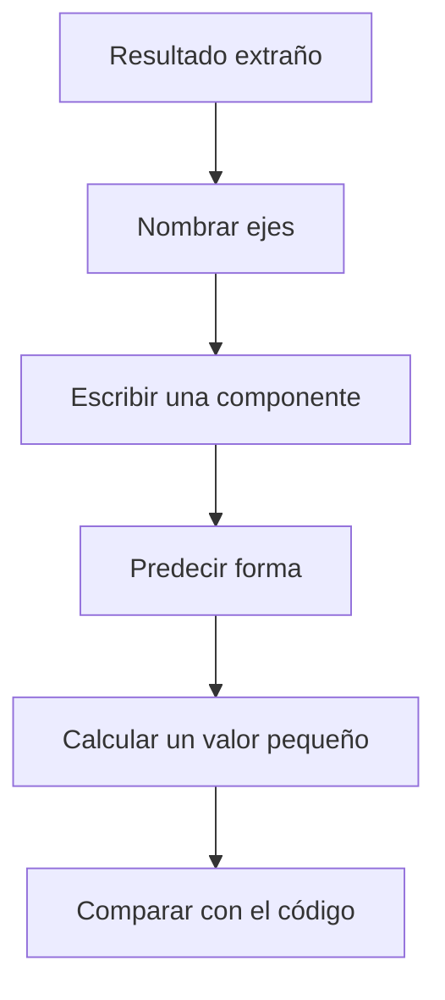
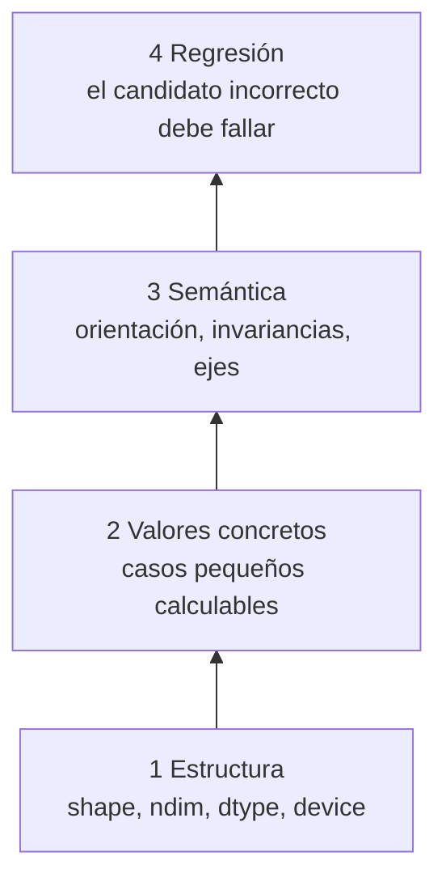

# Clínica de errores y pruebas semánticas

> [!summary] Idea principal
> PyTorch comprueba compatibilidad numérica, no intención. Un programa puede ejecutarse, conservar la forma esperada y aun así aplicar los valores sobre el eje equivocado.

## Método de diagnóstico en lenguaje sencillo

Cuando un resultado tensorial parece extraño, no empieces cambiando operaciones al azar. Responde en orden:

1. ¿Qué representa el tensor completo?
2. ¿Qué significa cada eje?
3. ¿Qué índice representa cada vector que participa?
4. ¿Qué eje debería desaparecer o conservarse?
5. ¿Qué valor pequeño puedo calcular a mano?
6. ¿La prueba verifica ese valor y esa orientación?



## Caso clínico: código válido, significado incorrecto

```python
scores = torch.tensor([
    [1., 2., 3.],
    [4., 5., 6.],
    [7., 8., 9.],
])
offset_by_observation = torch.tensor([10., 20., 30.])
```

El nombre declara un ajuste por observación: $offset_i$. La intención es:

$$corrected_{ih}=scores_{ih}+offset_i.$$

El candidato:

```python
candidate = scores + offset_by_observation
```

alinea el vector con el último eje y calcula:

$$candidate_{ih}=scores_{ih}+offset_h.$$

Como `B == H == 3`, no hay excepción y la forma sigue siendo `(3,3)`.

La expresión por componentes revela el error mejor que la forma:

| Expresión | Valor sumado a la fila 0 | Valor sumado a la fila 1 |
|---|---|---|
| intención: `offset_i` | `10` en todas sus columnas | `20` en todas sus columnas |
| candidato: `offset_h` | `10, 20, 30` | `10, 20, 30` |

El candidato trata el vector como si describiera salidas, aunque su nombre dice que describe observaciones.

## Corrección

```python
corrected = scores + offset_by_observation[:, None]
```

Resultado esperado:

$$
expected=
\begin{bmatrix}
11&12&13\\
24&25&26\\
37&38&39
\end{bmatrix}.
$$

## Qué debe probar un buen test

```python
assert torch.equal(corrected, expected)
assert not torch.equal(candidate, corrected)
```

La primera aserción confirma la relación declarada. La segunda evita una regresión hacia el candidato semánticamente incorrecto.

Una prueba de forma no lo habría detectado:

```python
assert candidate.shape == corrected.shape == (3, 3)  # ambas pasan
```

Por eso se necesita al menos un caso cuyo resultado pueda predecirse manualmente.

También conviene probar orientación:

```python
assert torch.equal(
    corrected[:, 0],
    torch.tensor([11., 24., 37.]),
)
```

## Pirámide de comprobación



### 1. Pruebas estructurales

```python
assert Y.shape == (B, H)
assert Y.dtype == X.dtype
assert Y.device == X.device
```

Son necesarias, pero insuficientes.

### 2. Pruebas de valores

Usa ejemplos pequeños con resultados manuales. Para flotantes generados por cálculos más complejos, suele ser mejor:

```python
assert torch.allclose(actual, expected, rtol=1e-5, atol=1e-7)
```

`torch.equal` exige igualdad exacta, la misma forma y el mismo contenido. Las operaciones en punto flotante pueden acumular redondeo, por lo que `allclose` expresa una tolerancia explícita.

### 3. Pruebas semánticas

Comprueban propiedades derivadas del significado:

- un sesgo por salida produce el mismo incremento en cada fila;
- un ajuste por observación produce un incremento constante dentro de cada fila;
- permutar y deshacer la permutación recupera el tensor;
- sumar sobre tiempo elimina variación temporal y conserva lote/característica.

```python
assert torch.equal((XW + b) - XW, b.expand_as(XW))
assert torch.equal(S.permute(2, 0, 1).permute(1, 2, 0), S)
```

### 4. Dimensiones que rompen accidentes

Evita que todos los ejes midan lo mismo. Usa, por ejemplo:

$$B=2,\qquad T=5,\qquad D=3,\qquad H=4.$$

Así, intercambiar $B$ y $H$ suele fallar de inmediato.

## Diagnóstico de errores frecuentes

| Síntoma | Causa probable | Pregunta diagnóstica |
|---|---|---|
| `.shape` correcta, valores incorrectos | broadcasting sobre otro eje | ¿qué índice representa el vector? |
| error en `matmul` | ejes interiores incompatibles | ¿el último de A coincide con el penúltimo de B? |
| `view` falla tras `permute` | tensor no contiguo | ¿los strides permiten esa vista? |
| se perdió el eje de lote | indexación escalar | ¿usaste `0` en vez de `0:1`? |
| resultado escalar inesperado | se redujeron todos los ejes | ¿qué índices quedaron libres? |

## Ejemplo de diagnóstico completo

Supón que esperabas `(B,H)` después de `X @ W`, pero PyTorch produce un error:

```text
X.shape = (2, 3)
W.shape = (4, 5)
```

Diagnóstico:

1. `X` declara tres características de entrada;
2. `W` espera cuatro entradas por receta;
3. la operación intentaría `(2,3) @ (4,5)`;
4. los tamaños interiores `3` y `4` no coinciden;
5. hay que corregir la construcción de `X` o de `W`, no agregar un `reshape` arbitrario.

> [!warning] Antipatrón
> No uses `reshape` únicamente para silenciar un error de forma. Primero corrige el contrato de ejes; de lo contrario puedes reorganizar números hasta que la API acepte una operación sin que esta tenga sentido.

## Plantilla de revisión antes de aprobar código

> [!check] Checklist
> - [ ] Nombré cantidades y unidades.
> - [ ] Declaré el significado de cada eje.
> - [ ] Escribí la relación por componentes.
> - [ ] Identifiqué índices libres, fijados y sumados.
> - [ ] Predije forma y al menos un valor.
> - [ ] Usé dimensiones que no oculten ejes intercambiados.
> - [ ] Probé valores/orientación, no solo `.shape`.
> - [ ] Expliqué por qué la implementación corresponde a la fórmula.

---

Anterior: [[09 Laboratorio PyTorch - formular, predecir y verificar]] · Siguiente: [[11 Resumen, mapa mental y autoevaluación]]
