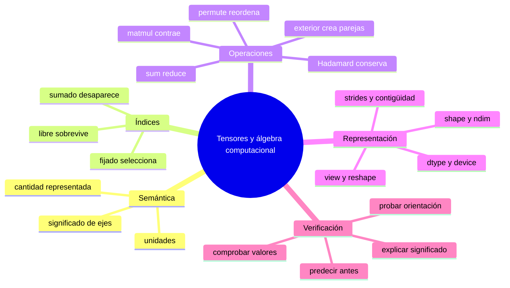

# Resumen, mapa mental y autoevaluación

## Resumen en 60 segundos

1. Un tensor de PyTorch es un conjunto de números organizado por ejes.
2. `shape` dice cuánto mide cada eje, pero no qué significa.
3. Indexar con un entero fija y elimina un eje; usar un intervalo lo conserva.
4. Una reducción suma o promedia un eje y normalmente lo elimina.
5. `permute` cambia el orden de ejes sin cambiar qué valores corresponden entre sí.
6. Broadcasting repite virtualmente valores; hay que comprobar sobre qué eje.
7. El producto matricial multiplica y suma sobre un eje compartido.
8. Una prueba correcta verifica valores y orientación, no únicamente la forma.

> [!summary] Frase que debes recordar
> Comprender un tensor significa poder decir: **qué representa, qué significa cada eje, qué hace la operación con esos ejes y qué forma debe resultar**.

## Diccionario mínimo

| Palabra | Significado |
|---|---|
| eje | una dirección de organización de los datos |
| tamaño de eje | cantidad de posiciones de ese eje |
| forma | tamaños de todos los ejes en orden |
| índice libre | varía y aparece en el resultado |
| índice fijado | seleccionamos una posición y deja de variar |
| índice contraído | se recorre, se suma y desaparece |
| broadcasting | repetición virtual para alinear formas compatibles |
| lote | conjunto de observaciones procesadas juntas |

## Mapa mental



## La cadena que debes poder reconstruir

Datos y contrato:

$$X:(B,D),\qquad W:(D,H),\qquad b:(H,),$$

con $i=$ observación, $d=$ entrada y $h=$ salida.

Componentes:

$$Y_{ih}=\sum_dX_{id}W_{dh}+b_h.$$

Índices: $d$ se contrae; $i,h$ quedan libres.

Matriz y forma:

$$Y=XW+\mathbf1_Bb^{\mathsf T}\in\mathbb R^{B\times H}.$$

Código:

```python
Y = X @ W + b
```

Contraste:

```python
assert Y.shape == (B, H)
assert torch.allclose(Y, expected)
```

Explicación: la misma $W$ transforma cada fila y $b_h$ se replica sobre las observaciones.

### Traducción completa a lenguaje común

La expresión:

$$Y_{ih}=\sum_dX_{id}W_{dh}+b_h$$

se lee:

> “Para obtener la salida `h` de la observación `i`, toma todas sus entradas `d`, multiplica cada una por el peso que la conecta con la salida `h`, suma esas contribuciones y agrega el sesgo de esa salida”.

La suma elimina `d` porque todas las entradas se combinan. `i` permanece porque seguimos teniendo una salida por observación. `h` permanece porque seguimos teniendo una posición por salida.

## Formulario razonado

| Situación | Regla |
|---|---|
| producto matricial | $(m,n)@(n,p)\to(m,p)$; se contrae $n$ |
| lote con contexto | $(B,T,D)@(D,H)\to(B,T,H)$ |
| sesgo por salida | $(B,H)+(H,)\to(B,H)$ |
| ajuste por observación | $(B,H)+(B,1)\to(B,H)$ |
| índice entero | elimina el eje fijado |
| slice | conserva el eje seleccionado |
| reducción `dim=r` | suma y elimina el eje $r$ |
| permutación | conserva valores, reordena ejes |
| `view` | requiere almacenamiento compatible |
| `reshape` | puede devolver vista o copia |

## Errores que ya deberías detectar

1. Inferir semántica solo desde `.shape`.
2. Concluir que una operación es correcta porque ejecutó.
3. Confundir `A * B` con `A @ B`.
4. Confiar en broadcasting sin nombrar índices.
5. Usar `B=H` en todas las pruebas y ocultar ejes intercambiados.
6. Confundir número de ejes con rango algebraico.
7. Creer que `reshape` siempre es una vista.
8. Olvidar que un índice entero elimina un eje.

## Un ejemplo que reúne todo

```python
X = torch.tensor([[1., 2.],
                  [3., 4.]])       # (2 observaciones, 2 entradas)
W = torch.tensor([[10., 100., 1000.],
                  [ 1.,  10.,  100.]])  # (2 entradas, 3 salidas)
b = torch.tensor([0., 1., 2.])          # (3 salidas,)

Y = X @ W + b                            # (2 observaciones, 3 salidas)
```

Primera observación:

```text
salida 0 = 1·10   + 2·1   + 0 = 12
salida 1 = 1·100  + 2·10  + 1 = 121
salida 2 = 1·1000 + 2·100 + 2 = 1202
```

Por tanto:

```python
assert torch.equal(Y[0], torch.tensor([12., 121., 1202.]))
assert Y.shape == (2, 3)
```

Este ejemplo contiene los conceptos esenciales: contrato de ejes, contracción de entradas, conservación del lote, aparición de salidas y broadcasting del sesgo.

## Autoevaluación

Intenta responder sin abrir las soluciones.

### Preguntas

1. Si $A_{ij}$ y $B_{jk}$ se multiplican y se suma sobre $j$, ¿qué índices y forma tiene el resultado?
2. ¿Por qué `shape == (3,3)` no permite saber si un vector se sumó por observación o por salida?
3. Para `S.shape == (4,5,2)`, ¿qué forma tienen `S[0]`, `S[0:1]` y `S.sum(dim=1)`?
4. ¿Cuál es la diferencia algebraica entre Hadamard y producto exterior?
5. ¿Por qué $f(x)=xW+b$ no es lineal cuando $b\neq0$?
6. ¿Qué forma produce `(4,5,2) @ (2,3)` y qué índice se contrae?
7. ¿Por qué `permuted.view(-1)` puede fallar después de `permute`?
8. Diseña una prueba que distinga un ajuste por observación de uno por salida.

> [!success]- Soluciones razonadas
> 1. $C_{ik}=\sum_jA_{ij}B_{jk}$; quedan $i,k$ y la forma es `(m,p)` si las entradas son `(m,n)` y `(n,p)`.
> 2. Porque ambas orientaciones pueden compartir la misma forma externa cuando $B=H$; hay que observar valores y declarar el índice del vector.
> 3. `(5,2)`, `(1,5,2)` y `(4,2)`, respectivamente.
> 4. Hadamard conserva los índices de posiciones existentes: $C_{ij}=A_{ij}B_{ij}$. El exterior crea todas las parejas: $O_{ij}=u_iv_j$.
> 5. Una función lineal debe cumplir $f(0)=0$, pero aquí $f(0)=b$.
> 6. `(4,5,3)`; se contrae el eje de tamaño 2, índice $d$.
> 7. `permute` cambia strides y suele producir una vista no contigua; `view` exige una organización compatible. Puede usarse `reshape` o `contiguous().view(...)` según la intención.
> 8. Con `Z=zeros(B,H)` y valores distintos en `r`, para ajuste por observación debe cumplirse `result[:,0] == r`; usa además `B != H` para romper la coincidencia accidental.

## Criterio de dominio

Has comprendido el módulo si puedes recibir una expresión nueva y, antes de ejecutarla:

1. declarar qué representa cada eje;
2. escribir sus componentes;
3. señalar índices libres y contraídos;
4. predecir la forma;
5. calcular un caso pequeño;
6. implementar y escribir una prueba que pueda detectar el eje equivocado.

---

Volver al [[00 Índice - Tensores y álgebra computacional con PyTorch]] · Laboratorio: [[09 Laboratorio PyTorch - formular, predecir y verificar]] · Taller integrador: [[12 Taller integrador - reconocimiento de actividad humana]]
