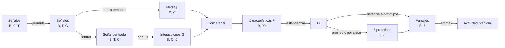

# Taller integrador: reconocer actividad humana con tensores

> [!abstract] Pregunta central
> ¿Es posible distinguir lo que hace una persona usando señales de un teléfono y solamente operaciones tensoriales de PyTorch?

> [!success] Resultado del notebook
> Sí. El clasificador por prototipos acierta **276 de 360 ventanas de prueba: 76,67 %**. No usa una red neuronal, `autograd`, optimizadores ni un clasificador externo. El objetivo principal no es batir un récord de exactitud, sino comprender qué hace cada eje y cada operación.

Notebook fuente: [[assets/04_taller_integrador_har.ipynb|04_taller_integrador_har.ipynb]].

## La idea antes del código

El teléfono registra nueve canales durante 128 instantes. Cada ventana se transforma en un vector de 90 características y se compara con seis prototipos, uno por actividad.



La cadena de formas es:

$$
(B,C,T)
\rightarrow(B,T,C)
\rightarrow(B,C,C)
\rightarrow(B,90)
\rightarrow(B,6)
\rightarrow(B).
$$

> [!important] Regla de lectura
> Antes de ejecutar una operación, responde: **¿qué significa cada eje?, ¿qué eje se conserva?, ¿cuál se reduce o contrae?**

## 1. Datos y contrato de ejes

El conjunto es un subconjunto de *Human Activity Recognition Using Smartphones* de UCI. Las seis clases son:

| Identificador | Actividad | Traducción |
|---:|---|---|
| 0 | `WALKING` | caminar |
| 1 | `WALKING_UPSTAIRS` | subir escaleras |
| 2 | `WALKING_DOWNSTAIRS` | bajar escaleras |
| 3 | `SITTING` | estar sentado |
| 4 | `STANDING` | estar de pie |
| 5 | `LAYING` | estar acostado |

Las señales se midieron a 50 Hz. Una ventana de 128 mediciones dura:

$$
\frac{128}{50}=2{,}56\ \text{segundos}.
$$

### Formas iniciales

| Tensor | Forma | Significado de los ejes |
|---|---:|---|
| `X_train_raw` | `(720, 9, 128)` | ventana, canal, tiempo |
| `y_train` | `(720,)` | actividad real de cada ventana |
| `X_test_raw` | `(360, 9, 128)` | ventana, canal, tiempo |
| `y_test` | `(360,)` | actividad real de cada ventana |

Usaremos estas letras en toda la nota:

- $B$: ventanas u observaciones;
- $C=9$: canales;
- $T=128$: instantes;
- $K=6$: actividades;
- $f$: características.

Una sola componente, `X_train_raw[b, c, t]`, es un número: la medición del canal $c$ en el instante $t$ de la ventana $b$.

Los nueve canales son tres de aceleración corporal, tres de giroscopio y tres de aceleración total:

```text
body_acc_x,  body_acc_y,  body_acc_z
body_gyro_x, body_gyro_y, body_gyro_z
total_acc_x, total_acc_y, total_acc_z
```

> [!note] Separación por participantes
> El `assert` del notebook comprueba que ningún participante aparezca simultáneamente en entrenamiento y prueba. Así se evita que el sistema memorice la manera particular de moverse de una persona y se evalúa mejor la generalización a personas nuevas.

## 2. Qué muestran las señales crudas

![[assets/har/walking-aceleracion.png|900]]

Al caminar aparecen oscilaciones grandes y repetidas, especialmente en `body_acc_x`. El movimiento corporal deja una firma dinámica clara.

![[assets/har/sitting-aceleracion.png|900]]

Al estar sentado, la escala vertical es mucho menor. Hay variación, pero se concentra cerca de cero.

> [!warning] Cuidado al comparar los gráficos
> Los dos ejes verticales no tienen la misma escala. En `WALKING` se observan aproximadamente valores entre $-0{,}4$ y $0{,}65$ g; en `SITTING`, entre $-0{,}018$ y $0{,}016$ g. La diferencia de amplitud es real, pero la escala automática de Matplotlib hace que ambos trazados llenen el panel.

### Código del gráfico, explicado

```python
walking_index = int(torch.where(y_test == 0)[0][0])
sitting_index = int(torch.where(y_test == 3)[0][0])
time_seconds = torch.arange(X_test_raw.shape[2]) / 50
```

- `y_test == 0` crea una máscara booleana: `True` donde la clase es `WALKING`.
- `torch.where(...)[0]` devuelve los índices que cumplen la condición.
- El segundo `[0]` selecciona el primer índice encontrado.
- `int(...)` lo convierte de tensor escalar a entero de Python.
- `torch.arange(128) / 50` convierte los índices de muestra en segundos.

```python
for channel_index, channel_name in enumerate(channel_names[:3]):
    axis.plot(
        time_seconds.numpy(),
        X_test_raw[sample_index, channel_index].numpy(),
        label=channel_name,
    )
```

- `channel_names[:3]` toma los tres canales de aceleración corporal.
- `enumerate` entrega simultáneamente el índice y el nombre.
- `X_test_raw[sample_index, channel_index]` fija ventana y canal; queda el eje temporal de longitud 128.
- `.numpy()` entrega a Matplotlib un arreglo de NumPy. Funciona directamente porque los tensores están en CPU y no requieren gradientes.

## 3. Carga segura del archivo `.pt`

El notebook busca los datos en varias ubicaciones posibles:

```python
candidate_paths = [
    Path.cwd() / "data" / "har_subset.pt",
    Path.cwd().parent / "data" / "har_subset.pt",
    Path.cwd() / "modules" / "m07-tensores-pytorch" / "data" / "har_subset.pt",
]

data_path = next((path for path in candidate_paths if path.exists()), None)
```

Lectura paso a paso:

1. `Path.cwd()` obtiene la carpeta desde la que se ejecuta Jupyter.
2. El operador `/` de `Path` une partes de una ruta; no es una división.
3. `(path for ... if path.exists())` produce solamente las rutas existentes.
4. `next(..., None)` toma la primera coincidencia o devuelve `None`.
5. Si no hay coincidencia, se lanza `FileNotFoundError` con las rutas revisadas.

```python
data = torch.load(data_path, map_location="cpu", weights_only=True)
```

- `map_location="cpu"` fuerza la carga en CPU aunque el archivo se haya guardado desde otro dispositivo.
- `weights_only=True` restringe la deserialización a tipos seguros compatibles con pesos/tensores y estructuras simples.
- El nombre `weights_only` no significa que el archivo deba contener una red; aquí contiene tensores y metadatos del conjunto.

> [!tip] Los `assert` son contratos ejecutables
> `assert tuple(X_train_raw.shape) == (720, 9, 128)` comprueba una suposición. Si los datos cambian o los ejes llegan en otro orden, el notebook falla temprano en vez de producir silenciosamente un resultado incorrecto.

## 4. `permute`: poner tiempo antes de canales

El archivo usa $(B,C,T)$, pero para estudiar en cada instante el vector de nueve canales conviene usar $(B,T,C)$:

```python
X_train = X_train_raw.permute(0, 2, 1)
X_test = X_test_raw.permute(0, 2, 1)
```

| Posición nueva | Eje original elegido | Significado |
|---:|---:|---|
| 0 | 0 | ventana |
| 1 | 2 | tiempo |
| 2 | 1 | canal |

Por eso:

$$
(720,9,128)\xrightarrow{\texttt{permute(0,2,1)}}(720,128,9).
$$

No se cambian los valores; solo se reordenan los ejes. La misma medición debe cumplir:

```python
assert X_train_raw[0, 2, 10] == X_train[0, 10, 2]
```

> [!example] Cómo leer `X_train[b, t, :]`
> Fija una ventana y un instante, conserva todos los canales. El resultado tiene forma `(9,)` y representa lo que observan simultáneamente las nueve señales.

## 5. Media temporal, eje unitario y broadcasting

Primero calculamos la media de cada canal dentro de cada ventana:

```python
mu_train = X_train.mean(dim=1)
mu_test = X_test.mean(dim=1)
```

El eje 1 es tiempo. Al promediarlo desaparece:

$$
\mu_{bc}=\frac{1}{T}\sum_{t=1}^{T}X_{btc},
\qquad
(B,T,C)\rightarrow(B,C).
$$

Luego centramos cada canal:

```python
Xc_train = X_train - mu_train[:, None, :]
Xc_test = X_test - mu_test[:, None, :]
```

`mu_train` tiene forma `(B,C)`. `mu_train[:, None, :]` inserta un eje temporal unitario:

$$
(B,C)\rightarrow(B,1,C).
$$

PyTorch replica conceptualmente ese eje de tamaño 1 sobre los 128 instantes:

$$
(B,T,C)-(B,1,C)\rightarrow(B,T,C).
$$

Una señal sencilla muestra la idea:

$$
x=[2,4,6],\qquad \mu=4,\qquad x-\mu=[-2,0,2].
$$

Centrar no hace desaparecer la señal. Separa:

- $μ$: el **nivel promedio**, útil para orientación y postura;
- $\widetilde X$: la **variación alrededor de ese nivel**, útil para movimiento.

La prueba semántica correcta es:

```python
assert float(Xc_train.mean(dim=1).abs().max()) < 1e-5
```

No basta comprobar la forma: también se exige que, después de centrar, la media temporal de cada canal sea casi cero.

## 6. Producto de Hadamard: energía por canal

```python
hadamard_train = Xc_train * Xc_train
energy_train = hadamard_train.mean(dim=1)
```

El operador `*` multiplica componente a componente:

$$
H_{btc}=\widetilde X_{btc}\widetilde X_{btc}=\widetilde X_{btc}^{2}.
$$

Ningún eje desaparece durante Hadamard:

$$
(B,T,C)*(B,T,C)\rightarrow(B,T,C).
$$

Después, `mean(dim=1)` promedia sobre tiempo:

$$
E_{bc}=\frac1T\sum_t\widetilde X_{btc}^{2},
\qquad
(B,T,C)\rightarrow(B,C).
$$

Elevar al cuadrado evita que variaciones positivas y negativas se cancelen. `energy_train[b, c]` es grande cuando el canal $c$ se mueve mucho durante la ventana $b$.

> [!note] Relación con la varianza
> Como la señal ya está centrada, esta “energía” coincide con la varianza poblacional de la ventana, es decir, con denominador $T$: `X_train.var(dim=1, correction=0)`. No es la varianza muestral con denominador $T-1$.

## 7. Producto exterior y matriz de interacciones

Para un instante fijo, `x = Xc_train[0, 0]` tiene nueve canales. Su producto exterior es:

```python
outer_one_time = torch.outer(x, x)
```

$$
O_{cd}=x_cx_d,
\qquad
(C,)\operatorname{outer}(C,)\rightarrow(C,C).
$$

Si $x=[2,-1]^{\mathsf T}$:

$$
xx^{\mathsf T}=
\begin{bmatrix}
4 & -2\\
-2 & 1
\end{bmatrix}.
$$

La diagonal contiene cuadrados; fuera de la diagonal aparecen relaciones entre pares de canales.

### Generalización a todas las ventanas

El notebook implementa la misma matriz de dos maneras.

**Con productos exteriores y broadcasting:**

```python
def interaction_by_outer(X_centered: torch.Tensor) -> torch.Tensor:
    products = X_centered[:, :, :, None] * X_centered[:, :, None, :]
    return products.mean(dim=1)
```

Las formas son:

```text
X_centered[:, :, :, None] -> (B,T,C,1)
X_centered[:, :, None, :] -> (B,T,1,C)
products                    -> (B,T,C,C)
products.mean(dim=1)        -> (B,C,C)
```

**Con producto matricial:**

```python
def interaction_by_matmul(X_centered: torch.Tensor) -> torch.Tensor:
    time_count = X_centered.shape[1]
    return X_centered.transpose(1, 2) @ X_centered / time_count
```

Para cada ventana:

$$
(C,T)@(T,C)\rightarrow(C,C).
$$

El eje temporal aparece en el centro, se multiplica y se suma; por eso se **contrae**. En componentes:

$$
G_{bcd}=\frac1T\sum_{t=1}^{T}
\widetilde X_{btc}\widetilde X_{btd}.
$$

Las dos implementaciones deben coincidir:

```python
assert torch.allclose(G_train_outer, G_train, atol=1e-6, rtol=1e-5)
```

> [!tip] Por qué preferir `matmul`
> La versión exterior crea un intermedio de forma `(720,128,9,9)`: 7.464.960 valores, cerca de 29,9 MB en `float32`. El producto matricial expresa directamente la contracción y evita materializar todo ese tensor de cuatro ejes.

### Qué clase de matriz es $G$

$G_b=\widetilde X_b^{\mathsf T}\widetilde X_b/T$ es simultáneamente:

- una **matriz de Gram** de los canales centrados;
- una **matriz de covarianza poblacional** dentro de la ventana;
- simétrica: $G_{bcd}=G_{bdc}$;
- semidefinida positiva: $v^{\mathsf T}G_bv\ge0$ para cualquier vector $v$.

Su diagonal coincide con la energía:

$$
G_{bcc}=\frac1T\sum_t\widetilde X_{btc}^{2}=E_{bc}.
$$

```python
assert torch.allclose(
    G_train.diagonal(dim1=1, dim2=2),
    energy_train,
    atol=1e-7,
    rtol=1e-6,
)
```

### Firma de una ventana de `WALKING`

![[assets/har/firma-interaccion-walking.svg|760]]

Lectura del mapa:

- fila $c$ y columna $d$: interacción promedio entre esos canales;
- diagonal: energía de cada canal;
- valor positivo: ambos canales suelen desviarse de su media con el mismo signo;
- valor negativo: suelen desviarse con signos opuestos;
- simetría respecto de la diagonal: intercambiar $c$ y $d$ no cambia el producto.

> [!warning] Una firma no representa toda la clase
> El gráfico muestra una sola ventana de `WALKING`. Un patrón representativo de la clase se obtendría promediando las firmas de muchas ventanas de caminar.

## 8. De la firma a 90 características

```python
F_train = torch.cat(
    (mu_train, G_train.flatten(start_dim=1)),
    dim=1,
)
```

`flatten(start_dim=1)` conserva el eje 0 de ventanas y aplana los dos ejes $9\times9$:

$$
(B,9,9)\rightarrow(B,81).
$$

`torch.cat(..., dim=1)` concatena características, no observaciones:

$$
F_b=[\mu_b,\operatorname{vec}(G_b)],
\qquad
9+81=90.
$$

El resultado es `F_train.shape == (720, 90)`.

> [!note] Complemento: hay características redundantes
> Como $G$ es simétrica, sus 81 celdas contienen solo $9(9+1)/2=45$ valores distintos. Se podría construir una versión compacta de $9+45=54$ características sin perder información:
>
> ```python
> row, col = torch.triu_indices(9, 9)
> F_compact = torch.cat((mu_train, G_train[:, row, col]), dim=1)
> assert F_compact.shape == (720, 54)
> ```
>
> El notebook conserva las 81 entradas porque `flatten` hace más transparente la correspondencia con la matriz.

## 9. Estandarización sin fuga de información

```python
feature_mean = F_train.mean(dim=0, keepdim=True)
feature_std = F_train.std(dim=0, keepdim=True).clamp_min(1e-6)

F_train_z = (F_train - feature_mean) / feature_std
F_test_z = (F_test - feature_mean) / feature_std
```

`dim=0` resume las 720 observaciones y conserva las 90 características:

$$
(720,90)\rightarrow(1,90).
$$

Cada característica se transforma así:

$$
F^{(z)}_{bf}=\frac{F_{bf}-m_f}{s_f}.
$$

- `keepdim=True` conserva una fila y facilita broadcasting.
- `clamp_min(1e-6)` impide dividir para cero si una característica es constante.
- Prueba utiliza **la media y desviación de entrenamiento**. Calcularlas con prueba sería fuga de información.

> [!important] Por qué estandarizar
> La distancia euclídea es sensible a la escala. Sin estandarización, una característica numéricamente grande dominaría la comparación aunque no fuera la más informativa.

## 10. Prototipos de actividad

```python
prototypes = torch.stack([
    F_train_z[y_train == class_id].mean(dim=0)
    for class_id in range(class_count)
])
```

La comprensión de lista repite el proceso para las seis clases:

1. `y_train == class_id` crea una máscara.
2. `F_train_z[mascara]` conserva solo las ventanas de esa actividad.
3. `.mean(dim=0)` promedia observaciones y produce un vector `(90,)`.
4. `torch.stack` crea un nuevo eje de clase.

$$
P_{kf}=\frac{1}{N_k}\sum_{b:y_b=k}F^{(z)}_{bf},
\qquad
P\in\mathbb R^{6\times90}.
$$

Un prototipo es el “centro promedio” de una actividad en el espacio de características estandarizadas.

## 11. Clasificación: del vecino más cercano a una función afín

La regla intuitiva es elegir el prototipo más cercano:

$$
\widehat y_b=\arg\min_k\lVert F_b^{(z)}-P_k\rVert^2.
$$

Al expandir la distancia:

$$
\lVert F_b-P_k\rVert^2
=\lVert F_b\rVert^2-2F_bP_k^{\mathsf T}+\lVert P_k\rVert^2.
$$

Para una ventana fija, $\lVert F_b\rVert^2$ es igual frente a todas las clases. Por tanto, minimizar distancia equivale a maximizar:

$$
S_{bk}=F_bP_k^{\mathsf T}-\frac12\lVert P_k\rVert^2.
$$

El código es:

```python
bias = -0.5 * (prototypes * prototypes).sum(dim=1)
scores = F_test_z @ prototypes.T + bias
predicted = scores.argmax(dim=1)
```

### Línea por línea

`prototypes * prototypes` calcula los cuadrados componente a componente y conserva `(6,90)`.

`sum(dim=1)` suma las 90 características de cada clase:

$$
(6,90)\rightarrow(6,),
\qquad
b_k=-\tfrac12\sum_fP_{kf}^2.
$$

`prototypes.T` tiene forma `(90,6)`, así que:

$$
(360,90)@(90,6)\rightarrow(360,6).
$$

El eje de 90 características se contrae. `bias` de forma `(6,)` se replica sobre las 360 filas. Finalmente, `argmax(dim=1)` elimina el eje de seis clases y devuelve una predicción por ventana:

$$
(360,6)\rightarrow(360,).
$$

La verificación calcula también las distancias explícitas:

```python
distances = (
    (F_test_z[:, None, :] - prototypes[None, :, :]) ** 2
).sum(dim=2)

assert torch.equal(
    scores.argmax(dim=1),
    distances.argmin(dim=1),
)
```

Broadcasting construye conceptualmente todas las parejas ventana–prototipo:

```text
F_test_z[:, None, :]       -> (360,1,90)
prototypes[None, :, :]     -> (1,6,90)
diferencias                -> (360,6,90)
sum(dim=2)                 -> (360,6)
```

> [!warning] `scores` no son probabilidades
> Un puntaje alto significa mayor compatibilidad con un prototipo. No está limitado entre 0 y 1 ni suma 1 entre clases. Para hablar de probabilidad haría falta una calibración adicional.

## 12. Matriz de confusión y exactitud

```python
confusion = torch.bincount(
    class_count * y_test + predicted,
    minlength=class_count * class_count,
).reshape(class_count, class_count)
```

Cada par `(real, predicha)` se convierte en una posición lineal:

$$
\text{posición}=6\times\text{real}+\text{predicha}.
$$

Por ejemplo, real 2 y predicha 4 producen $6(2)+4=16$. `bincount` cuenta cuántas veces aparece cada posición y `reshape(6,6)` recupera la tabla.

![[assets/har/matriz-confusion.svg|820]]

Las filas son actividades reales; las columnas, actividades predichas. La diagonal representa aciertos.

### Resultados por actividad

![[assets/har/exactitud-por-actividad.svg|820]]

| Actividad | Aciertos | Exactitud |
|---|---:|---:|
| `WALKING` | 41/60 | 68,33 % |
| `WALKING_UPSTAIRS` | 48/60 | 80,00 % |
| `WALKING_DOWNSTAIRS` | 34/60 | 56,67 % |
| `SITTING` | 44/60 | 73,33 % |
| `STANDING` | 51/60 | 85,00 % |
| `LAYING` | 58/60 | 96,67 % |
| **Global** | **276/360** | **76,67 %** |

Como todas las clases tienen 60 observaciones, la exactitud global coincide con el promedio de las seis exactitudes por clase, también llamado *balanced accuracy* en este caso equilibrado.

### Interpretación de los errores

- `LAYING` es la clase más fácil. La orientación respecto de la gravedad conserva una señal muy distintiva.
- `SITTING → STANDING` es la confusión individual más grande: 16 ventanas. Las dos clases tienen poca variación; la diferencia depende más de postura que de intensidad.
- Nueve ventanas de `STANDING` se predicen como `SITTING`, la confusión inversa.
- `WALKING_DOWNSTAIRS` es la clase más difícil: se confunde diez veces con `WALKING_UPSTAIRS` y nueve con `WALKING`.
- La firma $G$ resume una ventana completa, pero pierde el orden exacto de los 128 instantes. Esto limita la distinción entre patrones de marcha parecidos.

## 13. Clínica de error: mismo `shape`, significado equivocado

La versión correcta resta a cada canal su media temporal:

```python
correct_center = X_train - X_train.mean(dim=1, keepdim=True)
```

La versión equivocada resta en cada instante la media entre canales:

```python
wrong_center = X_train - X_train.mean(dim=2, keepdim=True)
```

| Operación | Media calculada | Forma de la media | Propiedad que deja en cero |
|---|---|---:|---|
| correcta, `dim=1` | sobre tiempo | `(B,1,C)` | media temporal de cada canal |
| incorrecta, `dim=2` | sobre canales | `(B,T,1)` | media entre canales de cada instante |

Ambas producen forma `(B,T,C)`. La forma no detecta el error. Las pruebas semánticas sí:

```python
assert correct_center.mean(dim=1).abs().max() < 1e-5
assert wrong_center.mean(dim=2).abs().max() < 1e-5
assert wrong_center.mean(dim=1).abs().max() > 1e-3
```

> [!danger] Lección
> Código válido + ejecución exitosa + forma esperada **no garantizan** una operación matemáticamente correcta. Hay que probar qué eje quedó centrado.

## 14. Tabla rápida del código

| Expresión | Qué hace | Cambio de forma |
|---|---|---|
| `permute(0, 2, 1)` | reordena ejes | `(B,C,T) → (B,T,C)` |
| `mean(dim=1)` | reduce tiempo | `(B,T,C) → (B,C)` |
| `[:, None, :]` | inserta eje unitario | `(B,C) → (B,1,C)` |
| `X * X` | Hadamard; cuadrado por componente | conserva la forma |
| `transpose(1, 2)` | intercambia tiempo y canal | `(B,T,C) → (B,C,T)` |
| `A @ B` | producto matricial; contrae eje interno | `(C,T)@(T,C) → (C,C)` |
| `flatten(start_dim=1)` | aplana todos los ejes salvo lote | `(B,9,9) → (B,81)` |
| `cat(..., dim=1)` | une características existentes | `(B,9)+(B,81) → (B,90)` |
| `stack(...)` | crea un eje nuevo | seis `(90,)` → `(6,90)` |
| `argmax(dim=1)` | selecciona la mejor clase | `(B,6) → (B,)` |
| `bincount(...).reshape(6,6)` | cuenta pares real–predicha | `(B,) → (6,6)` |

## 15. Qué complementos mejorarían el experimento

Estas extensiones no son necesarias para comprender el taller, pero responden a sus limitaciones.

### A. Matriz de confusión normalizada

```python
confusion_rate = confusion / confusion.sum(dim=1, keepdim=True)
```

Cada fila suma 1 y se interpreta como porcentaje condicionado a la clase real. Es especialmente útil si las clases tienen cantidades distintas.

### B. Estudio de ablación

Comparar tres clasificadores permite saber qué aporta cada bloque:

```python
F_mean_only = mu_train                    # 9 características
F_interaction_only = G_train.flatten(1)   # 81 características
F_combined = torch.cat((mu_train, G_train.flatten(1)), dim=1)
```

La pregunta deja de ser “¿funciona?” y pasa a ser “¿cuánto aporta postura y cuánto aporta movimiento?”.

### C. Conservar información temporal

$G$ promedia los 128 instantes y no sabe en qué orden ocurrieron. Se pueden añadir, por canal:

- energía de primeras diferencias `X[:, 1:] - X[:, :-1]`;
- autocorrelación a varios retardos;
- frecuencias dominantes mediante FFT;
- dividir la ventana en segmentos y calcular una firma por segmento.

Estas características ayudarían sobre todo a separar caminar, subir y bajar escaleras.

### D. Medir margen, no confundirlo con probabilidad

```python
top2 = scores.topk(k=2, dim=1).values
margin = top2[:, 0] - top2[:, 1]
```

Un margen pequeño señala que los dos prototipos principales obtuvieron puntajes parecidos. Es una alerta de ambigüedad, no una probabilidad calibrada.

### E. Evaluación por participante

La exactitud global puede esconder personas para las que el método funciona peor. Conviene agrupar aciertos por `subject_test` y revisar la variabilidad entre participantes.

## 16. Cinco ideas para recordar

1. `shape` describe tamaños; el problema aporta el significado de los ejes.
2. Una reducción elimina el eje indicado: `mean(dim=1)` elimina tiempo en `(B,T,C)`.
3. Hadamard conserva posiciones; el producto exterior crea parejas; `matmul` contrae un eje.
4. $G=X^{\mathsf T}X/T$ resume energía e interacción, pero pierde el orden temporal.
5. Un clasificador por prototipos puede escribirse como distancia mínima o como una transformación afín con `matmul + bias`.

## Autoevaluación

1. ¿Por qué `mean(dim=1)` produce `(B,C)` a partir de `(B,T,C)`?
2. ¿Qué diferencia conceptual existe entre `X * X` y `X.T @ X`?
3. ¿Por qué la diagonal de $G$ coincide con la energía?
4. ¿Qué información conservan las medias $μ$ que se perdería si se usara solamente $G$?
5. ¿Por qué prueba debe estandarizarse con estadísticas de entrenamiento?
6. ¿Cómo puede una operación usar el eje equivocado y aun conservar el mismo `shape`?
7. ¿Por qué `scores.argmax(dim=1)` y `distances.argmin(dim=1)` coinciden?

> [!success]- Respuestas razonadas
> 1. Porque el eje 1 representa los $T$ instantes y se promedia; sobreviven ventana y canal.
> 2. `X * X` eleva cada posición al cuadrado y no suma ningún eje. `X.T @ X` combina pares de canales y suma sobre tiempo.
> 3. Al elegir el mismo canal en fila y columna, el producto cruzado se vuelve un cuadrado: $G_{bcc}=T^{-1}\sum_t\widetilde X_{btc}^2$.
> 4. Conservan el nivel promedio y, por tanto, información de orientación/postura. $G$ se calcula después de centrar.
> 5. Porque usar estadísticas de prueba deja que la información del conjunto evaluado influya en el modelo.
> 6. `mean(dim=1)` y `mean(dim=2)` pueden volver a expandirse por broadcasting y ambas restas terminan en `(B,T,C)`, aunque centran cantidades distintas.
> 7. Al expandir la distancia cuadrada, el término $\lVert F_b\rVert^2$ es constante entre clases; los términos restantes son exactamente el puntaje afín con signo y escala equivalentes.

---

Anterior: [[11 Resumen, mapa mental y autoevaluación]] · Volver al [[00 Índice - Tensores y álgebra computacional con PyTorch]]
